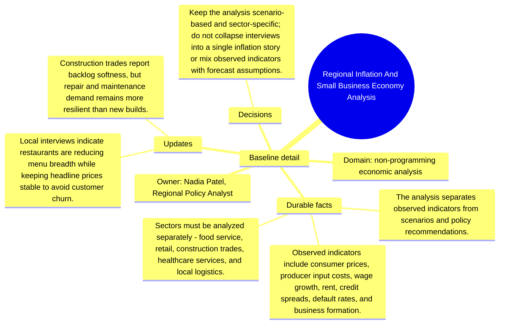

# Baseline detail: Regional Inflation And Small Business Economy Analysis

Source package: regional-economy-s01
Project domain: non-programming economic analysis
Named owner: Nadia Patel, Regional Policy Analyst
Intended ingestion: external Markdown file plus Markdown asset node in project structure
Expected consolidation behavior: create source-backed candidate memories for durable context, actors, risks, and boundaries.

## Project Context

Regional Inflation And Small Business Economy Analysis is a demo project used to evaluate whether Cognitive Memory stores source-grounded, useful memories rather than shallow or duplicated chunks. The source should be treated as a project-scoped document. It is not a generic article, and it should not be recalled for unrelated demo projects.

## Durable Facts To Preserve

- The analysis separates observed indicators from scenarios and policy recommendations.
- Observed indicators include consumer prices, producer input costs, wage growth, rent, credit spreads, default rates, and business formation.
- Sectors must be analyzed separately: food service, retail, construction trades, healthcare services, and local logistics.
- Scenarios include base, persistent inflation, credit crunch, wage catch-up, and demand rebound.
- Policy options must state tradeoffs, eligible sectors, expected lag, and evidence quality.

## Initial Validation Questions

- What is the canonical source of truth or governing boundary for this project?
- Which risks should be remembered as durable project risks?
- Which details should be summarized as project-specific context instead of global knowledge?
- Which facts must be attached to this source file and not to another project?

## Mindmap

## Expected Memory Behavior

The first memory cycle should create a small set of focused memories: one project overview, two to four specific operational memories, and any high-risk boundary that should require review. It should not create one memory per sentence, and it should not merge this project with similarly named sources from other projects.
