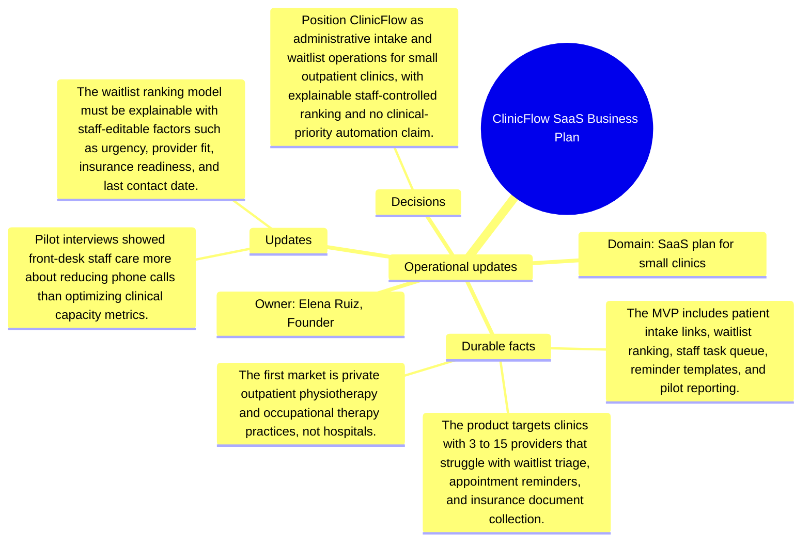

# Operational updates: ClinicFlow SaaS Business Plan

Source package: clinicflow-saas-s02
Project domain: SaaS plan for small clinics
Named owner: Elena Ruiz, Founder
Intended ingestion: external Markdown file plus project-structure update node
Expected consolidation behavior: update or extend existing memories where topics match, and create new candidates only for materially new facts.

## Operational Updates

- Pilot interviews showed front-desk staff care more about reducing phone calls than optimizing clinical capacity metrics.
- The waitlist ranking model must be explainable with staff-editable factors such as urgency, provider fit, insurance readiness, and last contact date.
- The landing page should not promise automated clinical prioritization; the system supports administrative triage only.
- A partner clinic requested exportable monthly metrics for no-show reduction, reminder completion, and insurance-document readiness.

## How These Updates Relate To Stage 01

The updates refine the baseline. They should not erase the original context. A good memory cycle should connect these facts to the existing project memories by topic: product scope, risks, operations, architecture, evidence, or evaluation. Duplicates should be detected when an update restates a Stage 01 fact with only wording changes.

## Expected Duplicate And Merge Checks

- If an update repeats a Stage 01 source fact, the review queue should show it as duplicate, reinforcement, or low-priority update rather than a new independent memory.
- If an update narrows scope, the resulting memory should mention the narrowed boundary and cite both the baseline and update source where useful.
- If the system cannot decide between update and new memory, the review item should expose enough source text for a human decision.

## Mindmap

