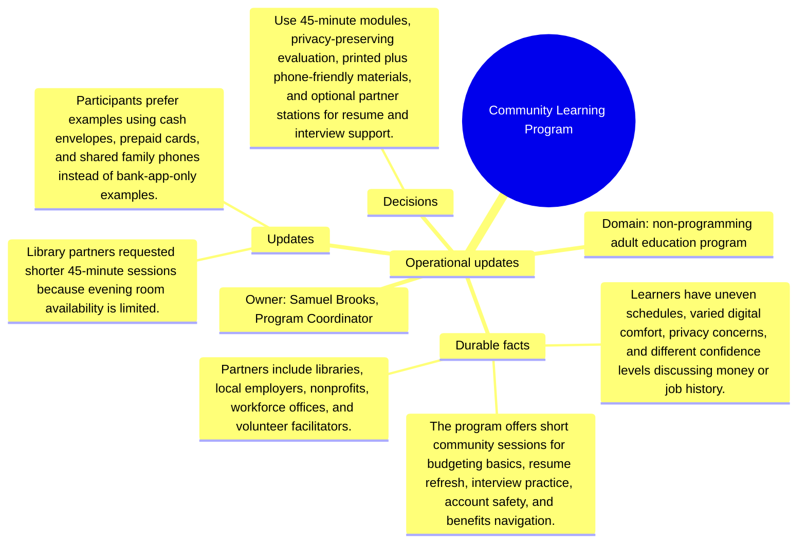

# Operational updates: Community Learning Program

Source package: community-learning-s02
Project domain: non-programming adult education program
Named owner: Samuel Brooks, Program Coordinator
Intended ingestion: external Markdown file plus project-structure update node
Expected consolidation behavior: update or extend existing memories where topics match, and create new candidates only for materially new facts.

## Operational Updates

- Library partners requested shorter 45-minute sessions because evening room availability is limited.
- Participants prefer examples using cash envelopes, prepaid cards, and shared family phones instead of bank-app-only examples.
- Employer partners want an optional mock interview station after resume sessions.
- The program added a privacy script explaining that facilitators do not need to see account balances or full job histories.

## How These Updates Relate To Stage 01

The updates refine the baseline. They should not erase the original context. A good memory cycle should connect these facts to the existing project memories by topic: product scope, risks, operations, architecture, evidence, or evaluation. Duplicates should be detected when an update restates a Stage 01 fact with only wording changes.

## Expected Duplicate And Merge Checks

- If an update repeats a Stage 01 source fact, the review queue should show it as duplicate, reinforcement, or low-priority update rather than a new independent memory.
- If an update narrows scope, the resulting memory should mention the narrowed boundary and cite both the baseline and update source where useful.
- If the system cannot decide between update and new memory, the review item should expose enough source text for a human decision.

## Mindmap

