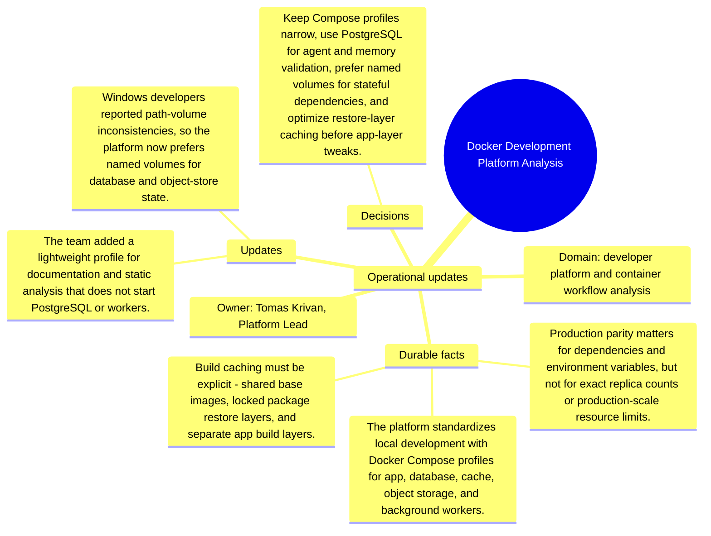

# Operational updates: Docker Development Platform Analysis

Source package: docker-platform-s02
Project domain: developer platform and container workflow analysis
Named owner: Tomas Krivan, Platform Lead
Intended ingestion: external Markdown file plus project-structure update node
Expected consolidation behavior: update or extend existing memories where topics match, and create new candidates only for materially new facts.

## Operational Updates

- The team added a lightweight profile for documentation and static analysis that does not start PostgreSQL or workers.
- Windows developers reported path-volume inconsistencies, so the platform now prefers named volumes for database and object-store state.
- The agent test profile must disable external email delivery and replace it with a local capture service.
- A build-cache benchmark showed dependency restore dominates cold starts, so the next optimization target is package-layer reuse.

## How These Updates Relate To Stage 01

The updates refine the baseline. They should not erase the original context. A good memory cycle should connect these facts to the existing project memories by topic: product scope, risks, operations, architecture, evidence, or evaluation. Duplicates should be detected when an update restates a Stage 01 fact with only wording changes.

## Expected Duplicate And Merge Checks

- If an update repeats a Stage 01 source fact, the review queue should show it as duplicate, reinforcement, or low-priority update rather than a new independent memory.
- If an update narrows scope, the resulting memory should mention the narrowed boundary and cite both the baseline and update source where useful.
- If the system cannot decide between update and new memory, the review item should expose enough source text for a human decision.

## Mindmap

