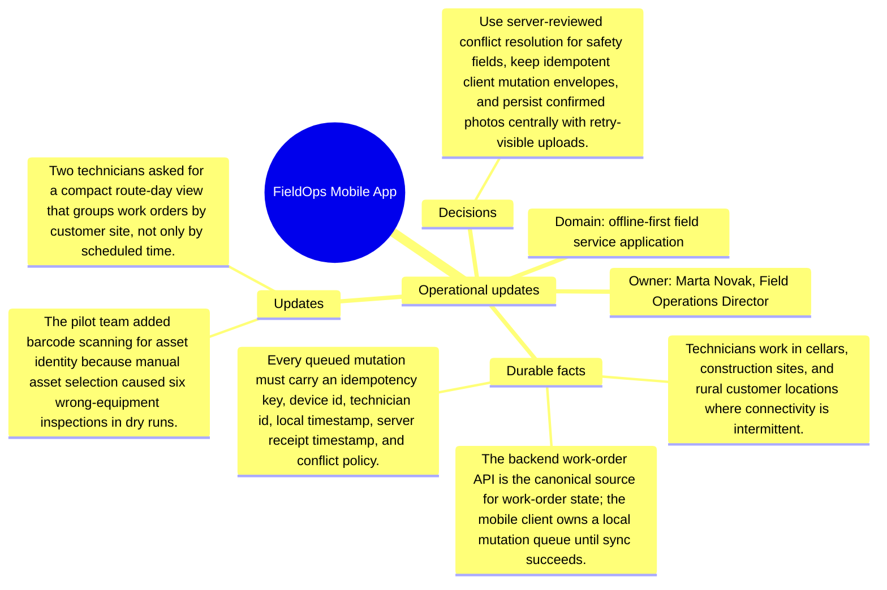

# Operational updates: FieldOps Mobile App

Source package: fieldops-mobile-s02
Project domain: offline-first field service application
Named owner: Marta Novak, Field Operations Director
Intended ingestion: external Markdown file plus project-structure update node
Expected consolidation behavior: update or extend existing memories where topics match, and create new candidates only for materially new facts.

## Operational Updates

- The pilot team added barcode scanning for asset identity because manual asset selection caused six wrong-equipment inspections in dry runs.
- Two technicians asked for a compact route-day view that groups work orders by customer site, not only by scheduled time.
- The sync queue must show retry backoff and the exact item blocking upload because hidden retries made the first pilot look frozen.
- Logs must mask customer names, addresses, and photo filenames while preserving queue age, retry count, and endpoint failure category.

## How These Updates Relate To Stage 01

The updates refine the baseline. They should not erase the original context. A good memory cycle should connect these facts to the existing project memories by topic: product scope, risks, operations, architecture, evidence, or evaluation. Duplicates should be detected when an update restates a Stage 01 fact with only wording changes.

## Expected Duplicate And Merge Checks

- If an update repeats a Stage 01 source fact, the review queue should show it as duplicate, reinforcement, or low-priority update rather than a new independent memory.
- If an update narrows scope, the resulting memory should mention the narrowed boundary and cite both the baseline and update source where useful.
- If the system cannot decide between update and new memory, the review item should expose enough source text for a human decision.

## Mindmap

