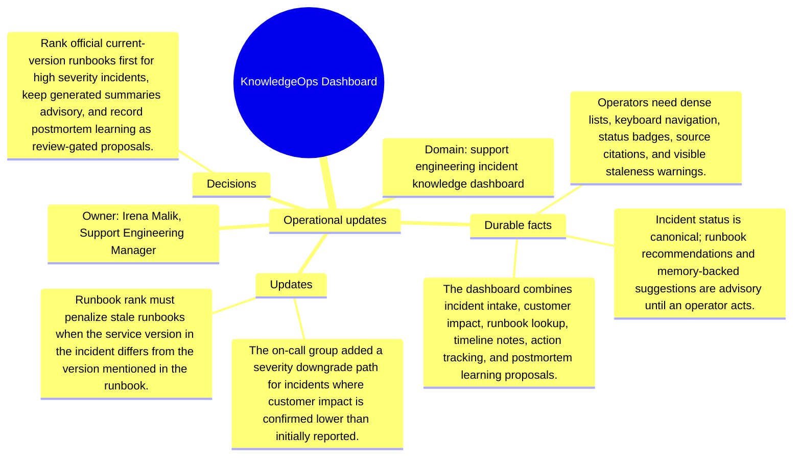

# Operational updates: KnowledgeOps Dashboard

Source package: knowledgeops-dashboard-s02
Project domain: support engineering incident knowledge dashboard
Named owner: Irena Malik, Support Engineering Manager
Intended ingestion: external Markdown file plus project-structure update node
Expected consolidation behavior: update or extend existing memories where topics match, and create new candidates only for materially new facts.

## Operational Updates

- The on-call group added a severity downgrade path for incidents where customer impact is confirmed lower than initially reported.
- Runbook rank must penalize stale runbooks when the service version in the incident differs from the version mentioned in the runbook.
- Operators want a single-key action to copy the suggested mitigation with citations into the incident timeline.
- Postmortem lessons should create review-gated learning proposals rather than directly mutating official runbooks.

## How These Updates Relate To Stage 01

The updates refine the baseline. They should not erase the original context. A good memory cycle should connect these facts to the existing project memories by topic: product scope, risks, operations, architecture, evidence, or evaluation. Duplicates should be detected when an update restates a Stage 01 fact with only wording changes.

## Expected Duplicate And Merge Checks

- If an update repeats a Stage 01 source fact, the review queue should show it as duplicate, reinforcement, or low-priority update rather than a new independent memory.
- If an update narrows scope, the resulting memory should mention the narrowed boundary and cite both the baseline and update source where useful.
- If the system cannot decide between update and new memory, the review item should expose enough source text for a human decision.

## Mindmap

