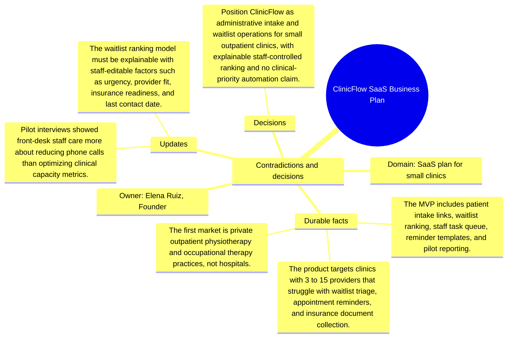

# Contradictions and decisions: ClinicFlow SaaS Business Plan

Source package: clinicflow-saas-s03
Project domain: SaaS plan for small clinics
Named owner: Elena Ruiz, Founder
Intended ingestion: conflict/decision Markdown file, then forced consolidation and review.
Expected consolidation behavior: create reviewable contradiction or decision candidates and keep obsolete claims distinguishable from accepted decisions.

## Conflicts Introduced

- The first business plan mentioned automated clinical priority scoring, but legal review says this is not allowed in the MVP messaging.
- A pricing note suggested per-patient fees; pilots disliked that because it feels punitive when marketing succeeds.
- A hospital network inbound lead is tempting but conflicts with the small-clinic implementation focus.

## Resolution Decision

Position ClinicFlow as administrative intake and waitlist operations for small outpatient clinics, with explainable staff-controlled ranking and no clinical-priority automation claim.

## Review Expectations

- The contradiction candidates must show the old claim, the new conflicting claim, and the deciding source.
- The review queue should not silently overwrite earlier memory.
- After approval, recall should prefer the resolved decision while still being able to explain that an older source was superseded.
- If the system produces near-duplicate candidates for the same contradiction, record them in the duplicate analysis sheet and approve only the best source-backed candidate.

## Mindmap

