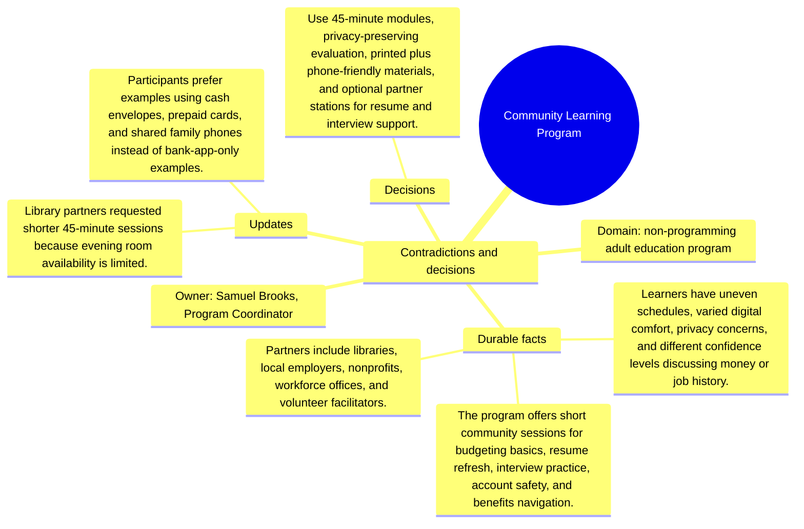

# Contradictions and decisions: Community Learning Program

Source package: community-learning-s03
Project domain: non-programming adult education program
Named owner: Samuel Brooks, Program Coordinator
Intended ingestion: conflict/decision Markdown file, then forced consolidation and review.
Expected consolidation behavior: create reviewable contradiction or decision candidates and keep obsolete claims distinguishable from accepted decisions.

## Conflicts Introduced

- The first curriculum plan assumed 90-minute classes, but partner locations can reliably support 45 minutes.
- A donor suggested tracking individual income changes; program leadership rejected this as too invasive for the current trust model.
- A digital-only reminder plan conflicts with learners who share phones or prefer printed calendars.

## Resolution Decision

Use 45-minute modules, privacy-preserving evaluation, printed plus phone-friendly materials, and optional partner stations for resume and interview support.

## Review Expectations

- The contradiction candidates must show the old claim, the new conflicting claim, and the deciding source.
- The review queue should not silently overwrite earlier memory.
- After approval, recall should prefer the resolved decision while still being able to explain that an older source was superseded.
- If the system produces near-duplicate candidates for the same contradiction, record them in the duplicate analysis sheet and approve only the best source-backed candidate.

## Mindmap

