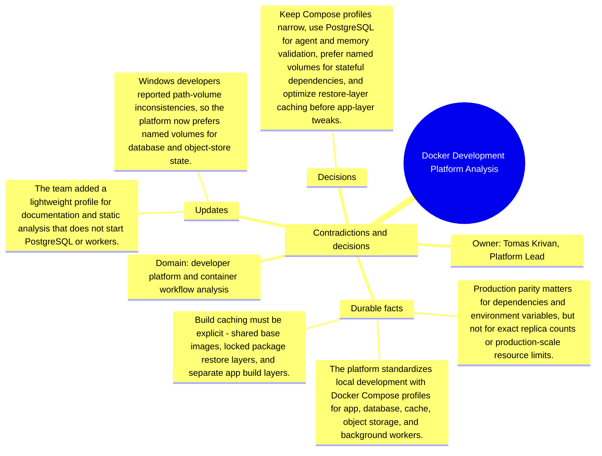

# Contradictions and decisions: Docker Development Platform Analysis

Source package: docker-platform-s03
Project domain: developer platform and container workflow analysis
Named owner: Tomas Krivan, Platform Lead
Intended ingestion: conflict/decision Markdown file, then forced consolidation and review.
Expected consolidation behavior: create reviewable contradiction or decision candidates and keep obsolete claims distinguishable from accepted decisions.

## Conflicts Introduced

- A proposal to mirror production replica counts locally conflicts with laptop resource constraints and does not improve most debugging.
- A Dockerfile draft copies the full repository before package restore, which defeats restore-layer caching.
- One doc says SQLite is acceptable for agent workflow tests; current PostgreSQL-first policy rejects that for this memory validation path.

## Resolution Decision

Keep Compose profiles narrow, use PostgreSQL for agent and memory validation, prefer named volumes for stateful dependencies, and optimize restore-layer caching before app-layer tweaks.

## Review Expectations

- The contradiction candidates must show the old claim, the new conflicting claim, and the deciding source.
- The review queue should not silently overwrite earlier memory.
- After approval, recall should prefer the resolved decision while still being able to explain that an older source was superseded.
- If the system produces near-duplicate candidates for the same contradiction, record them in the duplicate analysis sheet and approve only the best source-backed candidate.

## Mindmap

