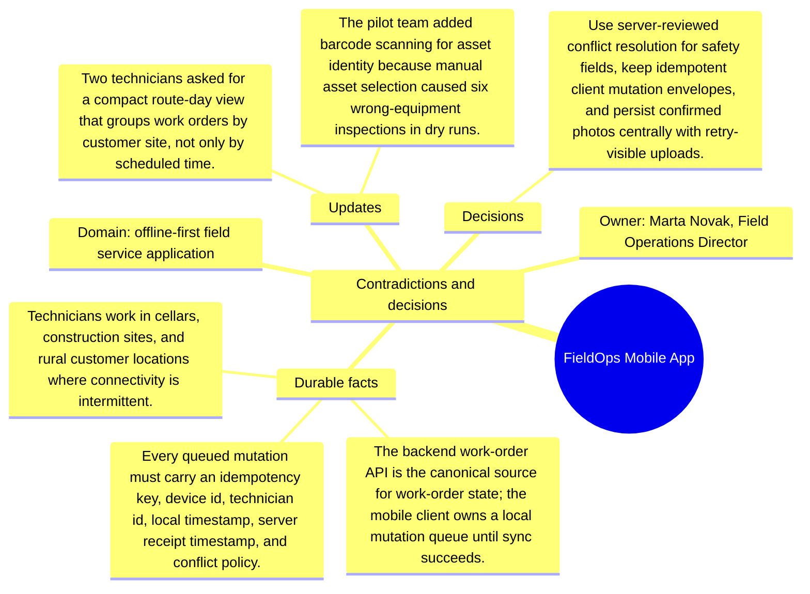

# Contradictions and decisions: FieldOps Mobile App

Source package: fieldops-mobile-s03
Project domain: offline-first field service application
Named owner: Marta Novak, Field Operations Director
Intended ingestion: conflict/decision Markdown file, then forced consolidation and review.
Expected consolidation behavior: create reviewable contradiction or decision candidates and keep obsolete claims distinguishable from accepted decisions.

## Conflicts Introduced

- Product originally suggested last-write-wins for conflicts, but operations now rejects it for safety checklist answers.
- A vendor proposed storing original photos only on the device for bandwidth savings; compliance rejected this because evidence retention must be centralized.
- The route-day view is useful, but it cannot become the canonical work-order sequence because dispatch remains responsible for priorities.

## Resolution Decision

Use server-reviewed conflict resolution for safety fields, keep idempotent client mutation envelopes, and persist confirmed photos centrally with retry-visible uploads.

## Review Expectations

- The contradiction candidates must show the old claim, the new conflicting claim, and the deciding source.
- The review queue should not silently overwrite earlier memory.
- After approval, recall should prefer the resolved decision while still being able to explain that an older source was superseded.
- If the system produces near-duplicate candidates for the same contradiction, record them in the duplicate analysis sheet and approve only the best source-backed candidate.

## Mindmap

