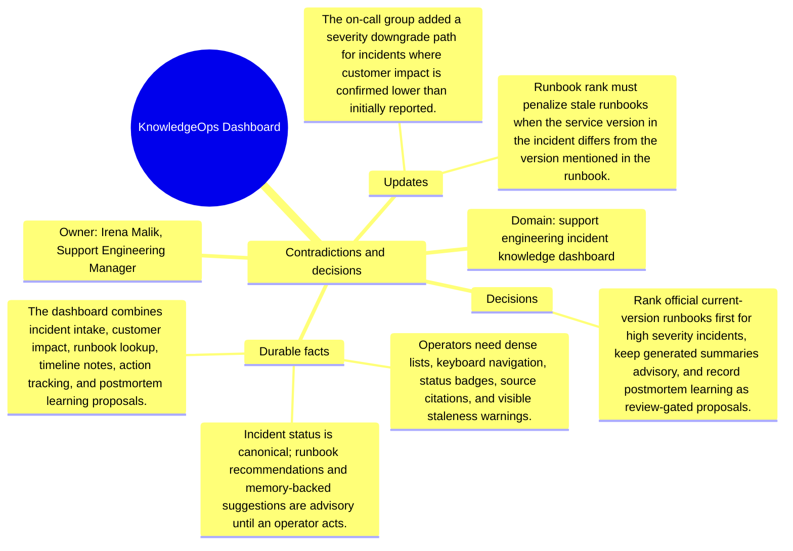

# Contradictions and decisions: KnowledgeOps Dashboard

Source package: knowledgeops-dashboard-s03
Project domain: support engineering incident knowledge dashboard
Named owner: Irena Malik, Support Engineering Manager
Intended ingestion: conflict/decision Markdown file, then forced consolidation and review.
Expected consolidation behavior: create reviewable contradiction or decision candidates and keep obsolete claims distinguishable from accepted decisions.

## Conflicts Introduced

- One team wants generated summaries to appear above official runbooks; support leadership rejected that ordering for high severity incidents.
- An old design treated repeated customer reports as duplicates, but the current rule keeps them separate when regions or product tiers differ.
- A proposed auto-close action conflicts with the requirement that incident ownership stays human-controlled.

## Resolution Decision

Rank official current-version runbooks first for high severity incidents, keep generated summaries advisory, and record postmortem learning as review-gated proposals.

## Review Expectations

- The contradiction candidates must show the old claim, the new conflicting claim, and the deciding source.
- The review queue should not silently overwrite earlier memory.
- After approval, recall should prefer the resolved decision while still being able to explain that an older source was superseded.
- If the system produces near-duplicate candidates for the same contradiction, record them in the duplicate analysis sheet and approve only the best source-backed candidate.

## Mindmap

