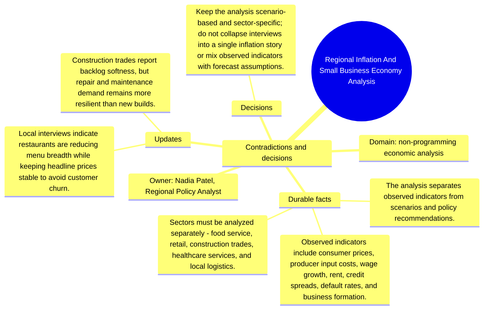

# Contradictions and decisions: Regional Inflation And Small Business Economy Analysis

Source package: regional-economy-s03
Project domain: non-programming economic analysis
Named owner: Nadia Patel, Regional Policy Analyst
Intended ingestion: conflict/decision Markdown file, then forced consolidation and review.
Expected consolidation behavior: create reviewable contradiction or decision candidates and keep obsolete claims distinguishable from accepted decisions.

## Conflicts Introduced

- A draft conclusion said inflation is uniformly hurting all sectors; the source interviews show sector-specific effects.
- One scenario assumed immediate demand rebound after rate cuts, but lenders expect credit standards to loosen slowly.
- A policy memo proposed blanket grants, while the analysis favors targeted support tied to sector-specific constraints.

## Resolution Decision

Keep the analysis scenario-based and sector-specific; do not collapse interviews into a single inflation story or mix observed indicators with forecast assumptions.

## Review Expectations

- The contradiction candidates must show the old claim, the new conflicting claim, and the deciding source.
- The review queue should not silently overwrite earlier memory.
- After approval, recall should prefer the resolved decision while still being able to explain that an older source was superseded.
- If the system produces near-duplicate candidates for the same contradiction, record them in the duplicate analysis sheet and approve only the best source-backed candidate.

## Mindmap

