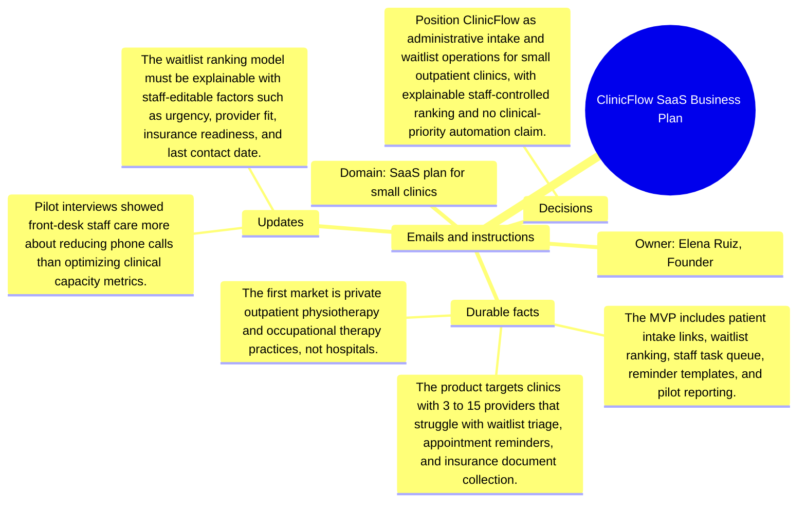

# Emails and instructions: ClinicFlow SaaS Business Plan

Source package: clinicflow-saas-s04
Project domain: SaaS plan for small clinics
Named owner: Elena Ruiz, Founder
Intended ingestion: Markdown email bundle as a project asset node and as an external file.
Expected consolidation behavior: preserve email-specific facts with source attribution and do not turn instructions into unsupported project facts.

## Email 1: Pilot feedback: phone calls are the pain

From: elena.ruiz@clinicflow.example
To: elena.ruiz,.founder@demo.example
Project: ClinicFlow SaaS Business Plan
Message:

The two pilot clinics both said capacity optimization sounds nice, but the actual buying trigger is fewer phone calls and fewer incomplete insurance packets. Memory should keep that buyer priority separate from long-term analytics ideas.

## Email 2: Instruction: do not say clinical prioritization

From: legal@clinicflow.example
To: elena.ruiz,.founder@demo.example
Project: ClinicFlow SaaS Business Plan
Message:

Replace clinical prioritization wording with administrative waitlist ranking. Staff must remain responsible for final decisions, and every ranking explanation must show editable administrative factors.

## Operator Instruction For Memory Review

- Treat email messages as source evidence with sender, subject, and stage.
- Approve durable facts only when they are useful for later project work.
- Reject or mark needs-changes for vague reminders, one-off scheduling chatter, or facts that duplicate a stronger source.
- During chat validation, ask one question that requires this email packet and one question that should ignore this email packet.

## Mindmap

