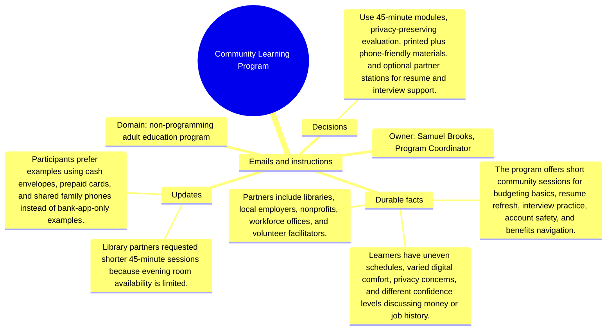

# Emails and instructions: Community Learning Program

Source package: community-learning-s04
Project domain: non-programming adult education program
Named owner: Samuel Brooks, Program Coordinator
Intended ingestion: Markdown email bundle as a project asset node and as an external file.
Expected consolidation behavior: preserve email-specific facts with source attribution and do not turn instructions into unsupported project facts.

## Email 1: Library room schedule

From: samuel.brooks@community.example
To: samuel.brooks,.program.coordinator@demo.example
Project: Community Learning Program
Message:

The library can host us twice a month, but only for 45 minutes after closing setup. Please keep the curriculum modular and do not require a 90-minute sequence for a learner to benefit.

## Email 2: Instruction: privacy script

From: participant.support@community.example
To: samuel.brooks,.program.coordinator@demo.example
Project: Community Learning Program
Message:

Facilitators must say that learners can discuss budgeting patterns without showing balances, account numbers, or complete job histories. Memory summaries should not imply that personal financial disclosure is required.

## Operator Instruction For Memory Review

- Treat email messages as source evidence with sender, subject, and stage.
- Approve durable facts only when they are useful for later project work.
- Reject or mark needs-changes for vague reminders, one-off scheduling chatter, or facts that duplicate a stronger source.
- During chat validation, ask one question that requires this email packet and one question that should ignore this email packet.

## Mindmap

