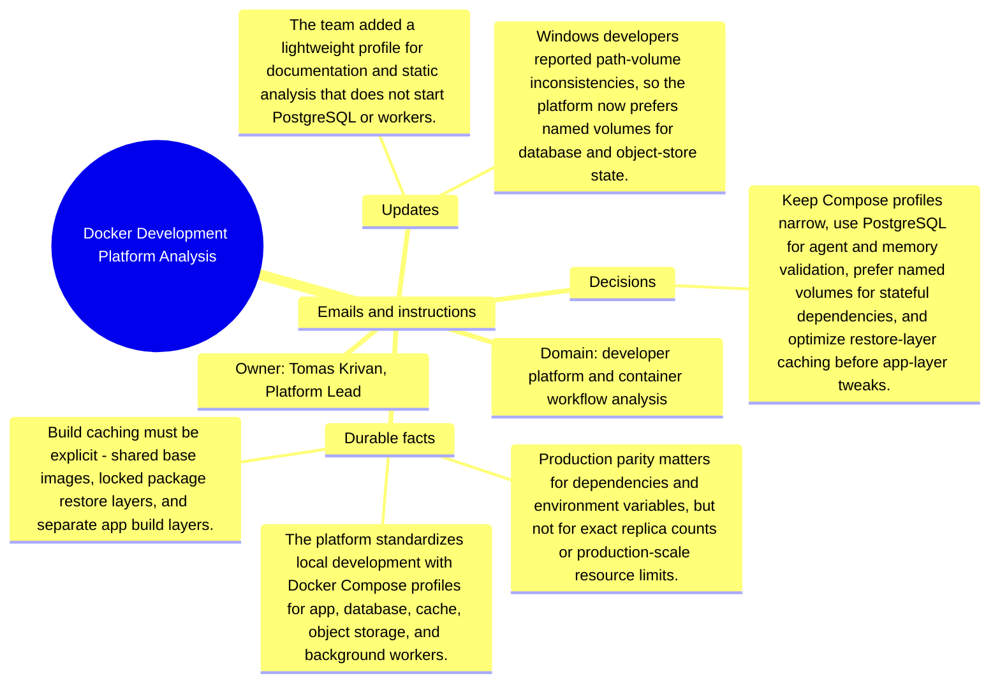

# Emails and instructions: Docker Development Platform Analysis

Source package: docker-platform-s04
Project domain: developer platform and container workflow analysis
Named owner: Tomas Krivan, Platform Lead
Intended ingestion: Markdown email bundle as a project asset node and as an external file.
Expected consolidation behavior: preserve email-specific facts with source attribution and do not turn instructions into unsupported project facts.

## Email 1: Compose profile scope

From: tomas.krivan@platform.example
To: tomas.krivan,.platform.lead@demo.example
Project: Docker Development Platform Analysis
Message:

Do not make the default profile start everything. The default should start app plus required dependencies. Workers, email capture, object storage, and observability are opt-in profiles.

## Email 2: Instruction: PostgreSQL for agent-memory validation

From: qa.platform@example
To: tomas.krivan,.platform.lead@demo.example
Project: Docker Development Platform Analysis
Message:

All agent automation and cognitive-memory behavior tests must run on PostgreSQL. SQLite compatibility can be tested separately, but it is not the proof path for this bundle.

## Operator Instruction For Memory Review

- Treat email messages as source evidence with sender, subject, and stage.
- Approve durable facts only when they are useful for later project work.
- Reject or mark needs-changes for vague reminders, one-off scheduling chatter, or facts that duplicate a stronger source.
- During chat validation, ask one question that requires this email packet and one question that should ignore this email packet.

## Mindmap

