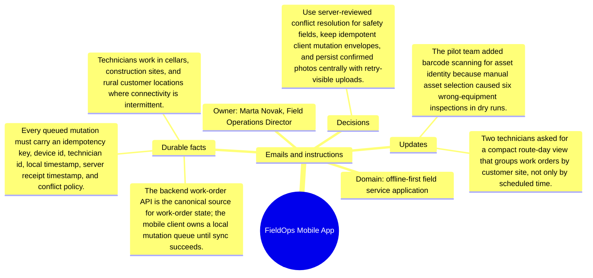

# Emails and instructions: FieldOps Mobile App

Source package: fieldops-mobile-s04
Project domain: offline-first field service application
Named owner: Marta Novak, Field Operations Director
Intended ingestion: Markdown email bundle as a project asset node and as an external file.
Expected consolidation behavior: preserve email-specific facts with source attribution and do not turn instructions into unsupported project facts.

## Email 1: Pilot incident: missing photo after cellar inspection

From: marta.novak@fieldops.example
To: marta.novak,.field.operations.director@demo.example
Project: FieldOps Mobile App
Message:

Technician R-17 completed the pump inspection offline. The checklist synced, but two photos stayed local and the supervisor did not see the failure until the next morning. Treat photo upload status as a first-class task state, not as a hidden background detail.

## Email 2: Instruction: conflict review wording

From: qa.lead@fieldops.example
To: marta.novak,.field.operations.director@demo.example
Project: FieldOps Mobile App
Message:

When the app detects conflicting safety answers, show both technician values, the server value, timestamps, and the supervisor decision. Do not summarize a conflict as a generic sync warning.

## Operator Instruction For Memory Review

- Treat email messages as source evidence with sender, subject, and stage.
- Approve durable facts only when they are useful for later project work.
- Reject or mark needs-changes for vague reminders, one-off scheduling chatter, or facts that duplicate a stronger source.
- During chat validation, ask one question that requires this email packet and one question that should ignore this email packet.

## Mindmap

