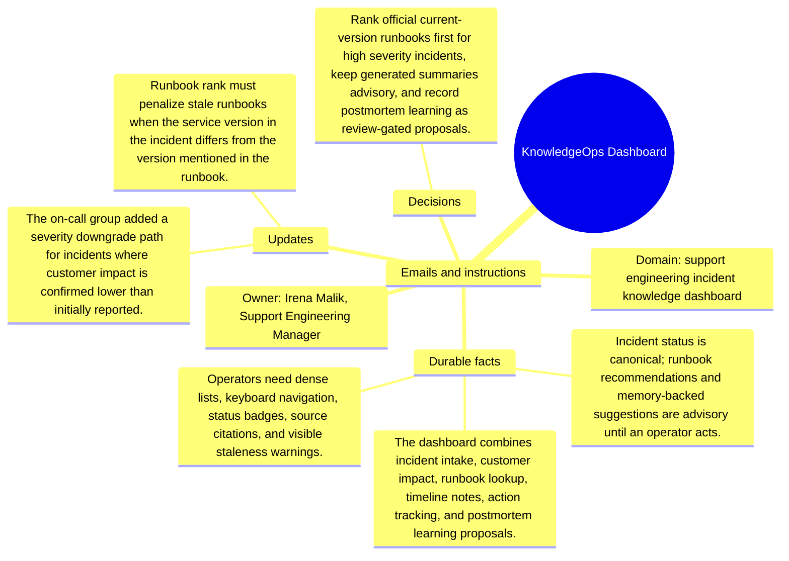

# Emails and instructions: KnowledgeOps Dashboard

Source package: knowledgeops-dashboard-s04
Project domain: support engineering incident knowledge dashboard
Named owner: Irena Malik, Support Engineering Manager
Intended ingestion: Markdown email bundle as a project asset node and as an external file.
Expected consolidation behavior: preserve email-specific facts with source attribution and do not turn instructions into unsupported project facts.

## Email 1: Runbook staleness caused wrong mitigation

From: irena.malik@support.example
To: irena.malik,.support.engineering.manager@demo.example
Project: KnowledgeOps Dashboard
Message:

The dashboard suggested a restart sequence for API Gateway 3.1 during an API Gateway 4.0 incident. The recommendation was plausible but stale. Memory must preserve version context and the source date.

## Email 2: Instruction: timeline citation copy

From: ops.tooling@support.example
To: irena.malik,.support.engineering.manager@demo.example
Project: KnowledgeOps Dashboard
Message:

When copying a suggested mitigation into the incident timeline, include source title, runbook version, and confidence label. Do not paste uncited memory text.

## Operator Instruction For Memory Review

- Treat email messages as source evidence with sender, subject, and stage.
- Approve durable facts only when they are useful for later project work.
- Reject or mark needs-changes for vague reminders, one-off scheduling chatter, or facts that duplicate a stronger source.
- During chat validation, ask one question that requires this email packet and one question that should ignore this email packet.

## Mindmap

