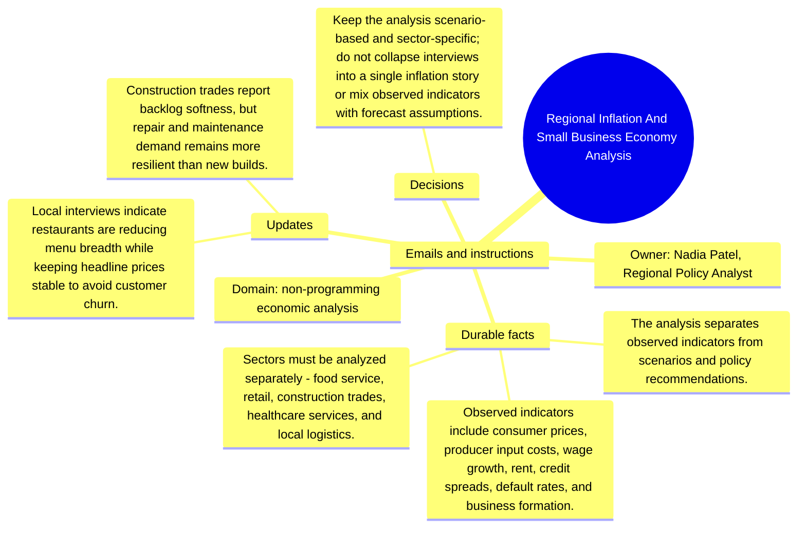

# Emails and instructions: Regional Inflation And Small Business Economy Analysis

Source package: regional-economy-s04
Project domain: non-programming economic analysis
Named owner: Nadia Patel, Regional Policy Analyst
Intended ingestion: Markdown email bundle as a project asset node and as an external file.
Expected consolidation behavior: preserve email-specific facts with source attribution and do not turn instructions into unsupported project facts.

## Email 1: Interview note: restaurant menu breadth

From: nadia.patel@region.example
To: nadia.patel,.regional.policy.analyst@demo.example
Project: Regional Inflation And Small Business Economy Analysis
Message:

Owners say they are dropping low-margin items rather than raising every price. Memory should preserve this as a food-service-specific response, not as a general small-business rule.

## Email 2: Instruction: separate observed facts from scenarios

From: review.board@region.example
To: nadia.patel,.regional.policy.analyst@demo.example
Project: Regional Inflation And Small Business Economy Analysis
Message:

When summarizing the economy analysis, label observed indicators, interview evidence, scenario assumptions, and recommendations separately. Do not present a scenario as a measured fact.

## Operator Instruction For Memory Review

- Treat email messages as source evidence with sender, subject, and stage.
- Approve durable facts only when they are useful for later project work.
- Reject or mark needs-changes for vague reminders, one-off scheduling chatter, or facts that duplicate a stronger source.
- During chat validation, ask one question that requires this email packet and one question that should ignore this email packet.

## Mindmap

