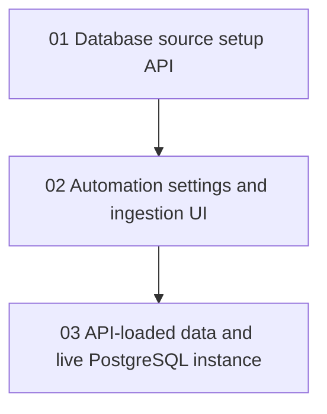

# Phase Plan

## Phase Sequence

1. Implement PostgreSQL-first database setup APIs and runtime alignment.
2. Implement automation settings, manual ingestion controls, external source ingestion, and UI tabs.
3. Load sample data through APIs into a new PostgreSQL database and leave the app running.
4. Run final closure audit and bundle validation.

## Subbundle Dependency Map

## Critical Subbundles

- Subbundle 01 is the foundation because all later proof must run against the same PostgreSQL database.
- Subbundle 02 is the UI/API foundation because sample data loading depends on external source APIs and manual ingestion controls.
- Subbundle 03 is the closure phase because it proves the live manual-testing path.

## Phase Gates

- Gate after preparation: run the bundle validator and repair failures.
- Gate before each subbundle: confirm prerequisites are complete and still valid.
- Gate after each subbundle: capture proof, review screenshots, and decide whether downstream work may continue.
- Gate before closure: rerun validators, close raw notes, and reopen anything with weak proof.
