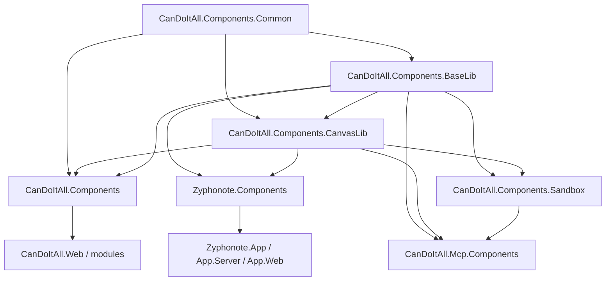

# Target Architecture

## Library Responsibilities

| Library | Responsibility | Allowed dependencies | Must not contain |
| --- | --- | --- | --- |
| `CanDoItAll.Components.Common` | light UI models, enums, helper primitives, shared low-level value objects | BCL, light ASP.NET abstractions only if unavoidable | branded components, JS interop, app services, heavy infra |
| `CanDoItAll.Components.BaseLib` | merged wrapper components, generic surfaces, layout primitives, notification/dialog services, shared icons/assets, light CSS/JS helpers | `Common`, `Microsoft.AspNetCore.Components*` | canvas runtime, app-specific shells, copied app-global CSS |
| `CanDoItAll.Components.CanvasLib` | canvas models, contracts, runtime components, JS interop, canvas CSS, canvas-specific helpers | `Common`, optionally `BaseLib` | app shells, preview-only demo components |
| `CanDoItAll.Components.Sandbox` | demo app, component catalog, fake data scenarios, visual tuning, doc examples | `Common`, `BaseLib`, `CanvasLib` | production app logic |
| `CanDoItAll.Mcp.Components` | read-only component documentation MCP server | `Common`, metadata/docs from `BaseLib`, `CanvasLib`, `Sandbox` | runtime UI |
| `CanDoItAll.Components` | CanDoItAll-only composed components and shells | `Common`, `BaseLib`, `CanvasLib`, CanDoItAll-specific deps | generic wrappers intended for reuse |
| `Zyphonote.Components` | Zyphonote-only composed components | `BaseLib`, `CanvasLib`, Zyphonote-specific deps | direct ownership of shared library internals |

## Proposed Dependency Graph

## Namespace Guidance

- Use the library name as the root namespace.
- Do not keep the long-term shared API under `Radzen.*`.
- Accept temporary compatibility facades during migration, but the final shared namespace must be explicit:
  - `CanDoItAll.Components.Common`
  - `CanDoItAll.Components.BaseLib`
  - `CanDoItAll.Components.CanvasLib`
- Temporary app-local compatibility wrappers are acceptable inside `CanDoItAll.Components` and `Zyphonote.Components` if they reduce adoption churn.

## What Moves Where

### `Common`

Move only truly light cross-library primitives here:

- layout enums and simple shared value types that are not bound to a specific component family
- CSS/class helper primitives if they are not tied to a branded component system
- neutral identifier/value models used by both `BaseLib` and `CanvasLib`

Do not move `NotificationService`, `StyledComponentBase`, icon catalogs, or component-specific enums here just because they are small. Keep ownership close to where behavior lives.

### `BaseLib`

This library should absorb:

- merged wrapper components from `CanDoItAll.Components` and `Zyphonote.App.Components`
- generic surface/layout components now in `CanDoItAll.ComponentKit\Components`
- selected generic components from `Zyphonote\App.Blazor\Components`
- local icon assets and icon resolution helpers
- small component-specific CSS sources that are not worth forcing into utility classes

### `CanvasLib`

This library should absorb:

- everything under `C:\repositories\CanDoItAll\src\CanDoItAll.ComponentKit\Canvas`
- canvas runtime Razor components from `C:\repositories\CanDoItAll\src\CanDoItAll.ComponentKit\Components`
- canvas JS under `C:\repositories\CanDoItAll\src\CanDoItAll.ComponentKit\wwwroot\js`
- `canvas-workbench.css`

### Sandbox Only

The following category must not remain in runtime libraries:

- preview components
- tuning boundaries
- demo scaffolds
- fake-data adapters used only for inspection

## Promotion Rules

- Promote only components that are app-agnostic in name, behavior, and dependency shape.
- If a component mostly exists to render branded classes from one app stylesheet, treat it as app-specific first and refactor before sharing.
- If a component is a demo shell around an internal service, move it to the sandbox.
- If a component exposes stringly-typed tones, variants, or modes today, keep the migration small first and convert to stronger types in the shared owner, not in app pages.

## Anti-Rules

- Do not turn `AppShell` and `AppTabStrip` into shared components.
- Do not move `zy-sheet-*` global CSS into `BaseLib` as-is.
- Do not let Zyphonote own the final implementation of shared library projects.
- Do not break current runtime consumers just to reach the target namespace immediately; use compatibility staging where useful.
