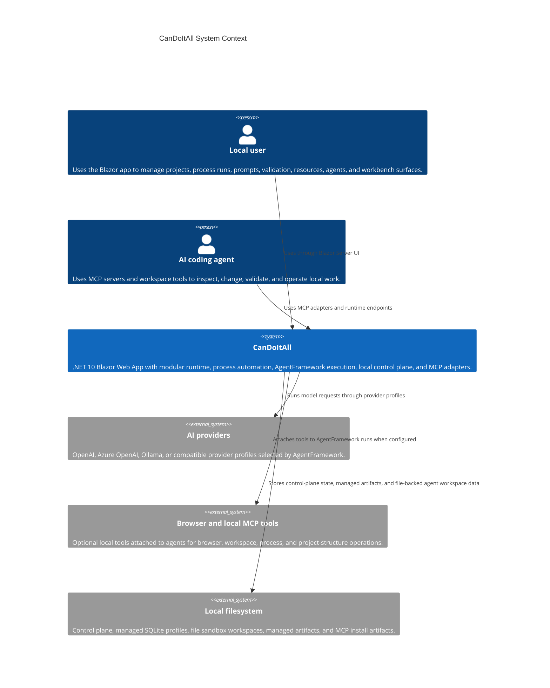
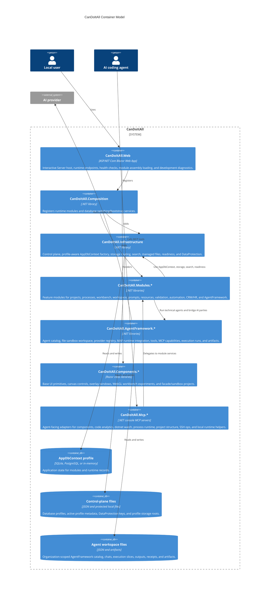
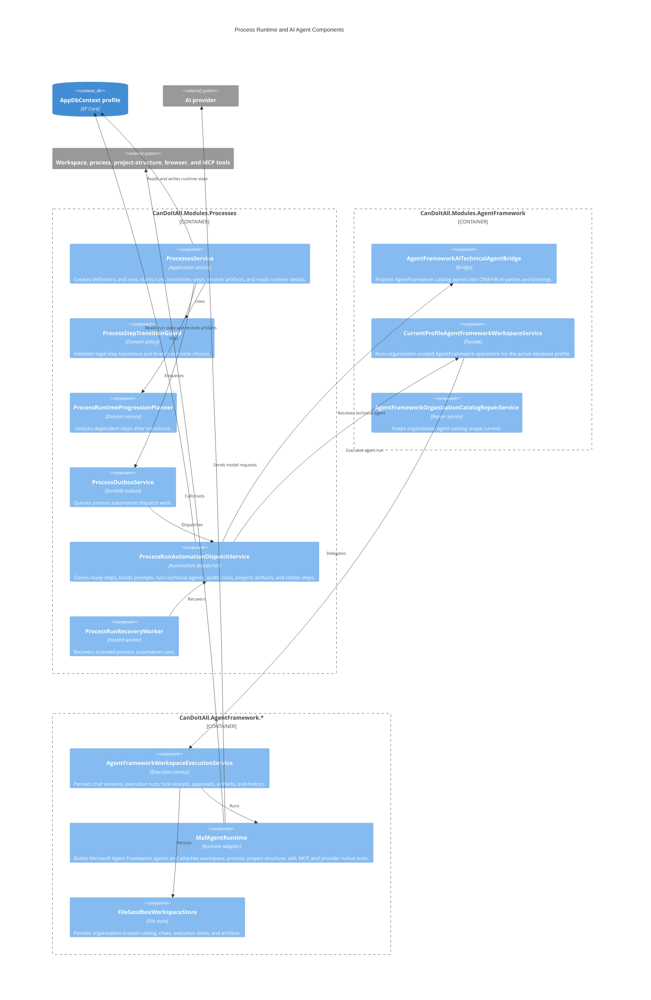
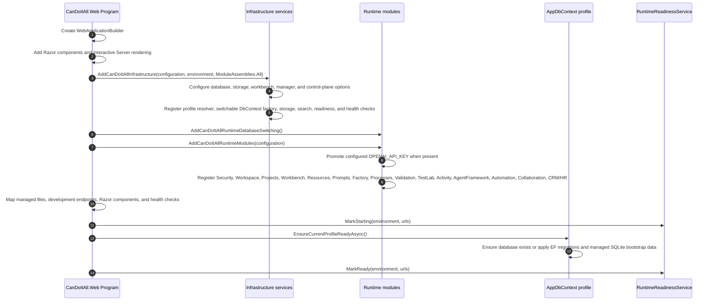
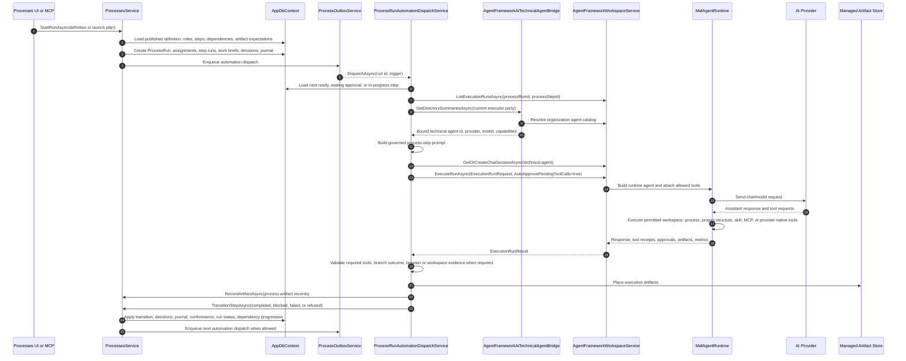
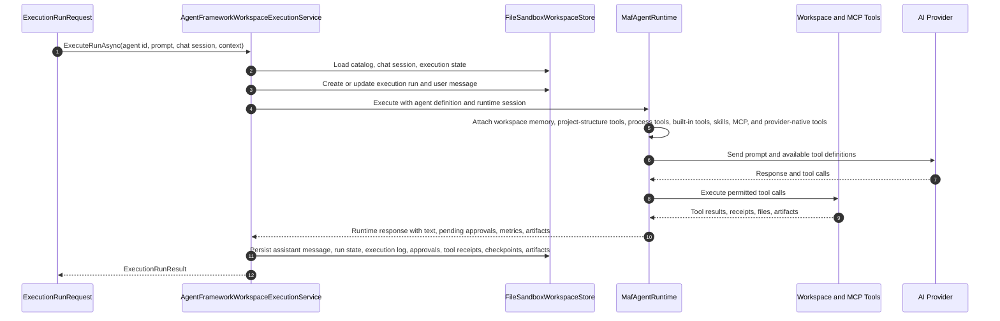

# CanDoItAll Architecture Beta

This page describes the current CanDoItAll architecture as of 2026-04-26. It is source-grounded in the current `CanDoItAll.slnx`, `CanDoItAll.Web`, `CanDoItAll.Composition`, `CanDoItAll.Infrastructure`, `CanDoItAll.Modules.Processes`, `CanDoItAll.Modules.AgentFramework`, and `CanDoItAll.AgentFramework.*` projects.

## Current Shape

CanDoItAll is a local-first .NET 10 Blazor Web App. The web host composes product modules, infrastructure, shared components, control-plane database profiles, MCP-facing developer services, and an AgentFramework-backed AI execution runtime.

The important architecture rule is simple: product semantics live in modules and shared services, while MCP servers and tools expose those semantics to agents. MCP projects are adapters, not competing implementations.

Primary source references:

- [`src/CanDoItAll.Web/Program.cs`](../src/CanDoItAll.Web/Program.cs)
- [`src/CanDoItAll.Composition/RuntimeHostServiceCollectionExtensions.cs`](../src/CanDoItAll.Composition/RuntimeHostServiceCollectionExtensions.cs)
- [`src/CanDoItAll.Composition/ModuleAssemblies.cs`](../src/CanDoItAll.Composition/ModuleAssemblies.cs)
- [`src/CanDoItAll.Infrastructure/DependencyInjection/InfrastructureServiceCollectionExtensions.cs`](../src/CanDoItAll.Infrastructure/DependencyInjection/InfrastructureServiceCollectionExtensions.cs)
- [`src/CanDoItAll.Modules.Processes/ProcessesModuleServiceCollectionExtensions.cs`](../src/CanDoItAll.Modules.Processes/ProcessesModuleServiceCollectionExtensions.cs)
- [`src/CanDoItAll.Modules.Processes/ProcessRunAutomationDispatchService.cs`](../src/CanDoItAll.Modules.Processes/ProcessRunAutomationDispatchService.cs)
- [`src/CanDoItAll.Modules.AgentFramework/AgentFrameworkModuleServiceCollectionExtensions.cs`](../src/CanDoItAll.Modules.AgentFramework/AgentFrameworkModuleServiceCollectionExtensions.cs)
- [`src/CanDoItAll.AgentFramework.Maf/MafAgentRuntime.Capabilities.cs`](../src/CanDoItAll.AgentFramework.Maf/MafAgentRuntime.Capabilities.cs)

## Architecture Beta Overview

## C4 Context

## C4 Containers

## C4 Process And Agent Components

## Runtime Startup Sequence

The startup sequence is important because module services assume the active database profile and file storage roots are ready before the web app is considered healthy. In development, `/_dev/runtime` exposes readiness, watch iteration, runtime PID, owner metadata, hot reload generation, and active URLs.

## Process Execution With AI Agents

The process runtime is durable. It does not simply call an agent and hope the session finishes. It materializes process state, records assignments and artifacts, uses transition guards, writes outbox records, detects stranded execution runs, and projects AgentFramework artifacts back into process evidence.

### Process Run Sequence

### Step Selection And Dispatch

`ProcessRunAutomationDispatchService` only considers active runs and steps in `Ready`, `WaitingApproval`, or `InProgress`. For each candidate step it:

- skips steps without a current executor party
- checks for active or recoverable execution runs for the same process run and step
- resolves manual recovery directives from process journal entries
- resolves the executor party to an AgentFramework technical agent through `IAiTechnicalAgentBridge`
- prepares upstream durable artifact inputs for the prompt
- loads expected artifacts and branch outcomes
- detects when a step must explicitly select a branch outcome because downstream dependencies are conditional

If the bridge cannot resolve a bound technical agent, the dispatcher logs the diagnostic and moves to another eligible step instead of fabricating an executor.

### Prompt Contract

The dispatcher prompt starts with `You are executing a CanDoItAll process step.` It includes:

- process name, run name, step title, and executor name
- run objective and project-structure context when present
- work brief, handoff summary, expected outcome, and evidence expectation
- required output artifacts and response contract
- upstream artifacts and governed artifact inspection rules
- available branch outcomes
- recovery directive when a previous run is being repaired
- governed evidence rules for `workspace_stat_path`, `workspace_read_file`, browser proof, build/test proof, and concrete product write tools when the step requires them

This prompt is intentionally stricter than a generic chat message. It makes tool and evidence use part of the step contract, not optional assistant behavior.

### Completion And Recovery

The dispatcher executes a step until it reaches a settled outcome or exhausts the step-specific attempt limit. It can:

- recover an existing AgentFramework execution run for a stranded step
- adopt a concurrently-started run when another dispatcher instance already claimed the chat session
- inspect failed execution detail after `AgentChatRunFailedException`
- detect missing governed tools or evidence
- retry recoverable gaps
- switch affected agents to a healthy fallback provider when provider failure is recoverable
- project non-transient execution artifacts into managed storage
- record process artifacts against expected artifact definitions when possible
- transition the process step with an explicit completion reason

Required artifacts gate completion in `ProcessesService.Runtime.StepTransitions.cs`. A step cannot complete until required artifacts are recorded.

## AgentFramework Tool And Artifact Sequence

Tool approval is modeled in execution state. Process automation passes `AutoApprovePendingToolCalls=true`, and `AgentFrameworkWorkspaceExecutionService` can continue approved pending tool calls when the agent/session policy allows it. For normal interactive agent use, approvals can remain explicit.

## Persistence And Control Plane

CanDoItAll uses two different persistence concepts:

- Application database profiles store module data through `AppDbContext`. The active provider can be SQLite, PostgreSQL, or in-memory for tests. Runtime database switching is mediated by profile services, a switchable DbContext factory, and `DatabaseSwitchCoordinator`.
- Control-plane and workspace files live outside the selected application database. The control plane stores profile metadata and DataProtection keys. AgentFramework file sandbox stores organization-scoped catalog, chats, execution runs, artifacts, receipts, and output files under the active profile workspace root.

This separation lets the selected app database change without losing machine-level profile metadata or AgentFramework file workspace shape.

## Module Boundaries

| Area | Responsibility |
| --- | --- |
| `CanDoItAll.Web` | Host, routes, Razor component bootstrapping, development endpoints, runtime readiness, health checks. |
| `CanDoItAll.Composition` | Runtime module registration, module assembly list, database profile bootstrapping and switching. |
| `CanDoItAll.Infrastructure` | AppDbContext factory, control plane, storage, search, readiness, managed artifacts, DataProtection, health. |
| `CanDoItAll.Modules.Processes` | Process definitions, template pack import/projection, process canvas, run state, transitions, outbox, recovery, agent dispatch, artifact records. |
| `CanDoItAll.Modules.AgentFramework` | Current-profile AgentFramework facade, CRM/HR AI-party bridge, provider runtime gateway, catalog warmup and repair. |
| `CanDoItAll.AgentFramework.Core` | Agent catalog services, execution service, workspace tools, command/file/artifact policies, execution audit trail. |
| `CanDoItAll.AgentFramework.Maf` | Microsoft Agent Framework integration, provider transport, capability composition, MCP integration, tool execution wrappers. |
| `CanDoItAll.Components.*` | Shared UI primitives, canvas, overlays, WebGL workbench experiments, facade/sandbox projects. |
| `CanDoItAll.Mcp.*` | Local or remote MCP adapters that expose canonical module/runtime behavior to agents. |

## MCP Boundaries

MCP projects are adapters:

- `CanDoItAll.Mcp.Processes` uses the same process module and active database profile as the web host.
- `CanDoItAll.Mcp.ProjectStructure` is a thin client against the web instance project-structure API.
- `CanDoItAll.Mcp.DotNetWatch` supervises development watch sessions and exposes readiness/log/status operations.
- `CanDoItAll.Mcp.CodeAnalytics` uses the sibling CodeAnalytics libraries to inspect solution and dependency facts.
- `CanDoItAll.Mcp.Components` exposes component-library discovery data to agents.
- `CanDoItAll.Mcp.SshOps` exposes SSH operations through explicit settings and policy.

The canonical rule is that MCP tools should call application services or specialized libraries. They should not fork process, project, storage, or AgentFramework behavior.

## Validation Guidance

For documentation changes:

- Check that project README coverage is complete for tracked `.csproj` directories.
- Check for required diagram block types when the architecture doc is changed.
- Run `git diff --check`.

For process or AgentFramework behavior changes:

- Add or update tests around `ProcessesService`, `ProcessRunAutomationDispatchService`, and AgentFramework execution records.
- Validate required artifact gates and branch outcome selection.
- Validate recovery and provider fallback only with explicit test data.
- Use browser proof only when UI behavior changes.
