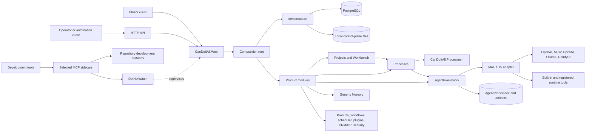
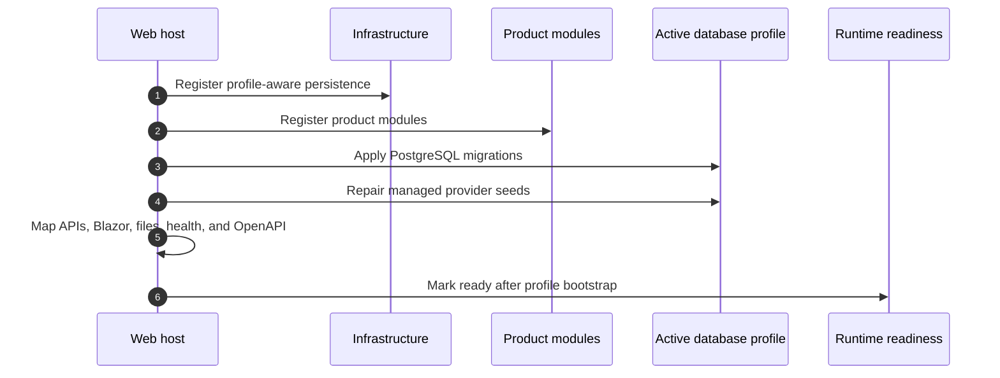
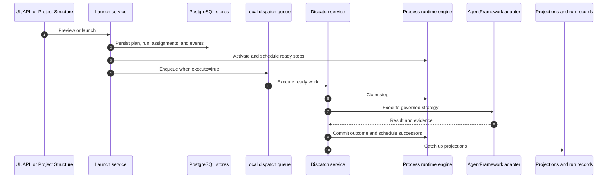

# CanDoItAll Architecture (Beta)

Last source review: 2026-07-28.

CanDoItAll is a local-first .NET 10 Blazor Web App. The base host composes product modules, PostgreSQL persistence, HTTP APIs, the provider-neutral Memory subsystem, Microsoft Agent Framework (MAF), and selected development integrations.

The durable boundary rule is: domain and application services own behavior; Blazor components, HTTP endpoints, runtime tools, and MCP sidecars adapt that behavior. They must not become parallel implementations.

## System Shape



## Composition And Ownership

The active module list is defined by [`ModuleAssemblies.cs`](../src/App/CanDoItAll.Composition/ModuleAssemblies.cs) and registered by [`RuntimeHostServiceCollectionExtensions.cs`](../src/App/CanDoItAll.Composition/RuntimeHostServiceCollectionExtensions.cs).

| Area | Owns |
| --- | --- |
| `CanDoItAll.Web` | Blazor host, endpoint mapping, OpenAPI, readiness, health, and managed-file routes. |
| `CanDoItAll.Composition` | Module registration, active database bootstrap, managed provider seeding, and generic Memory driver selection. |
| `CanDoItAll.Infrastructure` | Database profiles, `AppDbContext`, control-plane state, secrets, managed files, and runtime readiness. |
| `CanDoItAll.Modules.Workbench` | Project Structure UI/application boundary, API adapter, runtime tools, and process/workflow node bridges. |
| `CanDoItAll.Processes.*` | Process identifiers, definitions, compiler, runtime engine, persistence, projections, run records, and application services. |
| `CanDoItAll.Modules.Processes` | Process UI, DI, launch/dispatch workers, AgentFramework execution adapter, recovery, and operator integration. |
| `CanDoItAll.AgentFramework.*` | Provider-neutral agent models/runtime contracts, MAF adapter, provider drivers, workflows, memory integration, tools, telemetry, and persistence. |
| `CanDoItAll.Memory.*` and `CanDoItAll.Modules.Memory` | Generic memory contracts, provider profiles/drivers, persistence/workers, runtime tools, and `/memory` UI. |
| Other product modules | Projects, prompts, plugins, scheduler, collaboration, CRM/HR, resources, security, workspace, and test-lab behavior. |
| `CanDoItAll.AppComponents` | Product-facing component facade over shared component packages. Shared component source remains in the sibling `CanDoItAll.Components` repository. |

The base repository contains no native Cognitive Memory implementation or API.
Native Cognitive Memory is owned by its standalone, unpublished work-in-progress
repository and can be configured only as an explicit remote-provider integration.

## Startup



`GET /_dev/runtime` is the local diagnostics/readiness endpoint. `GET /api/access/status` reports API access configuration.

## Persistence

PostgreSQL is the supported runtime database. The InMemory driver exists for tests. SQLite runtime profiles and migrations are retired and must not be reintroduced through documentation or fallback logic.

The system separates:

- PostgreSQL state: module data, process state/events, projections, run records, provider profiles, and other EF-managed state.
- Local control-plane/workspace state: profile metadata, Data Protection keys, agent workspace files, artifacts, receipts, and local tool output.

Switching the selected database profile is restart-bound. A successful profile selection does not mutate the current process into the new canonical profile.

## Process Runtime

[`ProcessLaunchApplicationService`](../src/Processes/CanDoItAll.Processes.Application/ProcessLaunchApplicationService.cs) prepares and persists a compiled launch. [`ProcessRuntimeDispatchApplicationService`](../src/Processes/CanDoItAll.Processes.Application/ProcessRuntimeDispatchApplicationService.cs) claims ready work and delegates AgentFramework steps through [`AgentFrameworkProcessExecutionAdapter`](../src/Modules/CanDoItAll.Modules.Processes/Services/RuntimeIntegration/AgentFrameworkProcessExecutionAdapter.cs).



The dispatch queue is bounded and process-local; process state and run records are durable. Recovery scans reconcile persisted active work. See the [process operator runbook](process-agent-operator-runbook.md) for current defaults and routes.

## MAF And Runtime Tools

Package versions are centralized in [`MicrosoftAgentFramework.Packages.props`](../src/MAF/MicrosoftAgentFramework.Packages.props):

- stable: `1.15.0`
- preview: `1.15.0-preview.260722.1`

[`MafAgentRuntime`](../src/MAF/Common/CanDoItAll.AgentFramework.Maf/Runtime/MafAgentRuntime.cs) builds execution sessions and delegates capability composition to the runtime capability components. Current first-party `IAgentRuntimeToolProvider` implementations cover:

- Memory
- Project Structure
- Image Generation
- Workflow
- Prompt Gallery
- Prompts Curator
- Workflow Curator
- Capability Curator
- HR
- Scheduler

Registration does not grant access. Attachment is filtered by execution purpose, capability assignment, agent permissions, scope, and tool invocation policy. See [Agent runtime tool surface](agent-runtime-tool-surface.md).

## Provider Runtime And Bootstrap

The concrete AI provider drivers are OpenAI, Azure OpenAI, Ollama, and ComfyUI. Runtime handles are pooled by provider descriptor; profile revisions and dispatch lane gates constrain reuse and concurrency. Provider errors are normalized into quota/billing, rate-limit, and general provider failures with redacted diagnostics.

Database bootstrap normalizes the managed OpenAI chat profiles and seeds missing catalog profiles for OpenAI image generation (`gpt-image-1-mini`), local ComfyUI Flux (`flux1-dev.safetensors`), and local Ollama (`llama3.1`). Credentials remain environment- or secret-backed; bootstrap does not put raw credentials into tracked configuration.

See [Provider capability and pricing](provider-capability-and-pricing.md).

## Generic Memory

[`MemoryRuntimeServiceCollectionExtensions.cs`](../src/App/CanDoItAll.Composition/Memory/MemoryRuntimeServiceCollectionExtensions.cs) registers the generic memory module and conditionally adds provider drivers:

- deterministic mock
- HTTP
- native remote
- MCP

All four drivers and memory background workers are disabled in the base configuration. Enabling a driver is an explicit deployment decision. The base host has no implicit Qdrant dependency.

The experimental `/api/memory-providers` family exposes provider profiles and the
supported provider-neutral operations. Native service APIs are not mapped by this host.
Current setup is documented in [Memory providers](memory-providers/README.md).

## External Boundaries

- HTTP route families: access, projects, Project Structure, agents, agent recruiting, Prompt Gallery, workflows, processes, memory providers, plugins, and CRM/HR.
- MCP development sidecars: Code Analytics, Components, DotNetWatch, Mermaid, and SSH operations from the sibling `CanDoItAll.Mcp` repository.
- Reusable repository standards and operator skills: sibling `CanDoItAll.SharedInfo`.
- Shared Blazor component source: sibling `CanDoItAll.Components`.

The suppressed Processes and Project Structure MCP servers are not supported control-plane paths. Use their HTTP APIs. See [API control plane](api-control-plane.md).

## Validation

For documentation-only changes:

```powershell
git diff --check
```

For source changes, run focused tests for the owning module and then the stable gate in [Testing](testing.md).
