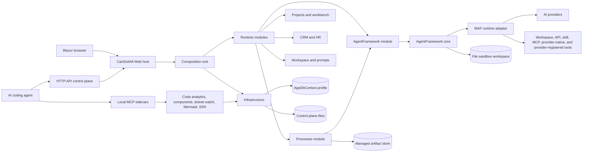
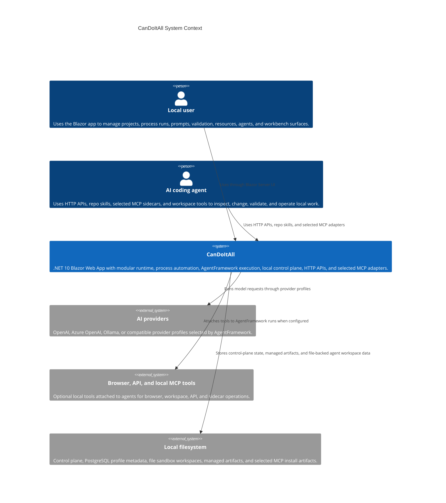
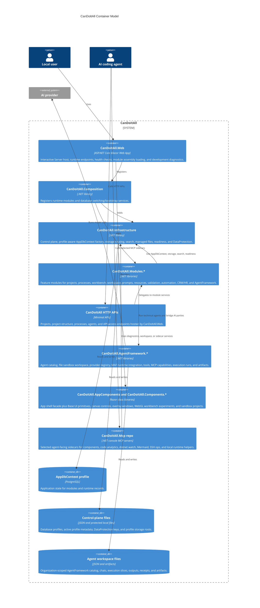
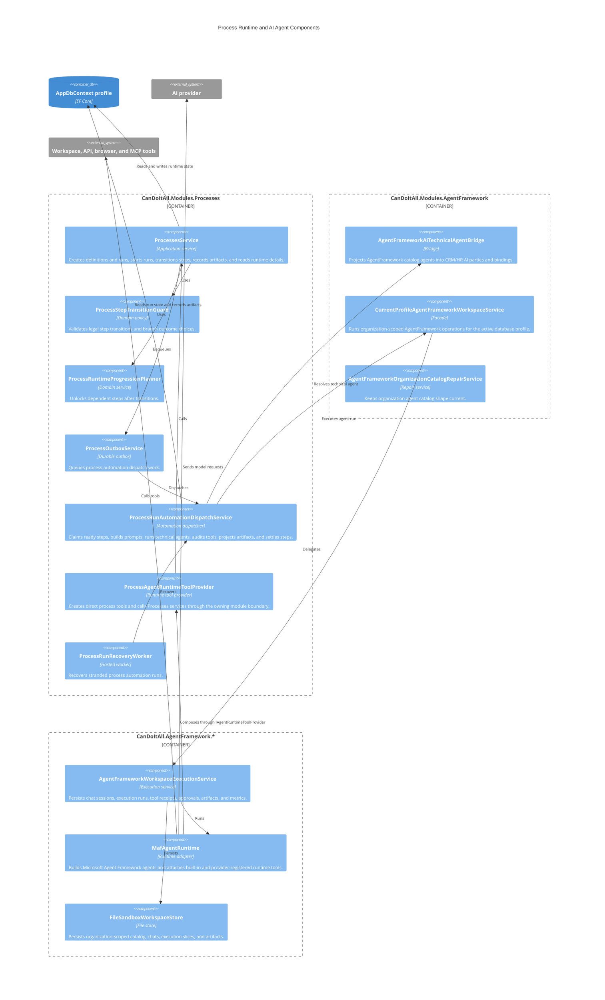
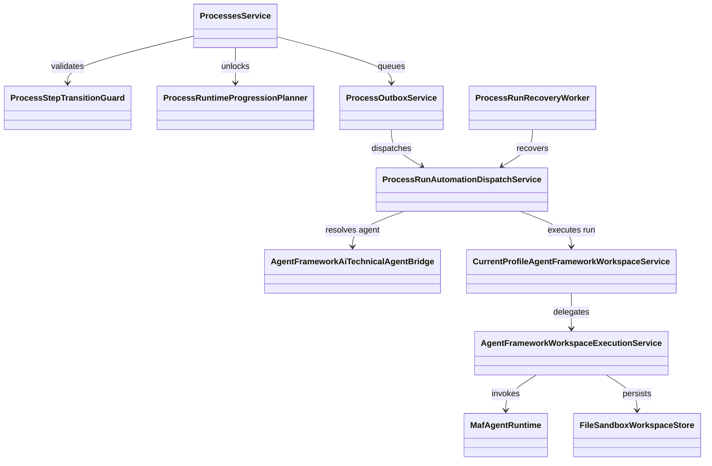
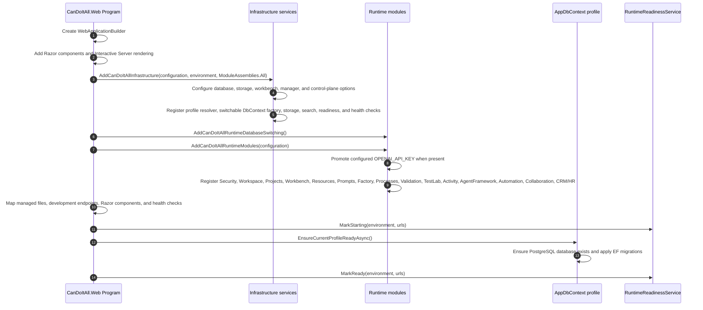
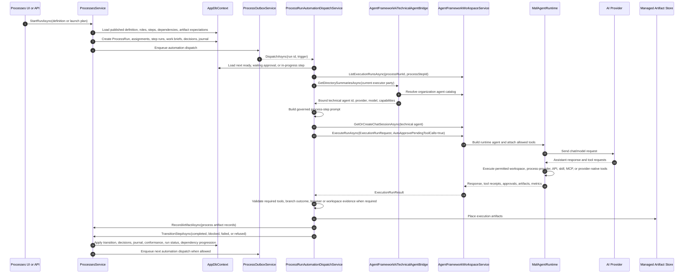
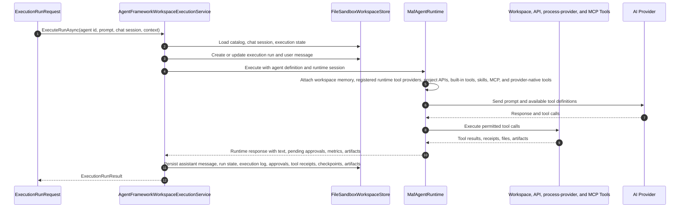

# CanDoItAll Architecture Beta

This page describes the current CanDoItAll architecture as of 2026-06-04. It is source-grounded in the current `CanDoItAll.slnx`, `CanDoItAll.Web`, `CanDoItAll.Composition`, `CanDoItAll.Infrastructure`, `CanDoItAll.Modules.Processes`, `CanDoItAll.Modules.AgentFramework`, and `CanDoItAll.AgentFramework.*` projects.

## Current Shape

CanDoItAll is a local-first .NET 10 Blazor Web App. The web host composes product modules, infrastructure, shared components, control-plane database profiles, HTTP APIs, selected MCP-facing developer sidecars, and an AgentFramework-backed AI execution runtime. MCP sidecar source lives in the sibling `CanDoItAll.Mcp` repository; this repo owns their workspace settings and installed artifacts.

The important architecture rule is simple: product semantics live in modules and shared services. HTTP APIs and MCP tools expose those semantics to agents and external automation; they must not become competing implementations. Process, project-structure, and agent automation now uses the web-hosted API control plane. The old Processes and ProjectStructure MCP servers are suppressed in the current repo state.

Current Cognitive Memory details now live in [docs/cognitive-memory](cognitive-memory/README.md). Treat that section as the source of truth for Cognitive Memory stage, diagrams, API, validation, and roadmap; this architecture beta page remains the broader system overview.

Primary source references:

- [`src/CanDoItAll.Web/Program.cs`](../src/CanDoItAll.Web/Program.cs)
- [`src/CanDoItAll.Composition/RuntimeHostServiceCollectionExtensions.cs`](../src/CanDoItAll.Composition/RuntimeHostServiceCollectionExtensions.cs)
- [`src/CanDoItAll.Composition/ModuleAssemblies.cs`](../src/CanDoItAll.Composition/ModuleAssemblies.cs)
- [`src/CanDoItAll.Infrastructure/DependencyInjection/InfrastructureServiceCollectionExtensions.cs`](../src/CanDoItAll.Infrastructure/DependencyInjection/InfrastructureServiceCollectionExtensions.cs)
- [`src/CanDoItAll.Modules.Processes/Services/ProcessesModuleServiceCollectionExtensions.cs`](../src/CanDoItAll.Modules.Processes/Services/ProcessesModuleServiceCollectionExtensions.cs)
- [`src/CanDoItAll.Modules.Processes/Automation/Dispatch/ProcessRunAutomationDispatchService.cs`](../src/CanDoItAll.Modules.Processes/Automation/Dispatch/ProcessRunAutomationDispatchService.cs)
- [`src/CanDoItAll.Modules.Processes/AgentTools/ProcessAgentRuntimeToolProvider.cs`](../src/CanDoItAll.Modules.Processes/AgentTools/ProcessAgentRuntimeToolProvider.cs)
- [`src/CanDoItAll.Modules.AgentFramework/Services/AgentFrameworkModuleServiceCollectionExtensions.cs`](../src/CanDoItAll.Modules.AgentFramework/Services/AgentFrameworkModuleServiceCollectionExtensions.cs)
- [`src/CanDoItAll.Modules.AgentFramework/AgentTools/ImageGenerationAgentRuntimeToolProvider.cs`](../src/CanDoItAll.Modules.AgentFramework/AgentTools/ImageGenerationAgentRuntimeToolProvider.cs)
- [`src/CanDoItAll.Modules.Workbench/AgentTools/ProjectStructureAgentRuntimeToolProvider.cs`](../src/CanDoItAll.Modules.Workbench/AgentTools/ProjectStructureAgentRuntimeToolProvider.cs)
- [`src/CanDoItAll.AgentFramework.Tooling/IAgentRuntimeToolProvider.cs`](../src/CanDoItAll.AgentFramework.Tooling/IAgentRuntimeToolProvider.cs)
- [`src/CanDoItAll.AgentFramework.Maf/Runtime/Capabilities/MafAgentRuntime.Capabilities.cs`](../src/CanDoItAll.AgentFramework.Maf/Runtime/Capabilities/MafAgentRuntime.Capabilities.cs)

## Architecture Overview

## C4 Context

## C4 Containers

## C4 Process And Agent Components

## Key Runtime Classes

## Runtime Startup Sequence

The startup sequence is important because module services assume the active database profile and file storage roots are ready before the web app is considered healthy. In development, `/_dev/runtime` exposes readiness, watch iteration, runtime PID, owner metadata, hot reload generation, and active URLs.

## Process Execution With AI Agents

The process runtime is durable. It does not simply call an agent and hope the session finishes. It materializes process state, records assignments and artifacts, uses transition guards, writes outbox records, detects stranded execution runs, and projects AgentFramework artifacts back into process evidence.

### Process Run Sequence

### Step Selection And Dispatch

`ProcessRunAutomationDispatchService` only considers active runs and steps in `Ready`, `WaitingApproval`, or `InProgress`. For each candidate step it:

- skips steps without a current executor party
- checks for active or recoverable execution runs for the same process run and step
- resolves manual recovery directives from process journal entries
- resolves the executor party to an AgentFramework technical agent through `IAiTechnicalAgentBridge`
- prepares upstream durable artifact inputs for the prompt
- loads expected artifacts and branch outcomes
- detects when a step must explicitly select a branch outcome because downstream dependencies are conditional

If the bridge cannot resolve a bound technical agent, the dispatcher logs the diagnostic and moves to another eligible step instead of fabricating an executor.

### Prompt Contract

The dispatcher prompt starts with `You are executing a CanDoItAll process step.` It includes:

- process name, run name, step title, and executor name
- run objective and project-structure context when present
- work brief, handoff summary, expected outcome, and evidence expectation
- required output artifacts and response contract
- upstream artifacts and governed artifact inspection rules
- available branch outcomes
- recovery directive when a previous run is being repaired
- governed evidence rules for `workspace_stat_path`, `workspace_read_file`, browser proof, build/test proof, and concrete product write tools when the step requires them

Stack-specific software-delivery evidence and recovery wording is produced by the read-only `CanDoItAll.Processes.Drivers.SoftwareDeliveryEvidence` package. The dispatcher supplies typed process facts and approved inspection snapshots; it does not keep Blazor, JavaScript, build-host, or static-server policy text in the generic prompt builder.

This prompt is intentionally stricter than a generic chat message. It makes tool and evidence use part of the step contract, not optional assistant behavior.

### Completion And Recovery

The dispatcher executes a step until it reaches a settled outcome or exhausts the step-specific attempt limit. It can:

- recover an existing AgentFramework execution run for a stranded step
- adopt a concurrently-started run when another dispatcher instance already claimed the chat session
- inspect failed execution detail after `AgentChatRunFailedException`
- detect missing governed tools or evidence
- retry recoverable gaps
- switch affected agents to a healthy fallback provider when provider failure is recoverable
- project non-transient execution artifacts into managed storage
- record process artifacts against expected artifact definitions when possible
- transition the process step with an explicit completion reason

Required artifacts gate completion in `ProcessesService.Runtime.StepTransitions.cs`. A step cannot complete until required artifacts are recorded.

## AgentFramework Tool And Artifact Sequence

Tool approval is modeled in execution state. Process automation passes `AutoApprovePendingToolCalls=true`, and `AgentFrameworkWorkspaceExecutionService` can continue approved pending tool calls when the agent/session policy allows it. For normal interactive agent use, approvals can remain explicit.

## Runtime Tool Provider Seam

MAF no longer owns first-party product tool construction directly. `CanDoItAll.AgentFramework.Tooling` defines `IAgentRuntimeToolProvider`; MAF resolves registered providers from DI, orders them deterministically, attaches their tools, records provider descriptors/metadata, and applies the same approval wrapping policy used by built-in tools.

Current first-party runtime providers are owned by their product/module boundary:

- `CanDoItAll.Modules.Processes` registers `ProcessAgentRuntimeToolProvider` and keeps process-specific request handling beside `ProcessesService`, template services, process access checks, and purpose-aware read/write exposure policy.
- `CanDoItAll.Modules.Workbench` registers `ProjectStructureAgentRuntimeToolProvider` and owns project-structure tool construction instead of MAF.
- `CanDoItAll.Modules.AgentFramework` registers `ImageGenerationAgentRuntimeToolProvider` and owns image-generation tool construction instead of MAF.

This is a dependency-inversion seam, not a completed process-core extraction. The process dispatcher, process DTOs, artifact lineage, recovery, and template-pack behavior still live in `CanDoItAll.Modules.Processes`. A future process-core or driver-pack split must be handled as its own migration with parity, policy, and runtime smoke proof.

Provider ownership is observable. MAF progress logs include provider key/display name/tool count, `AgentToolInvocationTrace` can carry `RuntimeToolProviderKey` and `RuntimeToolProviderName`, and provider-owned workspace receipts can include the same optional fields. Empty provider ownership means unknown or pre-existing receipt data, not invalid evidence.

When process tools are missing from an agent run, inspect runtime DI for `IEnumerable<IAgentRuntimeToolProvider>`, verify `ProcessAgentRuntimeToolProvider` is registered, check MAF progress for the registered-provider attachment message and provider key/display name, and inspect `AgentProcessAccessMetadata` before changing runtime code. Do not fix missing tools by adding a direct `CanDoItAll.AgentFramework.Maf` reference to `CanDoItAll.Modules.Processes`.

MAF currently keeps direct module references only for `CanDoItAll.Modules.Security` and `CanDoItAll.Modules.Workspace`. Those are allowed while MAF still needs security/workspace runtime services directly; product tool ownership should continue moving through runtime providers instead of adding new direct product-module references.

## Persistence And Control Plane

CanDoItAll uses two different persistence concepts:

- Application database profiles store module data through `AppDbContext`. The main runtime provider is PostgreSQL-only; in-memory remains limited to explicit test/runtime override scenarios. Runtime database switching is mediated by profile services, a switchable DbContext factory, and `DatabaseSwitchCoordinator`. Legacy SQLite catalog entries are rejected with a clear unsupported-provider message.
- Control-plane and workspace files live outside the selected application database. The control plane stores profile metadata and DataProtection keys. AgentFramework file sandbox stores organization-scoped catalog, chats, execution runs, artifacts, receipts, and output files under the active profile workspace root.

This separation lets the selected app database change without losing machine-level profile metadata or AgentFramework file workspace shape.

## Module Boundaries

| Area | Responsibility |
| --- | --- |
| `CanDoItAll.Web` | Host, HTTP APIs, routes, Razor component bootstrapping, development endpoints, runtime readiness, health checks. |
| `CanDoItAll.Composition` | Runtime module registration, module assembly list, database profile bootstrapping and switching. |
| `CanDoItAll.Infrastructure` | AppDbContext factory, control plane, storage, search, readiness, managed artifacts, DataProtection, health. |
| `CanDoItAll.Modules.Processes` | Process definitions, template pack import/projection, process canvas, run state, transitions, outbox, recovery, agent dispatch, artifact records, and the registered process runtime tool provider. |
| `CanDoItAll.Modules.AgentFramework` | Current-profile AgentFramework facade, CRM/HR AI-party bridge, provider runtime gateway, catalog warmup and repair. |
| `CanDoItAll.AgentFramework.Core` | Agent catalog services, execution service, workspace tools, command/file/artifact policies, execution audit trail. |
| `CanDoItAll.AgentFramework.Maf` | Microsoft Agent Framework integration, provider transport, capability composition, registered runtime tool-provider attachment, MCP integration, and tool execution wrappers. |
| `CanDoItAll.AppComponents`, `CanDoItAll.Components.*` | App shell facade, shared UI primitives, canvas, overlays, WebGL workbench experiments, and sandbox projects. |
| Sibling `CanDoItAll.Mcp` repo | Selected local sidecars for development diagnostics, code analytics, components, Mermaid, SSH, and local runtime helpers. |

## API And MCP Boundaries

The current automation boundary is split deliberately:

- HTTP API: `/api/projects`, `/api/project-structure`, `/api/processes`, `/api/agents`, and `/api/access` are the current process, project-structure, project, and agent control surfaces.
- Repo-managed skills: `candoitall-api-project-structure`, `candoitall-api-processes`, and `candoitall-api-agents` explain how agents should use those APIs.
- Selected MCP sidecars: `CanDoItAll.Mcp.DotNetWatch`, `CanDoItAll.Mcp.CodeAnalytics`, `CanDoItAll.Mcp.Components`, `CanDoItAll.Mcp.Mermaid`, `CanDoItAll.Mcp.SshOps`, and local runtime helpers remain thin adapters for development and inspection. Their source and tests live in the sibling `CanDoItAll.Mcp` repo.
- Suppressed MCPs: `CanDoItAll.Mcp.Processes` and `CanDoItAll.Mcp.ProjectStructure` are not active in the current repo state. Do not reinstall or call `candoitall_processes` or `candoitall_projectstructure`; use the HTTP API replacements.

The canonical rule is that API endpoints and MCP tools call application services or specialized libraries. They should not fork process, project, storage, or AgentFramework behavior.

## Validation Guidance

For documentation changes:

- Check that project README coverage is complete for tracked `.csproj` directories.
- Check for required diagram block types when the architecture doc is changed.
- Run `git diff --check`.

For process or AgentFramework behavior changes:

- Add or update tests around `ProcessesService`, `ProcessRunAutomationDispatchService`, and AgentFramework execution records.
- Validate required artifact gates and branch outcome selection.
- Validate recovery and provider fallback only with explicit test data.
- Use browser proof only when UI behavior changes.
