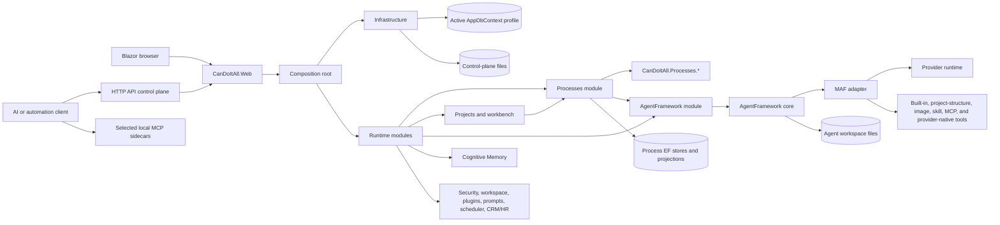
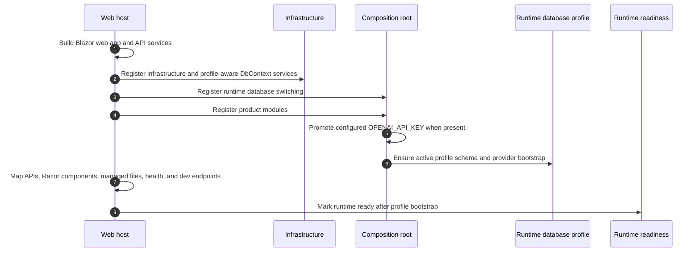
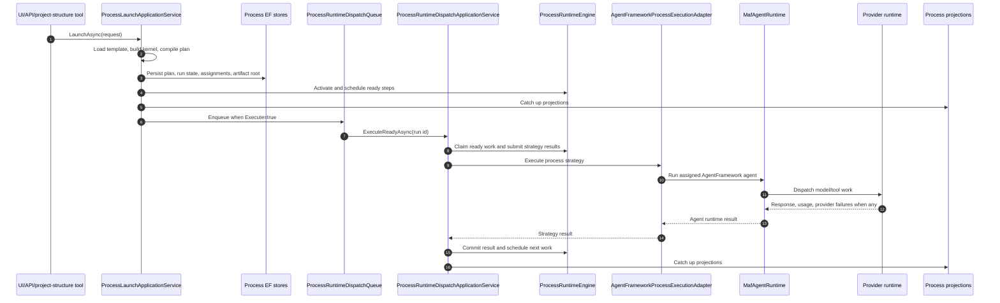

# CanDoItAll Architecture Beta

Last source review: 2026-06-25.

This page is the broad current architecture overview. For source-level details around process runtime, Microsoft Agent Framework, providers, and the next hardening roadmap, read [Processes, MAF, and providers implementation map](processes-maf-providers-implementation-map.md).

## Current Shape

CanDoItAll is a local-first .NET 10 Blazor Web App. The web host composes product modules, infrastructure, shared components, database profile control, HTTP APIs, selected development MCP sidecars, and an AgentFramework-backed AI execution runtime.

The important architecture rule is still simple: product semantics live in modules and application services. HTTP APIs, Blazor components, runtime tools, and MCP sidecars expose those semantics; they must not become competing implementations.

Primary source references:

- [`src/CanDoItAll.Web/Program.cs`](../src/CanDoItAll.Web/Program.cs)
- [`src/CanDoItAll.Web/Api/ApiEndpointRouteBuilderExtensions.cs`](../src/CanDoItAll.Web/Api/ApiEndpointRouteBuilderExtensions.cs)
- [`src/CanDoItAll.Web/Api/ProcessesApi.cs`](../src/CanDoItAll.Web/Api/ProcessesApi.cs)
- [`src/CanDoItAll.Web/ProjectStructureAgentApi.cs`](../src/CanDoItAll.Web/ProjectStructureAgentApi.cs)
- [`src/CanDoItAll.Composition/RuntimeHostServiceCollectionExtensions.cs`](../src/CanDoItAll.Composition/RuntimeHostServiceCollectionExtensions.cs)
- [`src/CanDoItAll.Modules.Processes/Services/ProcessesModuleServiceCollectionExtensions.cs`](../src/CanDoItAll.Modules.Processes/Services/ProcessesModuleServiceCollectionExtensions.cs)
- [`src/CanDoItAll.Processes.Application/ProcessLaunchApplicationService.cs`](../src/CanDoItAll.Processes.Application/ProcessLaunchApplicationService.cs)
- [`src/CanDoItAll.Processes.Application/ProcessRuntimeDispatchApplicationService.cs`](../src/CanDoItAll.Processes.Application/ProcessRuntimeDispatchApplicationService.cs)
- [`src/CanDoItAll.Modules.AgentFramework/Services/AgentFrameworkModuleServiceCollectionExtensions.cs`](../src/CanDoItAll.Modules.AgentFramework/Services/AgentFrameworkModuleServiceCollectionExtensions.cs)
- [`src/CanDoItAll.AgentFramework.Maf/Runtime/MafAgentRuntime.cs`](../src/CanDoItAll.AgentFramework.Maf/Runtime/MafAgentRuntime.cs)
- [`src/CanDoItAll.AgentFramework.Maf/Runtime/Providers/MafProviderRuntimeGateway.cs`](../src/CanDoItAll.AgentFramework.Maf/Runtime/Providers/MafProviderRuntimeGateway.cs)
- [`src/CanDoItAll.Modules.Workbench/AgentTools/ProjectStructureAgentRuntimeToolProvider.cs`](../src/CanDoItAll.Modules.Workbench/AgentTools/ProjectStructureAgentRuntimeToolProvider.cs)
- [`src/CanDoItAll.Modules.AgentFramework/AgentTools/ImageGenerationAgentRuntimeToolProvider.cs`](../src/CanDoItAll.Modules.AgentFramework/AgentTools/ImageGenerationAgentRuntimeToolProvider.cs)
- [`src/CanDoItAll.AgentFramework.Tooling/IAgentRuntimeToolProvider.cs`](../src/CanDoItAll.AgentFramework.Tooling/IAgentRuntimeToolProvider.cs)

## Architecture Overview



## Module Boundaries

| Area | Responsibility |
| --- | --- |
| `CanDoItAll.Web` | Blazor host, minimal APIs, route mapping, OpenAPI, development endpoints, managed file routes, health/readiness. |
| `CanDoItAll.Composition` | Runtime module registration, OpenAI credential promotion, Qdrant RAG wiring, database bootstrap/switching. |
| `CanDoItAll.Infrastructure` | AppDbContext factory, control plane, profile runtime, storage, search, managed files, DataProtection, readiness. |
| `CanDoItAll.Processes.*` | Generic process ids, graph/kernel contracts, builder/compiler, runtime engine/scheduler/dispatcher, EF stores, projections, templates, application services, driver abstractions. |
| `CanDoItAll.Modules.Processes` | Process DI, Blazor process workspace, AgentFramework process execution adapter, launch/dispatch queue workers, process shell navigation. |
| `CanDoItAll.Modules.Workbench` | Project structure UI/API/services and current project-structure runtime tools, including process definition link/start and subprocess launch tools. |
| `CanDoItAll.Modules.AgentFramework` | Current-profile AgentFramework facade, provider runtime gateway for workspace APIs, catalog repair/warmup, image-generation runtime tools. |
| `CanDoItAll.AgentFramework.Core` | Provider-neutral catalog, execution service, workspace file/command/artifact services, tool policy, output contracts, telemetry. |
| `CanDoItAll.AgentFramework.Maf` | Microsoft Agent Framework runtime adapter, capability composition, provider dispatch, MCP/A2A/workflow integration, structured output/finalizer handling. |
| `CanDoItAll.AgentFramework.Providers` | Provider driver contracts, runtime handles, dispatch lane gates, batching, concrete provider driver registry support. |
| `CanDoItAll.AppComponents` and `CanDoItAll.Components.*` | Shared Blazor shell, UI primitives, canvas, overlays, charts, Git/WebGL components. |
| Sibling `CanDoItAll.Mcp` repo | Development sidecars such as code analytics, components, dotnet watch, Mermaid, SSH, and local runtime helpers. |

## Runtime Startup



`/_dev/runtime` is the local readiness and diagnostics endpoint. API status starts at `GET /api/access/status`.

## Process Runtime

The current process implementation uses the rebuilt `CanDoItAll.Processes.*` libraries and module adapter, not the older `ProcessesService`/outbox-dispatch architecture from historical docs.

Current process flow:



The active `/api/processes` route set is contract, launch, dispatch, cancel, rework, live, run detail, and run history. See [API control plane](api-control-plane.md).

## MAF And Runtime Tools

MAF composes runtime capabilities through `MafAgentRuntime`. It attaches built-in tools, skills, MCP/A2A capabilities, context contributions, provider-native capabilities, and registered `IAgentRuntimeToolProvider` implementations.

Current first-party runtime tool providers:

- `ProjectStructureAgentRuntimeToolProvider` from Workbench.
- `ImageGenerationAgentRuntimeToolProvider` from AgentFramework module.

There is no current concrete process runtime tool provider in `CanDoItAll.Modules.Processes`. Process operations currently flow through `/api/processes` and project-structure bridge tools. If direct process tools are reintroduced, they need an explicit provider, typed models, tool policy classification, approval behavior, and tests.

## Provider Runtime

Provider runtime services are registered by `AddMafProviderRuntimeServices`. Current provider execution uses:

- provider descriptor store/source
- credential resolver
- concrete driver registry for OpenAI, Azure OpenAI, Ollama, and ComfyUI
- HTTP client pool
- runtime handle factory and pool
- dispatch lane gate and streaming gate
- batch balancer
- provider image-generation service
- provider health/test-chat/image-chat/model-maintenance gateway

Provider failures are classified into quota/billing, rate limit, or provider error with redacted details before they reach users and execution records.

## Persistence And Control Plane

CanDoItAll uses two persistence concepts:

- Active application database profile: module data, process runtime state, process projections, provider records, workspace records, and other EF-managed runtime state.
- Control-plane and workspace files: profile metadata, DataProtection keys, file-backed AgentFramework workspace slices, artifacts, receipts, and selected local tool artifacts.

The selected database profile can change, but control-plane metadata and local workspace files remain machine-local.

## API And MCP Boundaries

The current automation boundary is split deliberately:

- HTTP API: `/api/projects`, `/api/project-structure`, `/api/processes`, `/api/agents`, `/api/workflows`, `/api/cognitive-memory`, `/api/plugins`, and `/api/access`.
- Codex/operator API skills: `candoitall-api-project-structure`, `candoitall-api-processes`, `candoitall-api-agents`, `candoitall-api-workflows`, and `candoitall-api-cognitive-memory`.
- Internal app capability templates: skills, tools, MCP servers, and access policies under `Templates/Capabilities`.
- Selected MCP sidecars: development and diagnostics helpers from the sibling `CanDoItAll.Mcp` repo.
- Suppressed MCPs: old Processes and ProjectStructure MCP servers are not current. Use the HTTP APIs plus Codex/operator API skills for external operation, and use template-backed app capabilities for internal agents.

## Validation Guidance

For documentation-only changes:

```powershell
git diff --check
```

For process, MAF, or provider behavior changes, start with focused tests around the owning service or adapter before broad solution runs. The current implementation map lists the recommended next hardening gates.
