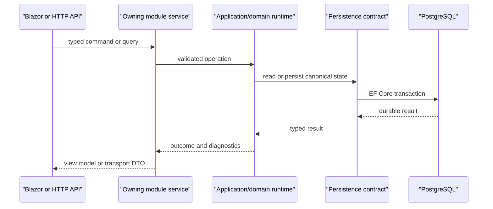

# Internal Communication

CanDoItAll communicates through typed in-process contracts for application behavior and
uses transport-specific adapters only at system boundaries.

## Communication Map

| Interaction | Contract | Authority |
|---|---|---|
| Blazor component to module | Injected module/application service | Owning module |
| Module to domain runtime | Typed command, query, identifier, or service interface | Owning domain |
| Domain to persistence | Store/repository contract implemented by EF Core infrastructure | PostgreSQL |
| HTTP client to application | Route DTO mapped by the web API boundary | Application/domain service |
| Runtime progress to clients | Typed server-sent event payload | Durable state plus bounded live projection |
| Agent to application tools | `IAgentRuntimeToolProvider` descriptors and typed invocations | Owning module and capability policy |
| Workflow node execution | Workflow executor contracts and runtime events | Workflow runtime |
| Process step execution | Process driver/adapter contracts and persisted process events | Process runtime |
| External AI/provider call | Provider-neutral request mapped by a provider adapter | AgentFramework boundary |
| Plugin integration | Plugin contracts, grants, settings, and activation services | Plugin boundary |
| Memory provider call | Provider-neutral Memory operation mapped by HTTP, MCP, mock, or service driver | Memory application boundary |

## Request Flow

Validation, authorization, capability policy, workspace scope, and approval checks occur
before mutation. A UI component or transport mapper must not recreate those decisions.

## Commands, Queries, And Events

- Commands describe an intended state change and return an explicit outcome.
- Queries return typed read models or projections and do not mutate canonical state.
- Durable events record process/runtime facts required for recovery and audit.
- Live events provide bounded feedback and never replace durable truth.
- Completion notifications may request a module refresh; they do not grant read or write authority.

Handlers must propagate cancellation and surface typed diagnostics or exceptions. Missing
dependencies and stale state fail explicitly rather than selecting a default entity or
silently dropping work.

## Transactions And Concurrency

The owning application service defines the transaction boundary. Optimistic concurrency,
leases, idempotency keys, and outbox records are part of the relevant domain contract.
Long-running provider calls do not hold database transactions open; durable admission and
completion are recorded around the external operation.

## Agent And Workflow Communication

Agent execution receives an immutable snapshot of the selected workspace, capabilities,
provider configuration, and transient context. Tool attachment is filtered through typed
capability and access policies. Tool receipts, approvals, run records, artifacts, and
runtime diagnostics preserve the execution boundary.

Workflows compile stored definitions into executor invocations. Executors contribute
typed outputs and progress events. Processes may orchestrate workflows or agent-backed
steps through explicit drivers; neither runtime mutates the other's state directly.

## External Boundaries

HTTP, MCP, OAuth, file-system, Git, provider, and plugin communication belongs in an
adapter with:

- typed configuration and identifiers
- bounded timeouts and cancellation
- explicit retry policy where safe
- masked actionable logging
- payload-size and path-scope validation
- predictable cleanup and disposal

The domain consumes the adapter contract and does not depend on protocol-specific DTOs.
