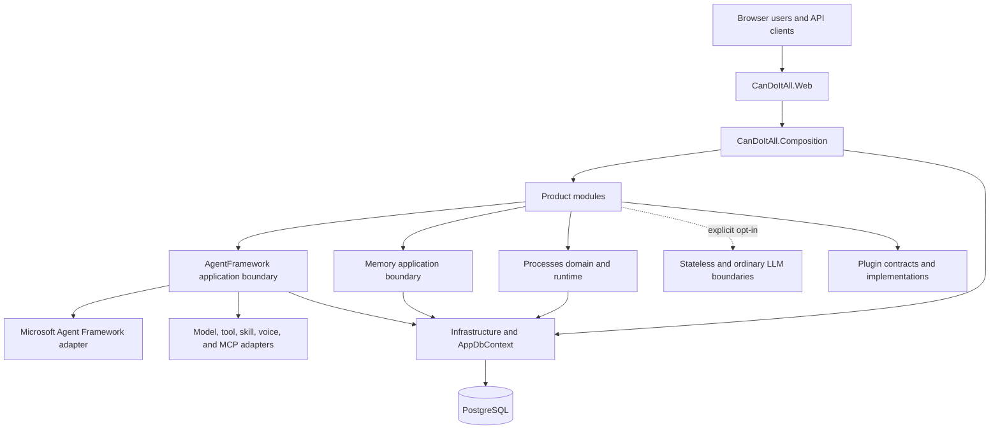

# Architecture Overview

CanDoItAll is a modular Blazor application with one web host and one composition root.
The runtime keeps product modules, provider-neutral execution domains, external adapters,
and infrastructure separate so each boundary can evolve independently.

## Runtime Boundaries

## Shared provider and request history boundaries

`SharedProviders.Abstractions` owns framework-neutral protocol values and ports;
`SharedProviders.Http` owns HTTP adapters, bounded JSON/SSE parsing and network policy.
ProviderManagement owns publication, source/import reconciliation and catalog/routing
projection. Web owns HTTP authorization, correlation and generated schemas; Composition
selects transports and registers the production implementations.

ProviderHistory Abstractions separates attempt/caller/owner/policy contracts from the
Application recorder, capture lifecycle and projections, and the PostgreSQL Persistence
stores. The MAF/provider and lightweight LLM adapters observe application-visible calls.
Canonical source content is linked rather than copied into standalone details. UI
components explicitly search and load authorized details; they do not own persistence.

Catalog cache hits check persisted publication/profile versions and required-secret
existence before reuse. Input retention freezes the deadline per logical request/input
revision; deleting an expired orphan tombstone cannot renew a late retry's capture.
These responsibilities stay in existing owners without new project references.

See [shared providers](../shared-providers.md) and
[request history](../provider-request-history.md) for operating behavior.

## Layer Responsibilities

| Layer | Responsibility |
|---|---|
| `src/App/CanDoItAll.Web` | Host startup, Blazor shell, HTTP API, OpenAPI, diagnostics, and transport mapping |
| `src/App/CanDoItAll.Composition` | Dependency injection, module registration, runtime startup, and infrastructure selection |
| `src/Modules` | Product-facing pages, typed UI state, module services, and module-owned tool providers |
| `src/Processes` | Process definitions, plans, state transitions, execution, projections, and persistence contracts |
| `src/Memory` | Provider-neutral memory operations, source gateways, drivers, and ledger persistence |
| `src/MAF` | Agent models, workflows, tools, skills, providers, lightweight LLM contracts, ordinary conversation foundation, and Microsoft Agent Framework integration |
| `src/Foundation` | Shared primitives, PostgreSQL infrastructure, migrations, and Git integration |
| `src/Integration` | Adapters for file tools and other separately owned systems |
| `src/plugins` | Plugin contracts and bundled plugin implementations |
| `src/UI` | Application-owned reusable UI facades and focused UI integrations |

## Dependency Direction

- The web host depends on composition and module entry points.
- Modules orchestrate product behavior through typed application/domain services.
- Domain contracts do not depend on Blazor, HTTP, EF Core, or provider-specific runtimes.
- Infrastructure implements persistence and external boundaries selected by composition.
- MAF, provider, plugin, MCP, and Memory drivers adapt external behavior to provider-neutral contracts.
- Cross-module behavior uses typed services, commands, events, projections, or runtime-tool contracts.

Direct calls from persistence into UI, module-to-module access through Razor components,
and provider-specific types in domain contracts violate this direction.

## Canonical State

PostgreSQL is the authoritative application store. `AppDbContext`, its factories, and the
PostgreSQL migrations project define the persisted model. In-memory implementations are
test doubles or bounded runtime projections unless their contract explicitly states
otherwise.

Durable process and workflow state remains authoritative across restarts. UI state,
server-sent event buffers, execution activity streams, caches, and provider sessions are
projections over or participants in that durable state.

The ordinary LLM conversation foundation is currently dormant product infrastructure. It is not
registered by the composition root and exposes no HTTP or UI surface. Any future activation must bind
storage and provider resolution to the active database profile id and generation and define retention
and profile-switch behavior explicitly.

## Composition

`CanDoItAll.Composition` is the only application-wide composition boundary. Each module or
adapter exposes focused service-registration extensions. Startup fails explicitly when a
required database, configuration, or runtime contract cannot be established.

## Extensibility

New behavior belongs in the narrowest existing boundary:

- product behavior in an owning module or domain
- reusable agent capabilities in AgentFramework contracts and implementations
- external transport behavior in an adapter
- optional product integration behind plugin contracts
- persistence behind infrastructure or domain-specific persistence projects

Add a new project only when it creates a real dependency boundary, independent validation
surface, or replaceable adapter.
