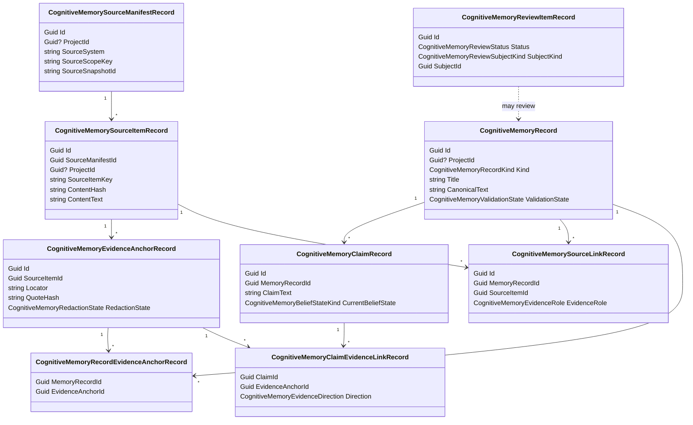

# Domain Model

## Durable Memory Class Diagram

## Service Class Diagram

```mermaid
classDiagram
    class ICognitiveMemorySourceIngestionService {
        IngestAsync(request)
    }

    class ICognitiveMemoryConsolidationEngine {
        RunAsync(request)
    }

    class ICognitiveMemoryConsolidationCandidateApplicator {
        ApplyAsync(dbContext, candidate, payload)
    }

    class ICognitiveMemoryMutationAuthority {
        SubmitAsync(command)
    }

    class ICognitiveMemoryReviewUiService {
        GetSnapshotAsync(query)
        DecideReviewItemAsync(request)
    }

    class ICognitiveMemoryRecallOrchestrator {
        RecallAsync(request)
    }

    class ICognitiveMemoryScoreGeometryDriver {
        EvaluateAsync(request)
    }

    class ICognitiveMemorySignalLedger {
        PublishAsync(request)
        QueryAsync(query)
    }

    class ICognitiveMemoryProjectionAdapter {
        ProjectAsync(request)
        SearchAsync(request)
        DeleteBySourceAsync(request)
    }

    class ICognitiveMemoryProjectionRebuildService {
        RebuildAsync(request)
    }

    class ICognitiveMemoryScheduledAutomationRunner {
        RunAsync(request)
    }

    class CognitiveMemoryAgentContextPackage {
        FromRecallResult(result)
    }

    class CognitiveMemoryAgentContextContributor {
        ContributeAsync(request)
    }

    ICognitiveMemorySourceIngestionService --> CognitiveMemorySourceManifestRecord
    ICognitiveMemorySourceIngestionService --> CognitiveMemorySourceItemRecord
    ICognitiveMemoryConsolidationEngine --> ICognitiveMemoryMutationAuthority
    ICognitiveMemoryConsolidationEngine --> ICognitiveMemoryConsolidationCandidateApplicator
    ICognitiveMemoryConsolidationCandidateApplicator --> CognitiveMemoryRecord
    ICognitiveMemoryConsolidationCandidateApplicator --> CognitiveMemoryClaimRecord
    ICognitiveMemoryReviewUiService --> ICognitiveMemoryConsolidationCandidateApplicator
    ICognitiveMemoryRecallOrchestrator --> ICognitiveMemoryScoreGeometryDriver
    ICognitiveMemoryRecallOrchestrator --> ICognitiveMemorySignalLedger
    ICognitiveMemoryRecallOrchestrator --> ICognitiveMemoryProjectionAdapter
    ICognitiveMemoryProjectionRebuildService --> ICognitiveMemoryProjectionAdapter
    ICognitiveMemoryProjectionRebuildService --> CognitiveMemoryRecord
    ICognitiveMemoryProjectionRebuildService --> CognitiveMemoryClaimRecord
    ICognitiveMemoryScheduledAutomationRunner --> ICognitiveMemorySourceIngestionService
    ICognitiveMemoryScheduledAutomationRunner --> ICognitiveMemoryConsolidationEngine
    CognitiveMemoryAgentContextContributor --> ICognitiveMemoryRecallOrchestrator
    CognitiveMemoryAgentContextContributor --> CognitiveMemoryAgentContextPackage
```

## Important Model Boundaries

- `CognitiveMemorySourceItemRecord` is ingested source material. It is not canonical memory.
- `CognitiveMemoryEvidenceAnchorRecord` points to source-grounded evidence. Canonical records and claims should be traceable to anchors.
- `CognitiveMemoryRecord` is canonical memory, but validation state still matters. Machine-generated and approved records are not equivalent.
- `CognitiveMemoryClaimRecord` gives claim-level granularity so contradictions, belief state, and evidence can be managed below the whole memory-record level.
- `CognitiveMemoryProjectionRecord` describes projection lifecycle state; the projection backend is rebuildable and not the source of truth.
- `CognitiveMemoryMutationCommandRecord` and audit events are the governance surface for truth mutation.

