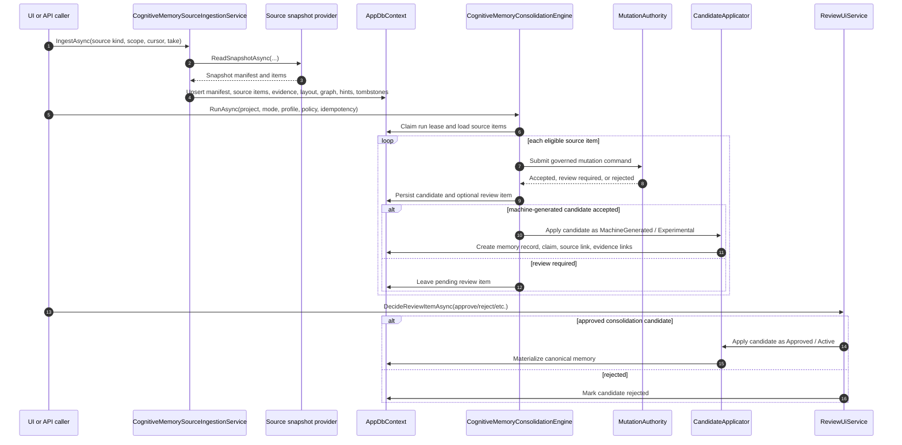
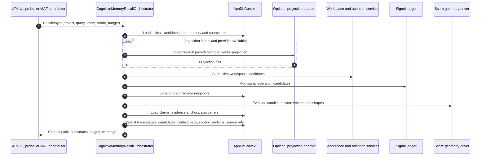
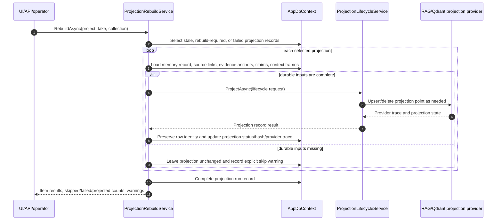
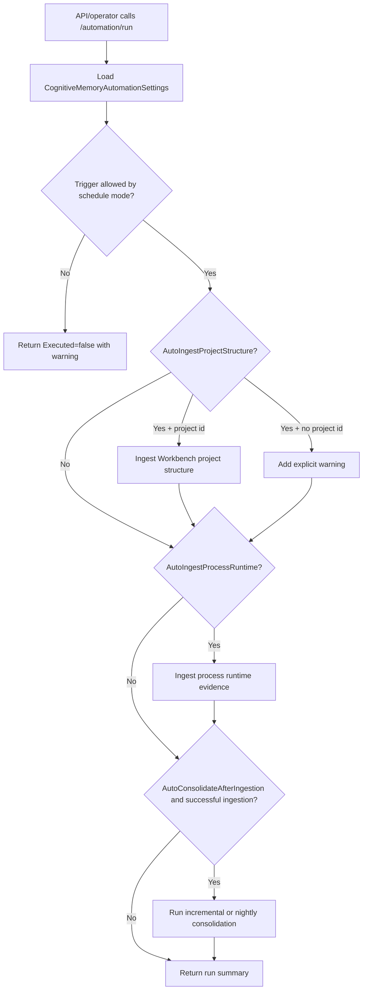
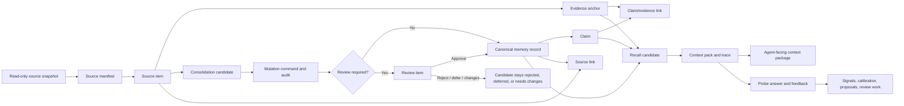
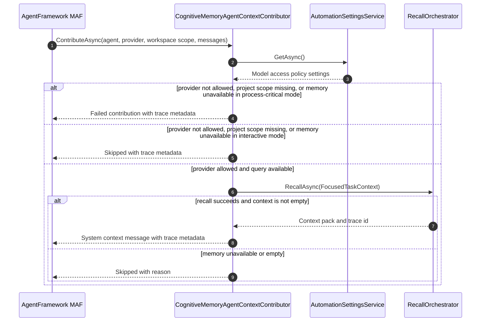

# Runtime Flows

## Source Ingestion And Consolidation

## Recall And Context Pack Rendering

## Projection Rebuild

## Explicit Automation Run

## Lifecycle Flow

## MAF Context Contribution

## Current Flow Limits

- Recall always records stages and warnings when vector projection is skipped or unavailable.
- Projection invalidation and explicit rebuild are now first-class service/API flows, but provider-backed operational proof is still required for beta.
- Scheduled automation settings are persisted and can be executed explicitly through the API runner. There is still no dedicated hosted cognitive-memory worker.

