# Cognitive Memory System Overview

## Architecture-Beta View

```mermaid
architecture-beta
    group host(server)[CanDoItAll Web Host]
    group module(server)[Cognitive Memory Module] in host
    group sources(cloud)[Source Owners]
    group projections(cloud)[Projection Providers]
    group stores(database)[Durable Stores]

    service browser(internet)[Blazor Browser] in host
    service api(server)[Minimal API] in host
    service page(server)[Cognitive Memory Page] in module
    service services(server)[Memory Services] in module
    service workbench(server)[Workbench Source] in sources
    service processes(server)[Process Source] in sources
    service workflows(server)[Workflow Source] in sources
    service files(disk)[External Files and Links] in sources
    service appdb(database)[AppDbContext Profile] in stores
    service rag(database)[Qdrant or RAG Projection] in projections
    service semantic(server)[SemanticCompletion] in projections
    service maf(server)[AgentFramework MAF] in host

    browser:R -- L:page
    page:R -- L:services
    api:R -- L:services
    maf:B -- T:services
    services:L -- R:workbench
    services:L -- R:processes
    services:L -- R:workflows
    services:L -- R:files
    services:B -- T:appdb
    services:R -- L:rag
    services:R -- L:semantic
```

## Current Runtime Architecture

```mermaid
flowchart TB
    User["Local user"] --> Page["Blazor routes /cognitive-memory and /memory"]
    Agent["AI agent or automation"] --> Api["/api/cognitive-memory"]
    Maf["AgentFramework MAF runtime"] --> Contributor["CognitiveMemoryAgentContextContributor"]

    Page --> ReviewUi["ICognitiveMemoryReviewUiService"]
    Page --> Probe["ICognitiveMemoryProbeService"]
    Page --> Settings["ICognitiveMemoryAutomationSettingsService"]
    Page --> SourceIngestion["ICognitiveMemorySourceIngestionService"]
    Page --> ExternalIngestion["ICognitiveMemoryExternalSourceIngestionService"]

    Api --> SourceIngestion
    Api --> ExternalIngestion
    Api --> Consolidation["ICognitiveMemoryConsolidationEngine"]
    Api --> Recall["ICognitiveMemoryRecallOrchestrator"]
    Api --> ReviewUi
    Api --> Advanced["Self-regulation, answer gate, professor review, learning, cross-project, distributed services"]

    Contributor --> Settings
    Contributor --> Recall

    SourceIngestion --> SourceProviders["Workbench, process, and workflow source providers"]
    ExternalIngestion --> ExternalSources["Uploaded files and web links"]
    Consolidation --> MutationAuthority["ICognitiveMemoryMutationAuthority"]
    Consolidation --> CandidateApplicator["Candidate applicator"]
    CandidateApplicator --> CanonicalRecords["Memory records, claims, source links, evidence links"]
    Recall --> ScoreGeometry["Score geometry driver"]
    Recall --> Signals["Signal ledger"]
    Recall --> Workspace["Workspace service and attention router"]
    Recall --> ProjectionAdapter["Optional RAG projection adapter"]
    ProjectionAdapter --> Qdrant["Qdrant or other RAG backend"]

    SourceIngestion --> AppDb[("AppDbContext")]
    ExternalIngestion --> AppDb
    Consolidation --> AppDb
    CandidateApplicator --> AppDb
    Recall --> AppDb
    ReviewUi --> AppDb
    Advanced --> AppDb
    Signals --> AppDb
    Workspace --> AppDb
```



## Architectural Truths

- The durable memory system is the relational model in `AppDbContext`.
- Qdrant/RAG is a rebuildable projection, not authoritative storage.
- SemanticCompletion is an adapter-backed embedding/ranking/classification utility, not the memory model.
- Generated summaries are not raw source truth. They must remain linked to source items and evidence anchors.
- MAF receives rendered context packs through `IAgentContextContributor`; it does not own Cognitive Memory state.
- Probe feedback and self-regulation output produce reviewable evidence, calibration signals, proposals, and control records. They must not mutate canonical truth directly.

## Current Entry Points

| Entry point | Path | Purpose |
| --- | --- | --- |
| Blazor UI | `/cognitive-memory`, `/memory` | Operator dashboard, probes, settings, sources, review queue, traces, health, self-regulation, scale. |
| HTTP API | `/api/cognitive-memory/*` | Agent/API control surface for ingestion, review, recall, probes, learning, distributed jobs. |
| MAF context | `cognitive-memory.context` | Optional AgentFramework context contributor for project-scoped recall context. |
| Source snapshots | `IProjectStructureSourceSnapshotProvider`, `IProcessRuntimeEvidenceSourceProvider`, `IWorkflowRuntimeEvidenceSourceProvider` | Read-only source boundaries for ingestion. |

