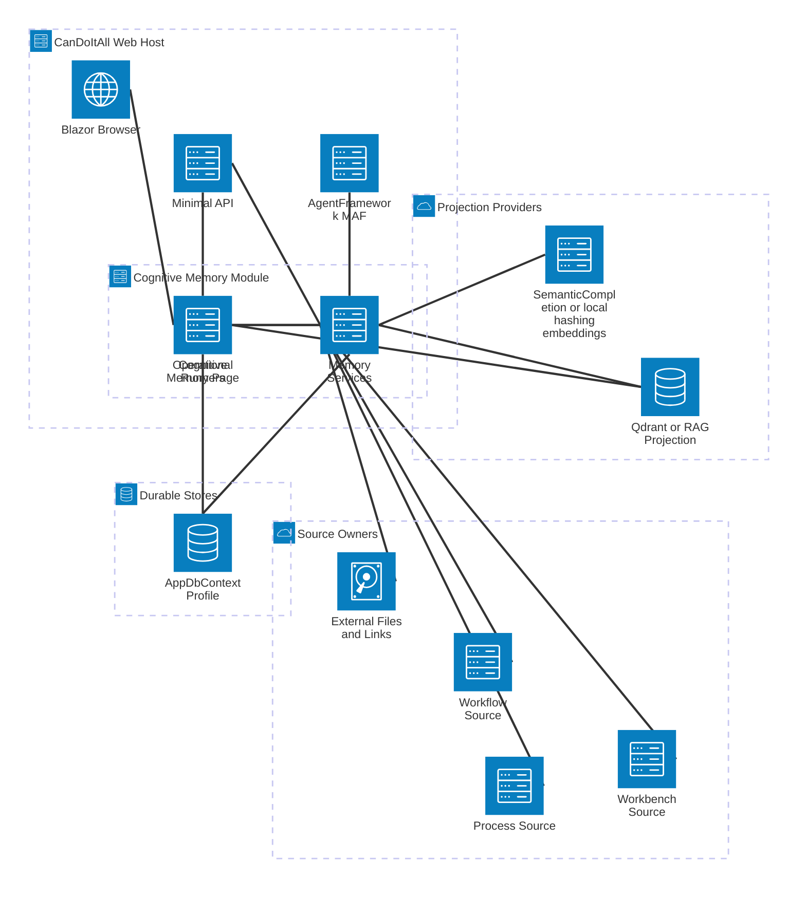

# Cognitive Memory System Overview

## Architecture-Beta View

## Current Runtime Architecture

```mermaid
flowchart TB
    User["Local user"] --> Page["Blazor routes /cognitive-memory and /memory"]
    Agent["AI agent or automation"] --> Api["/api/cognitive-memory and /api/cognitive-memory/v1"]
    Maf["AgentFramework MAF runtime"] --> Contributor["CognitiveMemoryAgentContextContributor"]

    Page --> ReviewUi["ICognitiveMemoryReviewUiService"]
    Page --> Probe["ICognitiveMemoryProbeService"]
    Page --> Settings["ICognitiveMemoryAutomationSettingsService"]
    Page --> SourceIngestion["ICognitiveMemorySourceIngestionService"]
    Page --> ExternalIngestion["ICognitiveMemoryExternalSourceIngestionService"]
    Page --> Audit["Operator audit health surface"]

    Api --> SourceIngestion
    Api --> ExternalIngestion
    Api --> Consolidation["ICognitiveMemoryConsolidationEngine"]
    Api --> Recall["ICognitiveMemoryRecallOrchestrator"]
    Api --> ReviewUi
    Api --> ProjectionRebuild["ICognitiveMemoryProjectionRebuildService"]
    Api --> AutomationRunner["ICognitiveMemoryScheduledAutomationRunner"]
    Api --> RetentionCleanup["ICognitiveMemoryRetentionCleanupService"]
    Api --> Advanced["Self-regulation, answer gate, professor review, learning, cross-project, distributed services"]

    Contributor --> Settings
    Contributor --> Recall

    SourceIngestion --> SourceProviders["Workbench, process, and workflow source providers"]
    ExternalIngestion --> Policy["External source ingestion policy and limits"]
    Policy --> ExternalSources["Uploaded files and web links"]
    Consolidation --> MutationAuthority["ICognitiveMemoryMutationAuthority"]
    Consolidation --> CandidateApplicator["Candidate applicator"]
    CandidateApplicator --> CanonicalRecords["Memory records, claims, source links, evidence links"]
    Recall --> ScoreGeometry["Score geometry driver"]
    Recall --> Signals["Signal ledger"]
    Recall --> Workspace["Workspace service and attention router"]
    Recall --> ProjectionAdapter["Optional RAG projection adapter"]
    ProjectionRebuild --> ProjectionLifecycle["Projection lifecycle service"]
    ProjectionRebuild --> MissingRecords["Projection-ready durable records without projection rows"]
    ProjectionRebuild --> AppDb
    ProjectionLifecycle --> ProjectionAdapter
    AutomationRunner --> Settings
    AutomationRunner --> SourceIngestion
    AutomationRunner --> Consolidation
    RetentionCleanup --> AppDb
    ProjectionAdapter --> Qdrant["Qdrant or other RAG backend"]

    SourceIngestion --> AppDb[("AppDbContext")]
    ExternalIngestion --> AppDb
    Consolidation --> AppDb
    CandidateApplicator --> AppDb
    Recall --> AppDb
    ReviewUi --> AppDb
    Audit --> ReviewUi
    Advanced --> AppDb
    Signals --> AppDb
    Workspace --> AppDb
```

## Architectural Truths

- The durable memory system is the relational model in `AppDbContext`.
- Qdrant/RAG is a rebuildable projection, not authoritative storage.
- SemanticCompletion or the configured deterministic local hashing provider supplies embeddings for projection/recall. Neither is the memory model.
- Generated summaries are not raw source truth. They must remain linked to source items and evidence anchors.
- MAF receives rendered agent-facing context packages through `IAgentContextContributor`; it does not own Cognitive Memory state.
- The HTTP API has a legacy compatibility surface and an additive `/api/cognitive-memory/v1` surface with contract metadata.
- Projection rebuild is explicit service/API work over durable memory. It can rebuild stale/failed rows or project missing durable records when projection settings are explicit. It should not be mistaken for canonical truth mutation.
- Scheduled automation execution is explicit service/API work today. No hosted cognitive-memory scheduler owns background mutation.
- Retention cleanup is explicit dry-run-first service/API work over operational rows. It must not delete canonical memory/source/evidence truth.
- Operator audit is a read model over mutation commands, audit events, claim state, evidence anchors, projection failures, and retention cleanup runs. It must not expose raw mutation payload JSON.
- Probe feedback and self-regulation output produce reviewable evidence, calibration signals, proposals, and control records. They must not mutate canonical truth directly.

## Current Entry Points

| Entry point | Path | Purpose |
| --- | --- | --- |
| Blazor UI | `/cognitive-memory`, `/memory` | Operator dashboard, probes, settings, sources, review queue, traces, health, self-regulation, scale. |
| HTTP API | `/api/cognitive-memory/*`, `/api/cognitive-memory/v1/*` | Agent/API control surface for ingestion, review, recall, probes, learning, distributed jobs, retention, and contract metadata. |
| MAF context | `cognitive-memory.context` | Optional AgentFramework context contributor for project-scoped recall context. |
| Projection rebuild API | `/api/cognitive-memory/projections/rebuild` | Explicit rebuild path for stale/failed projection rows and missing durable records. |
| Automation run API | `/api/cognitive-memory/automation/run` | Explicit run path for configured schedule-mode ingestion and consolidation. |
| Retention cleanup API | `/api/cognitive-memory/retention/cleanup` | Explicit dry-run-first cleanup path for old operational traces and jobs. |
| Source snapshots | `IProjectStructureSourceSnapshotProvider`, `IProcessRuntimeEvidenceSourceProvider`, `IWorkflowRuntimeEvidenceSourceProvider` | Read-only source boundaries for ingestion. |

