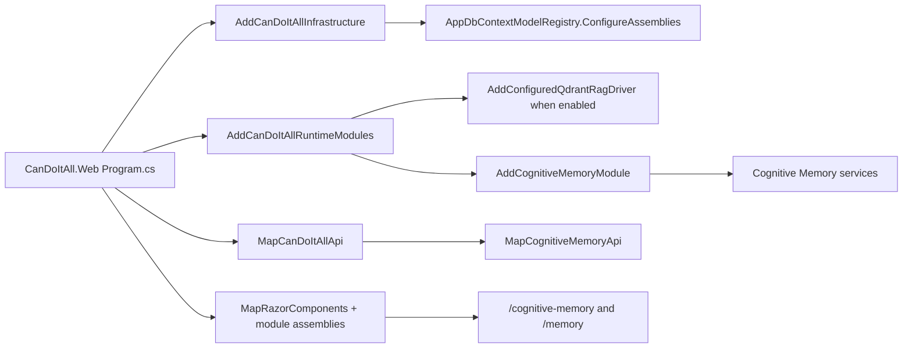

# Implementation Map

## Project Shape

The implementation lives primarily in `src/CanDoItAll.Modules.CognitiveMemory`. It is registered from `src/CanDoItAll.Composition/RuntimeHostServiceCollectionExtensions.cs` and exposed by `src/CanDoItAll.Web/Api/CognitiveMemoryApi.cs`.

| Folder | Source files | Responsibility |
| --- | ---: | --- |
| `Advanced` | 5 | Probe sessions, feedback, self-model, calibration, self-regulation, professor review, answer gate, Epistemic Drive, cross-project promotion, distributed workers, and MAF/workflow executors. |
| `Common` | 4 | JSON context, provider contracts, EF guardrails, shared typed values. |
| `Consolidation` | 6 | Consolidation runs, candidates, deterministic fact extraction, candidate application into canonical records. |
| `Foundation` | 4 | Core records, source manifests/items/links, memory records, relations, runs, review items, projection states. |
| `Ingestion` | 4 | Source snapshot ingestion, layouts, graph links, context hints, tombstones, scan failures. |
| `Neuro` | 4 | Evidence anchors, claims, belief state, entity/context binding, mutation authority. |
| `Pages` | 3 | Blazor operator UI and page-specific CSS/code-behind. |
| `Procedural` | 4 | Procedure skills, steps, failure modes, simulation, validation evidence, automation bindings. |
| `Projection` | 2 | SemanticCompletion and RAG/Qdrant adapter contracts and implementations. |
| `Recall` | 4 | Recall orchestration, candidates, context packs, trace persistence, source references. |
| `ReviewUi` | 2 | Snapshot DTOs and review decision workflow. |
| `Scoring` | 6 | Typed score spaces, dimensions, geometry driver, evaluation traces, persisted score components. |
| `Settings` | 7 | Automation settings, model access policy, model execution profiles, external file/web ingestion, staged manifests. |
| `Signals` | 4 | Prediction expectations, prediction errors, salience/signals, consumer policies. |
| `Taxonomy` | 4 | Record/relation validation, projection lifecycle, projection records. |
| `TemporalReplay` | 4 | Temporal episodes, replay jobs, causal links, worker results. |
| `Workspace` | 4 | Workspace frames, goals, slots, open questions, attention routing, inhibited candidates. |

## Runtime Registration

## Core Services

| Service | Interface | Current role |
| --- | --- | --- |
| `CognitiveMemorySourceIngestionService` | `ICognitiveMemorySourceIngestionService` | Reads source snapshots and persists source records, evidence, layout, graph, context, tombstone, and failure state. |
| `CognitiveMemoryExternalSourceIngestionService` | `ICognitiveMemoryExternalSourceIngestionService` | Ingests uploaded files and web links into source manifests/items/evidence. |
| `CognitiveMemoryConsolidationEngine` | `ICognitiveMemoryConsolidationEngine` | Processes source items into candidates, mutation commands, review rows, canonical memory records, and projection invalidations. |
| `CognitiveMemoryConsolidationCandidateApplicator` | `ICognitiveMemoryConsolidationCandidateApplicator` | Materializes approved or machine-generated candidates into memory records, claims, source links, and evidence links. |
| `CognitiveMemoryRecallOrchestrator` | `ICognitiveMemoryRecallOrchestrator` | Builds recall candidates from lexical, optional vector, workspace, signal, graph, and source-detail channels. |
| `CognitiveMemoryReviewUiService` | `ICognitiveMemoryReviewUiService` | Builds operator snapshots and applies review decisions. |
| `CognitiveMemoryAgentContextContributor` | `IAgentContextContributor` | Adds Cognitive Memory context packs to AgentFramework requests when provider policy and project scope allow it. |
| `CognitiveMemorySignalLedger` | `ICognitiveMemorySignalLedger`, `ICognitiveMemoryPredictionErrorEngine` | Records prediction expectations, prediction errors, salience signals, scores, and consumer policies. |
| `CognitiveMemoryTemporalReplayService` | `ICognitiveMemoryTemporalEpisodeService`, `ICognitiveMemoryReplayScheduler` | Records temporal episodes and replay jobs. |
| `CognitiveMemoryProcedureSkillService` | `ICognitiveMemoryProcedureSkillMemoryService`, `ICognitiveMemorySimulationSandboxService` | Stores procedure skills and simulations. |
| `CognitiveMemoryAdvancedServices` classes | Several advanced interfaces | Own probing, self-model, calibration, self-regulation, answer gate, professor review, learning proposals, cross-project, and distributed coordination. |

## Source Providers

| Source provider | Owner | Current source kind |
| --- | --- | --- |
| `WorkbenchProjectStructureSourceSnapshotProvider` | `CanDoItAll.Modules.Workbench` | `WorkbenchProjectStructure` |
| `ProcessRuntimeEvidenceSourceProvider` | `CanDoItAll.Modules.Processes` | `ProcessRuntime` |
| `WorkflowRuntimeEvidenceSourceProvider` | `CanDoItAll.Modules.AgentFramework` | `WorkflowRuntime` |
| `CognitiveMemoryExternalSourceIngestionService` | `CanDoItAll.Modules.CognitiveMemory` | Uploaded files and website links |

## HTTP Surface

`CognitiveMemoryApi.cs` currently maps 31 endpoints under `/api/cognitive-memory`. The surface covers status, database profile selection, settings, manual ingestion, external sources, snapshots, consolidation, recall, review decisions, probes, self-regulation, answer gate, professor reviews, Epistemic Drive, cross-project promotion, and distributed workers/jobs.

## Persistence Surface

The module currently has 109 entity record classes. Provider-specific migrations exist for both SQLite and PostgreSQL:

- SQLite migrations: 15 Cognitive Memory migrations.
- PostgreSQL migrations: 15 Cognitive Memory migrations.

This confirms the implementation is durable and provider-aware, but the schema should still be treated as alpha until the beta stabilization review closes.

## Test Surface

| Test project | Cognitive Memory files |
| --- | ---: |
| `CanDoItAll.Tests.Unit` | 17 |
| `CanDoItAll.Tests.Integration` | 12 |
| `CanDoItAll.Tests.Components` | 1 |
| `CanDoItAll.Tests.Playwright` | 1 |
| `CanDoItAll.Tests.Support` | 2 |

