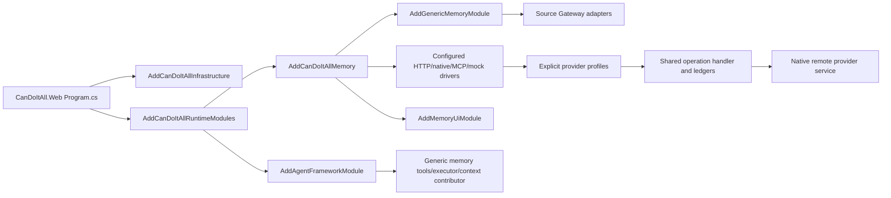

# Implementation Map

## Project Shape

The post-extraction implementation is split across generic memory projects, the generic memory UI module, MAF integration files, an optional native service repository, and retained legacy-native code.

| Area | Location | Responsibility |
| --- | --- | --- |
| Generic protocol | `src/Memory/CanDoItAll.Memory.Abstractions` | Provider profiles, capability ids, request/response envelopes, context packs, ledgers, feedback, events, source ids, and typed selection results. |
| Generic runtime | `src/Memory/CanDoItAll.Memory.Application` | Provider registry, shared operation handler, runtime dispatch, Source Gateway, async operation worker, feedback worker, event inbox/outbox workers, retention services, and driver contracts. |
| Generic persistence | `src/Memory/CanDoItAll.Memory.Persistence` | EF-backed stores for provider profiles, operations, feedback, events, source requests, retention, and worker hosting. It contains no provider driver. |
| HTTP/native drivers | `src/Memory/CanDoItAll.Memory.Http` | Generic HTTP driver and native-remote driver adapter. |
| MCP driver | `src/Memory/CanDoItAll.Memory.Mcp` | MCP descriptor/tool mapping, MCP memory driver, and manifest factory. |
| Deterministic test driver | `src/Memory/CanDoItAll.Memory.Mock` | Explicit development/test-only mock driver, isolated from persistence. |
| Generic UI | `src/Modules/CanDoItAll.Modules.Memory` | `/memory` provider management, query, feedback, event, operations, manual ingestion, and provider-specific surface host. |
| Agent memory integration | `src/MAF/Memory/CanDoItAll.AgentFramework.Memory` | Typed agent settings, aliases, directive parsing, bounded multi-provider orchestration, tool/status exposure, context contribution, and workflow adaptation. |
| Source contract | `src/Memory/CanDoItAll.Memory.SourceGateway.Abstractions` | Provider-neutral source snapshot contracts independent of Agent Framework Core. |
| Source adapters | Workbench, Processes, Resources, CRM/HR, AgentFramework modules | Module-owned Source Gateway adapters that return provider-neutral source snapshots. |
| Optional native service | `C:\repositories\CanDoItAll.CognitiveMemory` | External Cognitive Memory domain, DB, engine, protocol API, access policy, workers, and UI package. |
| Retained legacy module | `src/Modules/CanDoItAll.Modules.CognitiveMemory` | Legacy/native regression code retained until native-suite migration deletes or moves it. Not part of base startup. |

## Runtime Registration

Memory registration is owned by `src/App/CanDoItAll.Composition/Memory/MemoryRuntimeServiceCollectionExtensions.cs`; the general host extension delegates to that owner with one call. The base composition root does not register the old native Cognitive Memory module, Qdrant RAG driver, or SemanticCompletion driver as memory dependencies.

## Provider Driver Registration

| Driver kind | Base app registration | Provider profile extensions |
| --- | --- | --- |
| `Mock` | Explicit `Memory:Providers:DeterministicMock:Enabled=true` only. | Test/development profiles only. |
| `Http` | Explicit `Memory:Providers:Http:Enabled=true`. | `host.candoitall.memory.http.*` keys. |
| `NativeRemote` | Explicit `Memory:Providers:NativeRemote:Enabled=true`. | `native.cognitiveMemory.remote.*` keys. |
| `Mcp` | Explicit `Memory:Providers:Mcp:Enabled=true`. | `host.candoitall.memory.mcp.*` keys. |

See [provider setup](../operations/provider-setup.md).

## Core Runtime Services

| Service | Role |
| --- | --- |
| `IMemoryRuntimeService` | Provider-selected context query dispatch. |
| `IMemoryOperationHandler` | Shared operation path for tools, workflow executors, context contributors, UI/API-like callers, feedback handles, and source ingestion. |
| `IMemorySourceGateway` | Policy-gated source snapshot capture. |
| `ManualMemorySourceIngestionService` | Manual text/file/link source capture and ingestion operation enqueue. |
| `IMemoryAsyncOperationWorker` | Polls accepted async operations and updates operation ledgers. |
| `IMemoryFeedbackWorker` | Delivers delayed feedback and updates feedback ledgers. |
| `IMemoryProviderEventWorker` | Polls provider events, dedupes inbox rows, and delivers outbox acknowledgements. |
| `IMemoryProviderHealthDriver` implementations | Return provider health without dispatching unrelated work. |

## Generic UI

The generic provider UI is `/memory`. It supports:

- zero-provider empty state;
- provider profile list/detail;
- context query and context-pack display;
- feedback, source-request, and event ledgers as read-only operational evidence;
- mutation controls only when the selected provider and registered transport both implement the required delivery path;
- operations/status ledger;
- provider event inbox when an installed provider implements events;
- provider-specific RCL/iframe/external surface projection with safe fallback.

## Native Service

The native service is validated in `C:\repositories\CanDoItAll.CognitiveMemory`:

- `CanDoItAll.CognitiveMemory.Domain`
- `CanDoItAll.CognitiveMemory.Application`
- `CanDoItAll.CognitiveMemory.Persistence`
- `CanDoItAll.CognitiveMemory.Projection.Rag`
- `CanDoItAll.CognitiveMemory.Service`
- `CanDoItAll.CognitiveMemory.Workers`
- `CanDoItAll.CognitiveMemory.UI`

The main app talks to it only through generic provider protocol/driver contracts.

## Test Surface

| Test area | Project/filter |
| --- | --- |
| Generic memory | `tests/Memory/CanDoItAll.Memory.Tests` |
| MAF memory | `tests/MAF/CanDoItAll.AgentFramework.Memory.Tests`, plus focused compatibility coverage in `tests/Unit/CanDoItAll.Tests.Unit` |
| Generic UI components | Component tests filtered by `MemoryProvider` and `MemoryUiRefactoringCheckpoint` |
| Generic browser UI | Playwright tests filtered by `MemoryProviderManagementPlaywrightTests` |
| Database runtime switching | Integration tests filtered by `DatabaseSwitchIntegrationTests` |
| Native service | `C:\repositories\CanDoItAll.CognitiveMemory\tests\CanDoItAll.CognitiveMemory.Tests` |

Legacy `CognitiveMemory*` tests remain retained native coverage until the follow-up native-suite migration.
