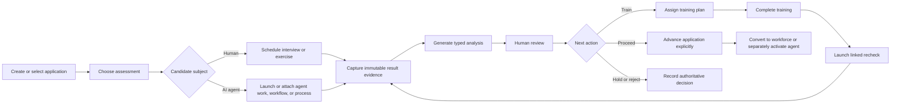

# CRM-HR recruiting assessment user-story map

Status: Approved target-state map; implemented foundation is tracked in the architecture companion  
Date: 2026-07-26

## Outcome

Recruiting must support two deliberately different candidate subjects:

- a human candidate represented by the canonical CRM-HR `Party`;
- an AI candidate represented by a CRM-HR AI-agent `Party` with a bound AgentFramework technical-agent ID.

The recruiter owns the application and the authoritative HR decision. Agent work, workflow runs, process runs, automated analysis, and model-proposed next steps are evidence. They never directly change an application stage, hire a person, or activate an AI agent.

The existing CRM-HR application, interview, support, lifecycle, and workforce-conversion journey remains canonical. The existing AgentFramework recruiting-evidence engine remains canonical for append-only AI-agent run evidence. The new assessment workspace connects those owners instead of creating a third recruiting engine.

## Actors

| Actor | Job |
| --- | --- |
| Recruiter | Own the application, choose an assessment, inspect results, and decide the next action. |
| Hiring manager | Define or approve the challenge and provide a human review. |
| Trainer or mentor | Own remediation work and confirm that a candidate is ready for recheck. |
| AI candidate | Perform bounded agent work or participate in a workflow/process under its technical identity. |
| Human candidate | Complete interviews, exercises, training, and rechecks recorded against the same application. |
| Result analyzer | Produce a versioned recommendation from immutable evidence. |
| CRM-HR | Retain the application decision, training plan, and query-efficient historical assessment view. |

## End-to-end journey

## P0 user stories

### 1. Candidate identity

As a recruiter, I can create an application for an existing person or bound AI-agent party without duplicating either identity.

Acceptance:

- The picker clearly labels people and AI agents.
- The application keeps the canonical party ID.
- AI assessment actions appear only when a valid technical binding exists.
- Inline person creation creates a candidate-lifecycle party; it does not create an active employee.
- Editing an existing application cannot silently replace its candidate after evidence exists.

### 2. Application-owned assessment

As a recruiter, I can add an assessment to one application and choose a strongly typed mode: interview/exercise, agent work, workflow, or process.

Acceptance:

- The assessment records application ID, candidate party ID, optional technical-agent ID, purpose, rubric/configuration version, owner, optional project ID, status, and timestamps.
- Human and AI subjects remain distinct.
- The execution target kind and target ID are validated together.
- An assessment cannot be reassigned after its first attempt.

### 3. Launch or attach execution

As a recruiter, I can launch a new action through its owning application service or deliberately attach an existing compatible terminal run.

Acceptance:

- Launch uses the canonical agent/workflow/process service and an idempotency/correlation ID.
- Attach is explicit and never guesses a run from names or recent activity.
- Agent-run ownership is verified against the technical candidate.
- Workflow participation is proven by executed node events for the exact run and definition version; process participation is proven by its run record.
- Nonterminal or unrelated runs remain visible as incomplete evidence and cannot qualify readiness.

### 4. Historical result snapshot

As CRM-HR, I can filter assessment history by application, candidate, project, target kind, completion time, and decision without reloading runtime graphs.

Acceptance:

- The snapshot stores scalar IDs, target kind, outcome, bounded summary, evidence references, token/cost totals with completeness, configuration/rubric versions, completion time, and ingestion time.
- Native internal GUIDs remain native GUID columns. Heterogeneous or externally owned IDs use a typed kind plus a bounded string value.
- Standard UTC temporal columns are indexed. A duplicate Unix-time column is added only after a measured query or partitioning need.
- Historical rows have no EF navigation graph and are read with no tracking.
- Snapshot text is bounded, redacted, and treated as untrusted evidence.

### 5. Typed analysis

As an evaluator, I can generate or record a structured analysis while keeping it separate from the HR decision.

Acceptance:

- Analysis includes classification, score dimensions, confidence, findings with evidence references, missing evidence, and a typed proposed next step.
- Proposed next steps are `Advance`, `RequestHumanReview`, `AssignTraining`, `Reassess`, `Hold`, or `Reject`.
- Provider, model, policy/instruction profile, prompt version, rubric version, generated time, and analysis cost are retained.
- Invalid or incomplete structured output fails explicitly; no free-text fallback advances the journey.
- Re-analysis appends a new version and preserves earlier analysis.

### 6. Human review

As an authorized reviewer, I can approve, reject, or request changes after inspecting evidence and analysis.

Acceptance:

- The review records actor, typed decision, notes, authorization reference, evidence version, and time.
- Automated recommendations cannot masquerade as human approval.
- Readiness requires the latest current-version attempt to have complete evidence plus a qualifying human approval.
- Readiness does not activate the technical agent.

### 7. Training and recheck

As a recruiter or manager, I can assign remediation and run a linked recheck.

Acceptance:

- A training plan records typed gaps, activities/tasks, owner, due date, status, and assessment/application relation.
- Recheck explicitly references the prior attempt and any completed training plan.
- The UI compares prior and current dimensions, findings, score, and evidence completeness.
- Earlier evidence and decisions stay immutable.
- Recheck uses the candidate's current configuration and a versioned rubric.

### 8. Stage and conversion gates

As HR, I cannot accidentally convert a rejected, withdrawn, or evidence-blocked application.

Acceptance:

- Allowed stage/decision combinations are validated centrally.
- Rejected and withdrawn applications cannot convert.
- Configured required assessments and human approvals block offer/hire.
- Any override is explicit, permission-controlled, reasoned, and audited.
- Workforce conversion and AI-agent activation remain separate commands.

## UX surface map

| Surface | Primary question | Required content |
| --- | --- | --- |
| Recruiting catalogue | What needs attention now? | Stage, candidate type, assessment/readiness status, next action, owner, due state, bounded filters. |
| Application tab | Who is being recruited and for what? | Compact identity, balanced candidate/role/ownership rows, stage history, save state. |
| Assessments tab | What was tested, what did it prove, and what happens next? | Readiness, dominant next action, attempt timeline, latest analysis, review state, training/recheck links. |
| Launch assessment dialog | What action should this candidate perform? | Mode, template/rubric, target or launch configuration, project/cost/privacy context, confirmation. |
| Running assessment panel | Is execution healthy? | Status, start/elapsed time, bounded runtime link, cancellation policy, no speculative result. |
| Results dialog | What evidence supports the recommendation? | Outcome, summary, evidence links, completeness, dimensions, cost, classification, proposed next step. |
| Human review dialog | What is the authorized decision? | Evidence version, analysis summary, typed decision, reason, reviewer identity. |
| Training plan dialog | What gap will be addressed and by whom? | Gap, activity, owner, due date, completion evidence, recheck eligibility. |
| Recheck comparison | Did the candidate improve? | Prior/current side-by-side dimensions, changed findings, evidence completeness, final review action. |
| Conversion tab | Are all gates satisfied? | Explicit gate checklist, blockers, audited override entry point, separate workforce/activation actions. |
| AI-agent record | Is the technical resource proven and governed? | Evidence/readiness tab linked to CRM applications; manual governance status remains separate. |

## P1

- Versioned assessment templates and role-specific requirements.
- Recruiter work queue for overdue reviews, training, and rechecks.
- Notifications, ownership escalation, and reviewer delegation.
- Search/filter by classification, readiness, next step, project, target kind, and evaluator.
- Candidate consent and scheduling flow.
- A first-class offer aggregate and approval workflow.

## P2

- Funnel, quality, training-effectiveness, recheck-improvement, cost-per-assessment, and time-to-decision analytics.
- Fairness and adverse-impact review with protected data isolated from evaluators.
- Explicit retention/redaction policies for prompts, outputs, attachments, and evidence.
- Bulk assessment campaigns after the single-candidate flow is stable.

## Target-state validation map

- Unit: transition policy, target identity, readiness, analysis validation, next-step selection, recheck lineage, snapshot mapping.
- Integration: application-to-assessment ownership, indexes and bounded queries, AI-party binding, conversion gates, workspace isolation.
- Component: catalogue indicators, balanced forms, controlled dialogs, dirty/blocker state, human-versus-AI action visibility.
- Browser: create/select AI candidate, attach or launch each target kind, inspect analysis, request training, complete training, recheck, approve, and prove activation remains separate.
