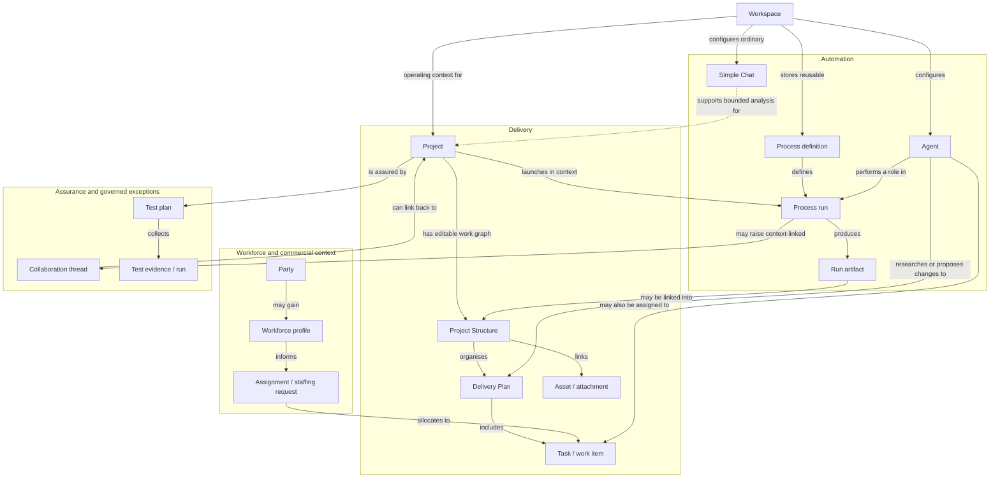
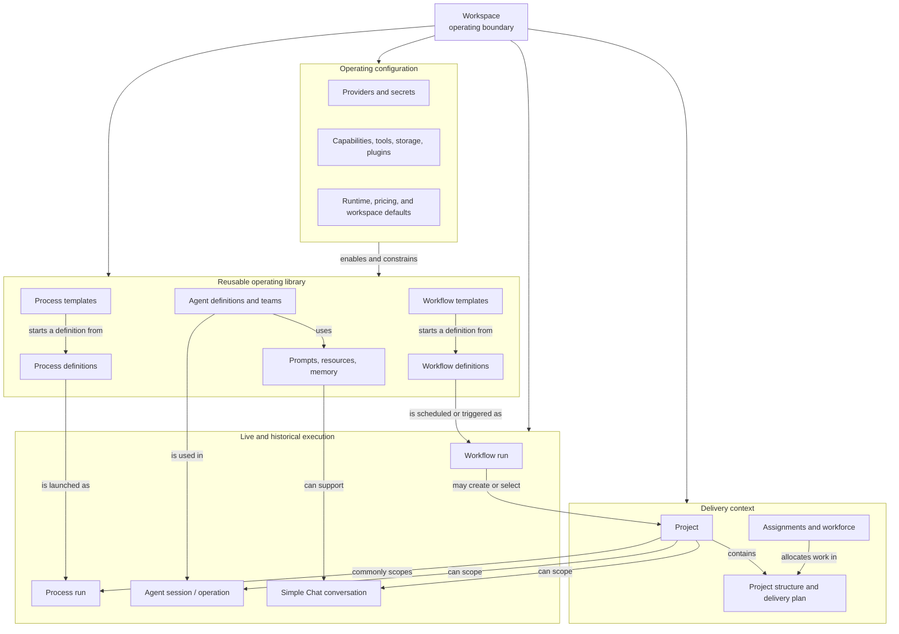

# Domain Model and Vocabulary

Use these terms consistently in navigation, labels, help, and future UX research. They
are a product vocabulary, not a list of implementation classes.

## Domain relationship map

This is the primary domain visualisation. Relationship labels express product meaning;
they are deliberately not database cardinalities or a proposal for future navigation.

Two distinctions are intentionally visible here: a Simple Chat supports ordinary,
bounded conversation but is not an Agent or Process Run; and a process definition is
reusable configuration while a process run is its dated execution.

## Workspace, library, project, and execution map

The application should not present every top-level area as an undifferentiated
“workspace item.” The workspace is the operating boundary. Within it, **configuration**
enables a reusable **operating library**; a **Project** is a delivery context; and a
**run/conversation** is a dated execution record.

This explains the Gmail-labelled workflow in the current catalogue: it is a reusable,
workspace-level automation definition. It can be scheduled or triggered from incoming
mail, then create or select a Project; it is useful precisely when no project exists yet.
The same is true of many workflow/process templates and agent definitions. Conversely,
project structure, assignments, and delivery plans have their primary meaning only in a
specific Project.

For information architecture, **Operating Library** is a clearer umbrella label than
“Workspace items.” It could contain Agents, Workflows, Processes, Prompts, Resources,
and templates, while **Settings** remains a separate configuration area and **Projects**
remains the delivery area. The current code does not settle whether Workflows should be
a peer of Processes or nested under automation/library; that is a stakeholder navigation
decision, not a domain ambiguity.

## Delivery context

| Term | Meaning | Evidence | Confidence |
|---|---|---|---|
| **Workspace** | The active operating context. It supplies settings, storage, provider defaults, secrets, and the selected database/runtime profile. | `Workspace` module; `/settings`; `MainLayout.razor` | Corroborated |
| **Project** | A portfolio/delivery record that can belong to a hierarchy and provides a context for planning, files, processes, assignments, and structure. | `ProjectsApi.cs`; `ProjectModels.cs`; `/projects` | Corroborated |
| **Subproject** | A project linked beneath another project in the portfolio hierarchy. It remains a project, rather than a second entity type. | `ProjectsApi.cs` hierarchy routes; `ProjectHierarchyModal.razor` | Corroborated |
| **Project structure** | The canonical graph/canvas representation of a project’s work and linked artifacts. It supports nodes, hierarchy, links, dependencies, status, progress, markers, priority, attachments, and controlled mutation. | `ProjectStructureAgentApi.cs`; `ProjectWorkbenchModels.cs`; `/projects/{id}/structure` | Corroborated |
| **Project node** | An addressable object within project structure. A node can be created, moved, re-parented, copied, linked, changed in type, or deleted, and may represent a task, asset, process, workflow, or other catalogued type. | `ProjectStructureAgentApi.cs`; `ProjectStructureActionCatalogAdapter.cs` | Confirmed |
| **Task/work item** | Planned project work with timing, status/progress, assignee, estimates and potentially resource/cost information. | task API routes; task dialogs; Gantt and calendar pages | Corroborated |
| **Delivery plan** | A project’s organised tasks, dependencies, timing and assignments. It may be authored manually, proposed by an agent, or produced through a process; Gantt and calendar are projections of it. | project-structure/task contracts; walkthrough 06:28–12:02 | Corroborated |
| **Asset/attachment** | Content or a managed file linked to a project-structure node, with content/read and revision operations. | project-structure asset routes; attachment/file-browser components | Corroborated |

## Automation and execution

| Term | Meaning | Evidence | Confidence |
|---|---|---|---|
| **Process** | A reusable, durable definition of coordinated steps, roles, branches, artifacts, assignments, and launch/recovery behavior. | `Processes` module; `ProcessesApi.cs`; `ProcessDefinition*` components | Corroborated |
| **Process run** | One launched instance of a process. It can be dispatched, observed, cancelled, reworked, examined through history/graph/analytics, and may need recovery. | process run routes; `ProcessRunRecordsApi.cs`; live-process pages | Corroborated |
| **Workflow** | A reusable automation definition with versioning, lifecycle transitions, validation, execution backends/components, runs, artifacts, events, checkpoints, and pending external requests. | `WorkflowsApi.cs`; `/agents/workflows`; workflow components | Corroborated |
| **Workflow run** | One execution of a workflow, carrying inspectable status/detail, events, artifacts, checkpoints, cancellation and possibly a pending external request. | workflow run routes | Confirmed |
| **Artifact** | A durable output associated with a process or workflow run. It is distinct from a project attachment, though the UX may link them. | process/workflow artifact contracts and routes | Confirmed |
| **Approval / external request** | A pause point where governed execution needs an explicit response before proceeding. | workflow pending-request/response routes; agent pending-approval routes; launch approval dialog | Corroborated |
| **Operation** | The durable unit of asynchronous work used especially for LLM Chat turns. It owns status, events and cancellation/reconciliation rather than making an HTTP request itself the execution authority. | [LLM Chats product and API](../llm-chats-api.md) | Confirmed |

## AI and conversation

| Term | Meaning | Evidence | Confidence |
|---|---|---|---|
| **Agent** | A configured AI worker that can have a provider, capabilities, memory settings, governance, chats, execution runs, metrics, artifacts, checkpoints and approvals. | `AgentsApi.cs`; `/agents`; AgentFramework module README | Corroborated |
| **Agent team** | A named collection of agents whose membership is managed separately from individual agent configuration. | agent team API routes and dialogs | Corroborated |
| **Provider profile** | Credential-free operational configuration identifying a connector/model capability set used by agents, workflows, or Simple Chats. It references secrets rather than exposing them to ordinary UI/read models. | Agents/Workspace APIs; provider panels; LLM Chats docs | Corroborated |
| **Capability** | A declared or verified ability available to an agent, including setup/testing and access preview. | agent capability routes; setup wizard | Corroborated |
| **Tool grant / authority** | Explicit permission for an agent or process role to perform a scoped consequential action, such as create project-structure work, read/write a storage location, or use a configured tool. Missing authority should lead to an approval or escalation rather than an implicit bypass. | agent capability/governance routes; walkthrough 06:57–07:19, 22:13–23:44, 32:40–34:18 | Corroborated |
| **Agent chat session** | A conversation context owned by a particular agent. It is separate from a Simple Chat and can be listed, created, renamed and used through the agent workspace. | agent chat-session routes | Confirmed |
| **Simple Chat definition** | Reusable ordinary LLM-chat configuration. Edits create immutable revisions and the definition has activation/suspension/archive lifecycle. It does not create an agent, tools, skills, memory, process, or workspace. | [LLM Chats product and API](../llm-chats-api.md) | Confirmed |
| **Simple Chat conversation** | A multi-turn conversation created from a definition and pinned to its current revision. It can be renamed or archived. | LLM Chat API and UI documentation | Confirmed |
| **Turn** | A user message submitted to a Simple Chat conversation and admitted as a durable, idempotent operation. | LLM Chat API documentation | Confirmed |

## People, organisations, and commercial work

| Term | Meaning | Evidence | Confidence |
|---|---|---|---|
| **Party** | A directory record used for people and organisations, their contact data, affiliations, relationships and safe list/detail views. | `CrmHrApi.cs`; CRM/HR API docs; Directory page | Corroborated |
| **Workforce profile** | A staffing-oriented view of a party with roles, skills, capacity and availability information. | CRM/HR workforce routes and page | Corroborated |
| **Skill** | A reusable skill-catalogue entry that can be assigned with proficiency to a party/workforce record. | CRM/HR API and skill matrix | Corroborated |
| **Capacity block** | A dated availability fact such as leave, unavailable, reserve, or tentative capacity. | CRM/HR API docs | Confirmed |
| **Opportunity** | A CRM item managed through a board/pipeline and capable of handoff/conversion to a project. | CRM components, including `OpportunityConversionDialog.razor` | Corroborated |
| **Recruiting application** | A candidate-oriented aggregate with interviews, lifecycle tasks, support assignments, and conversion to workforce. Candidates may be people or AI agents. | CRM/HR recruiting routes and components | Corroborated |
| **Assignment/staffing request** | A request and allocation of people or agents to project work, joining delivery planning to workforce evidence. | assignments page and project-allocation components | Corroborated |

## Supporting product records

- **Prompt item** — a reusable prompt artifact with versions, tags, model guidance,
  favorite/archive state, compatibility evaluation and optional chat-composer use.
  **Corroborated:** `PromptGalleryApi.cs`, `PromptDomainModels.cs`, Prompt Gallery UI.
- **Resource** — a reusable workspace resource record, including a file-browsing and
  storage-promotion surface. **Corroborated:** Resources module page/components.
- **Memory provider** — configured provider for memory operations, diagnostics,
  ingestion, querying, events and feedback. **Corroborated:** `MemoryProvidersApi.cs`
  and Memory module components.
- **Plugin** — an installable integration with catalog/package, activation, grants,
  connections/OAuth, settings, executors and logs. **Corroborated:** `PluginsApi.cs`
  and Plugins page.
- **Schedule plan** — a scheduled process or workflow launch with a cron projection,
  plan/run history and an approval/failure route when execution cannot proceed.
  **Corroborated:** Scheduler Planner module and page.
- **Collaboration thread** — a durable, context-linked discussion record containing
  participants and timestamped messages. It may be a notification or escalation, can be
  unread or closed, and can link back to a process run, launch, automation signal, or
  manually supplied context. **Corroborated:** Collaboration contracts/page and
  `CollaborationIntegrationTests`.
- **Test plan** — a delivery-assurance record scoped optionally to a project, phase and
  responsible party. It groups test cases, evidence references and execution-run
  history, rather than splitting those records into separate trackers. **Corroborated:**
  Test Lab models/page and CRM/HR-to-Test-Lab Playwright flows.
- **Test case / evidence / test run** — respectively, the scenario under assurance and
  its status; a labelled artifact reference that supports the result; and a dated runner
  result with summary. **Confirmed:** Test Lab persisted models.

## Critical distinctions to preserve

1. A **definition** is reusable configuration; a **run**, **operation**, or
   **conversation** is a dated instance and must retain its original context.
2. **Simple Chat** is ordinary provider-neutral conversation; it is not an Agent run.
3. A **project** is the portfolio context; **project structure** is its editable work
   graph; a **project node** is an item in that graph.
4. A **party** is a general directory identity; a **workforce profile** and a
   **recruiting application** add different work-lifecycle meaning to a party.
5. A **provider profile** is configuration; a **secret** is a protected referenced
   value; neither should be represented as ordinary content in user-facing histories.
6. A **proposed plan or artifact** becomes delivery truth only through the project
   context and the authority granted to create or change it. Agent assistance does not
   itself imply permission to mutate the plan.
7. A **collaboration thread** is a durable context trail for people, agents, roles, and
   system signals; it is not interchangeable with a Simple Chat or an Agent chat
   session.
8. A **test plan** records assurance for delivery work. Its cases, evidence, and run
   history must remain attributable to the same plan even if a future UI changes how
   they are displayed.
