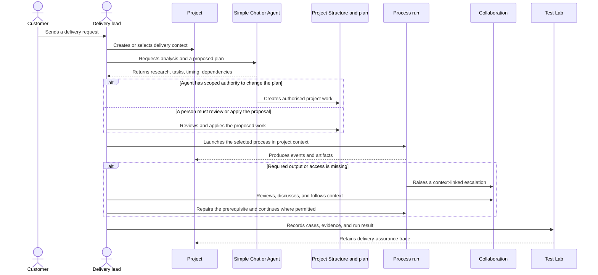

# Scenarios and UX Principles

These are outcome-oriented scenarios reconstructed from public routes, current pages,
component tests, and maintained product documentation. They state the user problem and
the product result; a future interface may arrange the controls differently.

## Governed delivery journey

This sequence visualises the primary product story. It intentionally shows a proposed
plan, authority to apply it, execution evidence, and escalation as separate states.

Connector-specific intake mechanics and exact permission names are intentionally absent:
they are configuration details, not the stable product journey.

## 1. Turn intake into a governed delivery plan

**Problem:** A customer request or other intake needs to become actionable delivery work
without losing the source context or letting automation quietly change the plan.

**Scenario:** A lead creates a Project for the request (or receives a suitably routed
intake), uses an ordinary LLM conversation or an Agent to research and shape an initial
architecture, then asks for a plan. The proposed tasks include dependencies and timing;
an authorised agent may create them in Project Structure, or a person may review and
apply them. The resulting plan is visible as both structure and Gantt, with costs and
assignments considered before execution.

**Result:** The product turns an unstructured request into a reviewable, scheduled,
cost-aware project plan. AI is an accountable contributor, not an invisible planner.

**Evidence:** Product-owner walkthrough 00:01–12:53; project/task and Gantt contracts;
`ProjectsPageTests`, `ProjectStructurePageSimpleMutationTests`, and project-assignment
tests. Intake routing is demonstrated rather than established as a generic product
contract, so its connector-specific implementation remains open.

## 2. Establish a delivery context

**Problem:** A delivery lead needs a coherent place for a body of work rather than a
collection of unrelated automation runs and files.

**Scenario:** The lead creates a Project, optionally positions it within a project
hierarchy, then opens its Project Structure. They add or link work nodes, including
tasks and assets; establish parentage/dependencies; set status, progress, priority, and
markers; and open the schedule/calendar projections when planning time matters.

**Result:** The project remains the navigable delivery context. Work, artifacts,
relationships, processes, workflows, assignees and schedule views can be reached from
that context without implying that all are the same entity.

**Evidence:** Projects and Project Structure route families; `ProjectsPageTests`,
`ProjectStructurePageSimpleMutationTests`, `ProjectStructureGantt*Tests`, and
`ProjectCalendarPageTests`.

## 3. Plan and assign delivery work

**Problem:** A plan has to express work, timing, dependencies, accountable participants,
and expected effort/cost—not merely a list of AI requests.

**Scenario:** A planner creates or edits a task in Project Structure, specifies its
estimate/timing/status and relationships, then selects a person or agent where an
assignee/resource is appropriate. Workforce evidence, skills, capacity, and project
assignment views inform that selection. Gantt and calendar surfaces expose the resulting
schedule from different perspectives.

**Result:** People and agents can participate in the plan, but planning retains enough
information to explain allocation and delivery impact.

**Evidence:** project task/resource routes, task/assignment/Gantt components and their
component tests; CRM/HR workforce and capacity routes.

## 4. Define and operate a repeatable process

**Problem:** A repeated delivery procedure needs a governed definition and observable
execution, including exceptions.

**Scenario:** An operator authors or selects a Process definition with steps, roles,
branches and expected artifacts; launches it in the appropriate project context; watches
live activity and the run graph/history; opens scoped run files when relevant; and
cancels, dispatches, or requests rework when the runtime state permits.

**Result:** The process definition is not confused with any one run. The UI makes run
state, recovery, files, and history discoverable rather than hiding them behind a
“finished” message.

**Evidence:** `ProcessesApi.cs`, `ProcessRunRecordsApi.cs`, Process module components,
and `ProcessWorkspaceShellTests`/`ProcessRunFilesDialogTests`.

The recorded walkthrough additionally establishes the intended exception model:
when a required output or access grant is missing, the run can escalate; an operator can
inspect the affected context, collaborate with the responsible agent(s), repair the
missing artifact, and continue. **Corroborated:** walkthrough 22:13–30:49 and process/
agent execution tests.

## 5. Configure and govern AI workers

**Problem:** An organisation needs useful agents without losing visibility into provider
configuration, available capabilities, memory, execution activity, cost, and authority.

**Scenario:** An administrator creates or imports an Agent, chooses a provider profile,
adds and verifies capabilities, configures governance and allowed context, and optionally
organises agents into a team. A user starts an agent chat session or execution run,
observes its activity/outputs/approvals, and responds explicitly when approval is needed.

**Result:** An agent is a configured operational participant with inspectable execution;
it is not a generic chat bubble or a provider credential.

**Governance boundary:** The authority to use a tool or change project work is explicit
and scoped. A plan-analysis agent needs the exact verified skill/tool assignments as
well as an active, non-template, tool-enabled identity; a governed process tool call
fails closed if its process restrictions cannot be applied. A policy denial retains its
run/step context for recovery instead of bypassing the boundary.

**Evidence:** `AgentsApi.cs`, AgentFramework README, Agent catalog/details/governance
components; `ProjectPlanAgentAuthorizationPolicyTests`,
`ToolGovernancePipelineAndApprovalLifecycleTests`, and Agent component tests.

## 6. Hold an ordinary LLM conversation

**Problem:** A user sometimes needs a normal, reusable-configured conversation without
creating an agent or unintentionally granting tools/workspace access.

**Scenario:** The user manages a Simple Chat definition, creates a conversation from its
current revision, submits a turn, follows durable progress, and—if needed—cancels or
reconciles a non-terminal operation. They may rename or archive the conversation later.

**Result:** The transcript is durable, each conversation remains revision-pinned, and
ambiguous provider execution is surfaced as recovery rather than silently repeated.

**Evidence:** [LLM Chats product and API](../llm-chats-api.md) and LLM Chat UI/component
tests. This separation from agent execution is **confirmed**, not a design preference.

## 7. Coordinate people, organisations, opportunities, and recruiting

**Problem:** Delivery planning needs real organisational context: who the parties are,
who can do work, capacity/skills, customer opportunities, and recruiting progression.

**Scenario:** A user maintains Party records and relationships; turns relevant parties
into workforce profiles with skills/capacity; reviews and assigns project staffing; tracks
opportunities through a pipeline and converts a qualified opportunity to a project; or
progresses a recruiting application through interviews, support, lifecycle work, and
conversion to workforce.

**Result:** CRM, HR, recruiting, and project delivery share identities and handoffs while
remaining distinct lifecycle views.

**Evidence:** [CRM/HR API](../crm-hr-api.md), CRM/HR routes/pages/components, and
CRM/HR component tests.

## 8. Prepare the operating environment

**Problem:** A local-first product must make data source, files, secrets, providers,
plugins, memory, and runtime readiness understandable before a user trusts automation.

**Scenario:** An administrator selects or manages a database profile, configures storage
catalogs and routing, stores secret references, configures provider profiles and pricing,
installs/enables plugins and grants, and checks Memory/runtime capability surfaces.

**Result:** Configuration is a visible prerequisite with test/health feedback; secrets
remain referenced values, and a database-profile change makes its workspace impact clear.

**Evidence:** Settings, Plugins, Memory, and Runtime Capabilities pages; corresponding
API route families and component tests.

## 9. Assure delivery and resolve governed exceptions

**Problem:** A delivery team needs to prove what was tested and to resolve automation
exceptions in their actual project/process context, rather than lose that evidence in a
separate tracker or a generic chat.

**Scenario:** A responsible party creates a Test Plan for a project and phase, records
its coverage goal and cases, attaches evidence references, and records execution-run
results. When a process or automation needs human attention, it creates or projects a
durable Collaboration thread with its context link, participants and message trail. A
user reviews unread items or escalations, replies, follows the linked context, and marks
the thread read after triage.

**Result:** Assurance and exception handling remain connected to delivery truth: the
team can find what was tested, what evidence supports it, what is blocked, and which
human/agent/system conversation led to a decision. Reading a thread records review; it
does not by itself claim that an escalation is resolved.

**Evidence:** Test Lab models/page and CRM/HR-to-Test-Lab Playwright flows;
`CollaborationIntegrationTests`, `MainLayoutCollaborationTests`, and the product-owner
walkthrough 25:20–30:49.

## UX principles derived from the scenarios

1. **Start with the user’s object and intent.** Project, run, conversation, party,
   provider, or schedule plan should remain explicit in the page/frame title and primary
   action—not inferred from a generic workspace.
2. **Make lifecycle state legible.** Draft/published/archived, active/suspended,
   queued/running/completed/failed/recovery-required and similar states should always
   explain what a user can do next.
3. **Keep definition, instance, and evidence together but distinct.** A user should be
   able to traverse from a run to its outputs/events/approvals and understand which
   definition/revision caused it, without editing history by accident.
4. **Treat authority and recovery as first-class UX.** Approval, cancellation,
   rework, reconciliation, destructive deletion, and script-launch prompts require
   clear consequence, scope, and an intentional choice.
5. **Offer multiple views of the same delivery truth.** Canvas/structure, Gantt,
   calendar, portfolio, list, and analytics are projections; changing presentation must
   not silently create conflicting domain state. This is an **Inference** from the
   existing projection architecture.
6. **Do not collapse chat modes.** Clearly distinguish agent conversations (agent
   authority/context) from Simple Chats (ordinary LLM conversations).
7. **Handle sensitive context deliberately.** CRM/HR detail, provider configuration,
   secret values, and execution diagnostics should use graduated disclosure and safe
   summaries rather than treating all records as generic list content.
8. **Keep evidence and discussion attached to their context.** Test evidence and
   escalation messages must preserve their project/process/automation reference and
   remain linkable back to the work that needs action.
