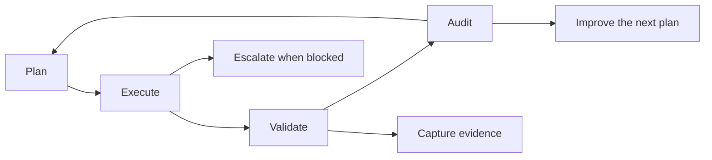
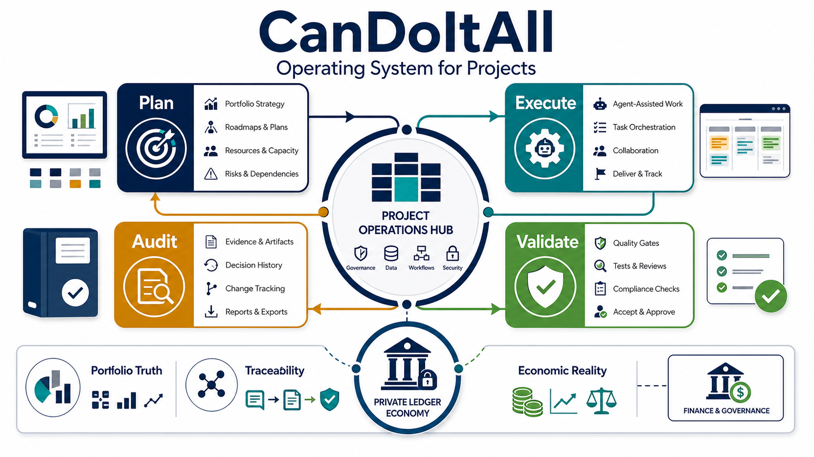
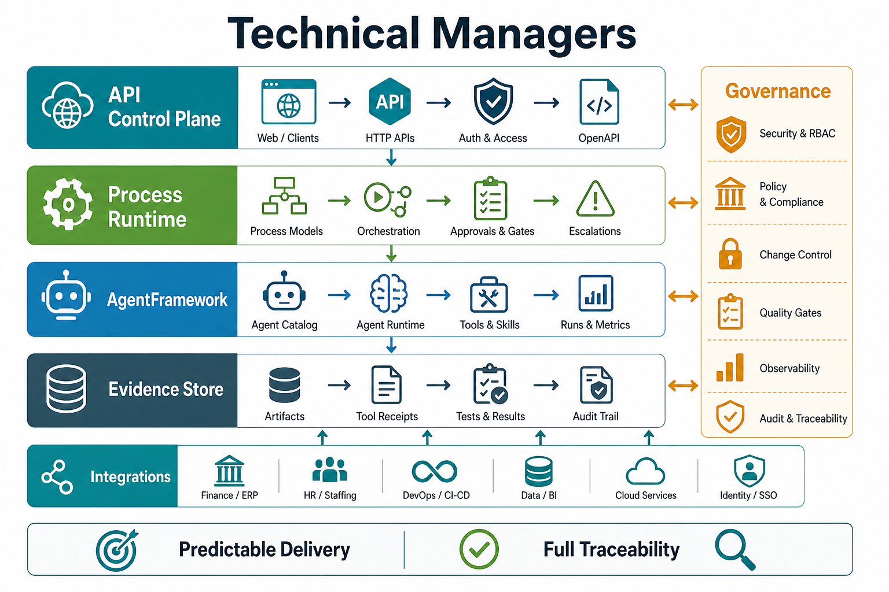
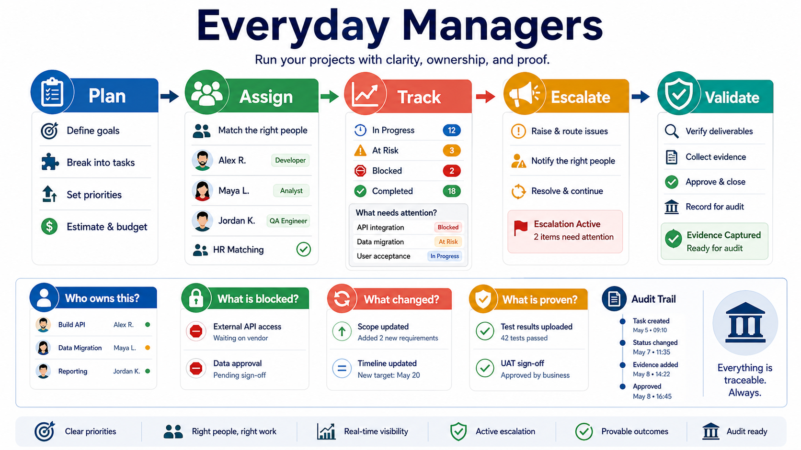
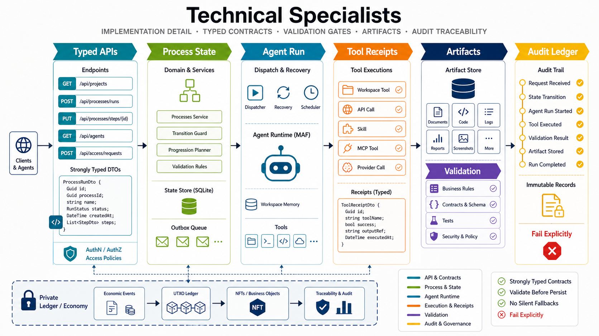

# CanDoItAll As An Operating System For Projects

CanDoItAll is built for organizations that need project work to be planned, executed, validated, and audited in one governed workspace. It is not only a task board and it is not only an agent chat surface. The goal is to keep project intent, process state, people, AI agents, artifacts, decisions, validations, and audit evidence connected.

The short version for enterprise buyers: CanDoItAll turns project delivery into an observable operating loop.

## Executive Summary

For executives, CanDoItAll is about portfolio truth. The system connects project goals, delivery flow, validation evidence, and decision history so leaders can ask:

- Which initiatives are moving, blocked, or under-proven?
- Which decisions changed scope, budget, risk, or timing?
- Which deliverables have evidence rather than unverified status reporting?
- Where does financial reality constrain the plan?

The external `CanDoItAll.Economy` work is directionally important here. Its private ledger model is intended to add traceability for finances and cash flow across projects, simulate project economics, and give agents hard economic boundaries instead of allowing work to drift outside budget reality.

## Technical Managers

Technical managers need to know where responsibility lives. In the current architecture:

- Product behavior lives in modules and application services.
- Project, process, and agent automation uses the web-hosted HTTP API control plane.
- AgentFramework runs technical agents and records execution runs, tool receipts, approvals, artifacts, checkpoints, logs, and metrics.
- Selected MCP sidecars remain useful for development operations such as dotnet watch, code analytics, component discovery, Mermaid, SSH, and local runtime helpers.
- Removed Processes and ProjectStructure MCP servers are not the current operating path.

This keeps rollout manageable. API access, provider configuration, database profile choice, process runtime settings, and validation gates can be reviewed independently without turning every automation concern into a new runtime implementation.

## Everyday Managers

Everyday managers need fewer disconnected status meetings and more reliable answers. CanDoItAll helps by making project work explicit:

- `Plan`: define goals, process templates, roles, dependencies, artifacts, and validation expectations.
- `Assign`: connect human parties and AI parties to the work; HR/staffing matching helps choose feasible executors.
- `Track`: observe active runs, step state, artifacts, approvals, and blocked work.
- `Escalate`: blocked, failed, refused, and waiting-approval states create durable escalation records instead of disappearing into chat.
- `Validate`: required artifacts, tests, reviews, and approval outcomes gate completion.
- `Audit`: decisions, transitions, evidence, and artifacts remain available after the run.

The practical promise is not that every project becomes automatic. The promise is that work becomes easier to inspect, recover, and improve because the system records the operating context.

## Technical Specialists

Technical specialists should treat CanDoItAll as a typed, evidence-oriented runtime:

- API routes accept typed request models and return explicit results.
- Process transitions are guarded by domain rules and required-artifact checks.
- Agent runs persist structured execution state instead of relying on assistant prose.
- Tool receipts, approvals, checkpoints, artifacts, logs, and metrics are first-class proof.
- Invalid machine-critical output is rejected or repaired explicitly; it is not silently accepted from Markdown.
- Validation belongs before persistence and before downstream process progression.

This is the architecture principle to preserve: agents can help execute work, but the system decides what state transitions are legal.

## How The Process Operating Loop Works

1. A project or process definition captures objective, roles, steps, dependencies, expected artifacts, and validation rules.
2. A run materializes assignments, step runs, work briefs, decisions, journals, outbox dispatch records, and artifact expectations.
3. Ready agent-owned steps resolve a CRM/HR AI party to a technical AgentFramework agent.
4. The dispatcher builds a governed prompt with the process context and evidence expectations.
5. AgentFramework executes the run with allowed tools, provider settings, approvals, and artifact capture.
6. The dispatcher validates required tools, branch outcomes, artifacts, and evidence before transitioning the step.
7. Blocking states create escalations and rework paths rather than hiding failures.
8. Operators review escalations, approvals, direct messages, and recovery attempts in the process workspace.
9. Audit views can reconstruct what changed, who or what acted, which evidence was captured, and why a run progressed.

## What Enterprise Customers Need To Prepare

- A first project portfolio or program where traceability matters.
- Process templates for repeatable work such as onboarding, release governance, incident response, architecture decisions, or AI-assisted delivery.
- Role definitions for humans, AI parties, approvers, managers, reviewers, and specialists.
- Provider and agent policies that state which tools are allowed and which outputs require typed finalization.
- Database profile decisions. Governed multi-agent process automation should use PostgreSQL when the runtime guard requires it.
- API access policy: bearer-token settings, token lifetime, and where tokens are issued.
- Evidence rules: what proof is required before delivery can be called complete.

## Where Economy Fits

`CanDoItAll.Economy` is external to this repository, but the intended integration is strategically aligned:

- private ledger for project economic events
- UTXO-style accounting and NFT/business-object identity
- traceable cash-flow and finance observations across projects
- project economy simulation before commitments are made
- economic limits that agents and process runs must respect

That matters because project governance without economic constraints is incomplete. CanDoItAll can coordinate the work loop; Economy can make the financial boundary observable and enforceable when integrated.
