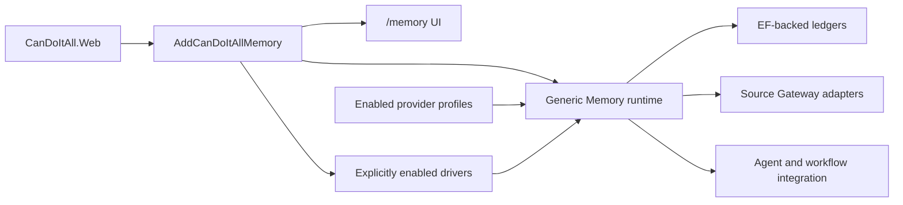

# Generic Memory Implementation Map

This provider model is experimental and remains under active development.

## Runtime Shape

`src/App/CanDoItAll.Composition/Memory/MemoryRuntimeServiceCollectionExtensions.cs` always registers the generic runtime and UI. It conditionally registers a driver only when the corresponding `Memory:Providers:*:Enabled` value is `true`.

## Project Ownership

| Area | Location | Responsibility |
| --- | --- | --- |
| Protocol | `src/Memory/CanDoItAll.Memory.Abstractions` | Provider identity, profiles, manifests, capabilities, envelopes, context packs, and typed results. |
| Application | `src/Memory/CanDoItAll.Memory.Application` | Registry, selection, dispatch, operation handling, Source Gateway, worker contracts, and ledgers. |
| Persistence | `src/Memory/CanDoItAll.Memory.Persistence` | EF-backed profile, operation, feedback, event, source-request, retention, and lease stores. |
| HTTP | `src/Memory/CanDoItAll.Memory.Http` | Generic HTTP adapter. |
| Cognitive Memory driver | `src/Memory/Drivers/CanDoItAll.Memory.Drivers.CognitiveMemory` | Isolated adapter for the standalone native service. |
| MCP | `src/Memory/CanDoItAll.Memory.Mcp` | Remote HTTP MCP descriptor and tool mapping. |
| Mock | `src/Memory/CanDoItAll.Memory.Mock` | Explicit test/development driver. |
| UI | `src/Modules/CanDoItAll.Modules.Memory` | Provider management and operational evidence at `/memory`. |
| MAF integration | `src/MAF/Memory/CanDoItAll.AgentFramework.Memory` | Agent bindings, directives, context contribution, runtime tools, and workflow integration. |
| Source contracts | `src/Memory/CanDoItAll.Memory.SourceGateway.Abstractions` | Provider-neutral source snapshots. |

Workbench, Processes, Resources, CRM-HR, and AgentFramework own their Source Gateway adapters. Providers receive snapshots, not module EF entities or `AppDbContext`.

## Driver Registration

| Driver kind | Registration switch | Intended use |
| --- | --- | --- |
| `Mock` | `Memory:Providers:DeterministicMock:Enabled` | Deterministic tests and explicit development scenarios. |
| `Http` | `Memory:Providers:Http:Enabled` | Generic synchronous HTTP query and health transport. |
| `NativeRemote` | `Memory:Providers:NativeRemote:Enabled` | Adapter for a separately hosted native Cognitive Memory service. |
| `Mcp` | `Memory:Providers:Mcp:Enabled` | Remote HTTP MCP query and optional operation-status transport. |

Driver registration and provider profiles are independent gates: enabling one does not create or authorize the other. See [provider setup](../operations/provider-setup.md).

## Invariants

- The base host starts with zero providers and workers disabled.
- Selection uses explicit enabled profiles and agent bindings; it never chooses the first available provider.
- Provider-specific code stays behind a driver or remote service boundary.
- Dispatch, failures, and asynchronous status are observable through typed results and durable ledgers.
- Background workers use database-backed leases when enabled.
- Native Cognitive Memory implementation projects are not referenced by this repository.

These boundaries are guarded by `tests/Memory/CanDoItAll.Memory.Tests/HostCompositionDependencyRemovalTests.cs`.

## Validation Surfaces

| Concern | Test project |
| --- | --- |
| Generic runtime and composition | `tests/Memory/CanDoItAll.Memory.Tests` |
| MAF memory integration | `tests/MAF/CanDoItAll.AgentFramework.Memory.Tests` and focused unit tests |
| Component UI | `tests/Components/CanDoItAll.Tests.Components` |
| Browser UI | `tests/Playwright/CanDoItAll.Tests.Playwright` |
| Database switching | `tests/Integration/CanDoItAll.Tests.Integration` |
