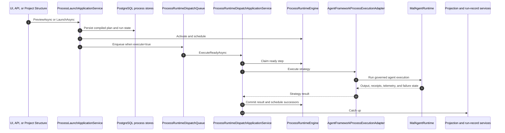

# Processes, MAF, And Providers Implementation Map

Last source review: 2026-07-28.

This map identifies the current implementation owners. It is not a roadmap or generated route reference.

## Composition

[`RuntimeHostServiceCollectionExtensions.AddCanDoItAllRuntimeModules`](../src/App/CanDoItAll.Composition/RuntimeHostServiceCollectionExtensions.cs) composes the runtime in this order of responsibility:

- infrastructure and the active PostgreSQL profile
- product modules, including generic Memory, Workbench, Processes, AgentFramework, Scheduler, and CRM/HR
- MAF runtime and provider drivers
- HTTP and Blazor adapters in the web host

The base host does not compose the legacy Cognitive Memory module or Qdrant/RAG services.

## Process Ownership

| Layer | Current owner |
| --- | --- |
| Identifiers and contracts | [`CanDoItAll.Processes.Abstractions`](../src/Processes/CanDoItAll.Processes.Abstractions) |
| Definitions, builder, and compiler | [`CanDoItAll.Processes.Builder`](../src/Processes/CanDoItAll.Processes.Builder) |
| Runtime engine and scheduling | [`CanDoItAll.Processes.Runtime`](../src/Processes/CanDoItAll.Processes.Runtime) |
| EF stores and durable state | [`CanDoItAll.Processes.Persistence`](../src/Processes/CanDoItAll.Processes.Persistence) |
| Projections and run-record contracts | [`CanDoItAll.Processes.Projections`](../src/Processes/CanDoItAll.Processes.Projections) |
| Launch, dispatch, operator, and query services | [`CanDoItAll.Processes.Application`](../src/Processes/CanDoItAll.Processes.Application) |
| Product adapter, workers, and UI | [`CanDoItAll.Modules.Processes`](../src/Modules/CanDoItAll.Modules.Processes) |
| HTTP transport | [`ProcessesApi.cs`](../src/App/CanDoItAll.Web/Api/ProcessesApi.cs) and [`ProcessRunRecordsApi.cs`](../src/App/CanDoItAll.Web/Api/ProcessRunRecordsApi.cs) |

## Launch And Dispatch



Key implementation files:

- [`ProcessLaunchApplicationService.cs`](../src/Processes/CanDoItAll.Processes.Application/ProcessLaunchApplicationService.cs)
- [`ProcessRuntimeDispatchApplicationService.cs`](../src/Processes/CanDoItAll.Processes.Application/ProcessRuntimeDispatchApplicationService.cs)
- [`ProcessRuntimeEngine.cs`](../src/Processes/CanDoItAll.Processes.Runtime/ProcessRuntimeEngine.cs)
- [`ProcessRuntimeDispatchQueue.cs`](../src/Modules/CanDoItAll.Modules.Processes/Services/ProcessRuntimeDispatchQueue.cs)
- [`ProcessRuntimeDispatchQueueServices.cs`](../src/Modules/CanDoItAll.Modules.Processes/Services/ProcessRuntimeDispatchQueueServices.cs)
- [`AgentFrameworkProcessExecutionAdapter.cs`](../src/Modules/CanDoItAll.Modules.Processes/Services/RuntimeIntegration/AgentFrameworkProcessExecutionAdapter.cs)

The queue is a bounded, deduplicated, process-local coordinator. PostgreSQL remains authoritative for run state. Recovery discovery, claim reconciliation, projection replay, and run-record processing operate against persisted state. Current configuration defaults and operator routes are in the [operator runbook](process-agent-operator-runbook.md).

The authoritative HTTP route list comes from `GET /api/processes/contract` and is summarized in [API control plane](api-control-plane.md). It includes run-record search, analytics, summary, and graph routes in addition to launch, dispatch, cancellation, rework, live detail, and history.

## Project Structure Bridge

[`ProjectStructureProcessNodeService`](../src/Modules/CanDoItAll.Modules.Workbench/ProjectStructure/ProjectStructureProcessNodeService.cs) is the supported bridge for:

- linking a project node to a process definition
- starting the linked process with typed project context
- linking the resulting run node back into Project Structure
- launching a governed subprocess with parent run/step scope

The corresponding Workbench runtime tools are process-adjacent Project Structure tools, not a general direct process tool provider.

## MAF Version And Runtime

Versions are centralized in [`MicrosoftAgentFramework.Packages.props`](../src/MAF/MicrosoftAgentFramework.Packages.props):

| Channel | Version |
| --- | --- |
| Stable | `1.15.0` |
| Preview | `1.15.0-preview.260722.1` |

The primary runtime path is:

| Concern | Implementation |
| --- | --- |
| Runtime entry | [`MafAgentRuntime.cs`](../src/MAF/Common/CanDoItAll.AgentFramework.Maf/Runtime/MafAgentRuntime.cs) |
| Runtime agent construction | [`MafRuntimeAgentFactory.cs`](../src/MAF/Common/CanDoItAll.AgentFramework.Maf/Runtime/MafRuntimeAgentFactory.cs) |
| Capability composition | [`RuntimeCapabilityComposer.cs`](../src/MAF/Common/CanDoItAll.AgentFramework.Maf/Runtime/Capabilities/RuntimeCapabilityComposer.cs) |
| Runtime-tool provider composition | [`RuntimeToolProviderComposer.cs`](../src/MAF/Common/CanDoItAll.AgentFramework.Maf/Runtime/Capabilities/RuntimeToolProviderComposer.cs) |
| Session persistence | [`MafRuntimeSessionPersistenceDriver.cs`](../src/MAF/Common/CanDoItAll.AgentFramework.Maf/Runtime/MafRuntimeSessionPersistenceDriver.cs) |
| Approval continuation | [`MafApprovalContinuationDriver.cs`](../src/MAF/Common/CanDoItAll.AgentFramework.Maf/Runtime/MafApprovalContinuationDriver.cs) |
| Structured finalization | [`MafFinalizerDriver.cs`](../src/MAF/Common/CanDoItAll.AgentFramework.Maf/Runtime/MafFinalizerDriver.cs) |

MAF attaches built-in capabilities, skills, MCP/A2A tools, context contributors, provider-native tools, and registered runtime-tool providers. Product modules contribute through `IAgentRuntimeToolProvider`; the MAF project does not reference product modules to discover them.

## First-Party Runtime-Tool Providers

| Provider | Owner and source |
| --- | --- |
| Memory | [`MemoryAgentRuntimeToolProvider.cs`](../src/MAF/Memory/CanDoItAll.AgentFramework.Memory/Tools/MemoryAgentRuntimeToolProvider.cs) |
| Project Structure | [`ProjectStructureAgentRuntimeToolProvider.cs`](../src/Modules/CanDoItAll.Modules.Workbench/AgentTools/ProjectStructureAgentRuntimeToolProvider.cs) |
| Image Generation | [`ImageGenerationAgentRuntimeToolProvider.cs`](../src/Modules/CanDoItAll.Modules.AgentFramework/AgentTools/ImageGenerationAgentRuntimeToolProvider.cs) |
| Workflow | [`WorkflowAgentRuntimeToolProvider.cs`](../src/Modules/CanDoItAll.Modules.AgentFramework/AgentTools/WorkflowAgentRuntimeToolProvider.cs) |
| Prompt Gallery | [`PromptGalleryAgentRuntimeToolProvider.cs`](../src/Modules/CanDoItAll.Modules.AgentFramework/AgentTools/PromptGalleryAgentRuntimeToolProvider.cs) |
| Prompts Curator | [`PromptsCuratorAgentRuntimeToolProvider.cs`](../src/Modules/CanDoItAll.Modules.AgentFramework/AgentTools/PromptCurator/PromptsCuratorAgentRuntimeToolProvider.cs) |
| Workflow Curator | [`WorkflowCuratorAgentRuntimeToolProvider.cs`](../src/Modules/CanDoItAll.Modules.AgentFramework/AgentTools/WorkflowCurator/WorkflowCuratorAgentRuntimeToolProvider.cs) |
| Capability Curator | [`CapabilityCuratorAgentRuntimeToolProvider.cs`](../src/Modules/CanDoItAll.Modules.AgentFramework/AgentTools/CapabilityCurator/CapabilityCuratorAgentRuntimeToolProvider.cs) |
| HR | [`HrAgentRuntimeToolProvider.cs`](../src/Modules/CanDoItAll.Modules.AgentFramework/AgentTools/Hr/HrAgentRuntimeToolProvider.cs) |
| Scheduler | [`SchedulerAgentRuntimeToolProvider.cs`](../src/Modules/CanDoItAll.Modules.SchedulerPlanner/AgentTools/SchedulerAgentRuntimeToolProvider.cs) |

There is no general `ProcessAgentRuntimeToolProvider`. Process control uses the HTTP API, governed process execution adapter, and Project Structure bridge. Provider registration alone does not grant a tool: execution purpose, capability assignment, agent permissions, scope, and invocation policy still apply.

## Provider Runtime

[`MafProviderRuntimeGateway.cs`](../src/MAF/Common/CanDoItAll.AgentFramework.Maf/Runtime/Providers/MafProviderRuntimeGateway.cs) exposes provider health, test chat, image operations, and Ollama maintenance over pooled runtime handles.

Concrete drivers:

- [`OpenAiProviderDriver.cs`](../src/MAF/Common/CanDoItAll.AgentFramework.Providers/Drivers/OpenAiProviderDriver.cs)
- [`AzureOpenAiProviderDriver.cs`](../src/MAF/Common/CanDoItAll.AgentFramework.Providers/Drivers/AzureOpenAiProviderDriver.cs)
- [`OllamaProviderDriver.cs`](../src/MAF/Common/CanDoItAll.AgentFramework.Providers/Drivers/OllamaProviderDriver.cs)
- [`ComfyUiProviderDriver.cs`](../src/MAF/Common/CanDoItAll.AgentFramework.Providers/Drivers/ComfyUiProviderDriver.cs)

The runtime:

- resolves credentials without storing secret values in provider descriptors
- pools handles by provider id and descriptor key
- replaces a handle when its descriptor changes
- applies per-provider/capability/model dispatch lanes
- classifies quota/billing, rate-limit, and provider failures with redacted details
- keeps canonical provider-profile snapshots revision- and database-generation-fenced

## Managed Provider Bootstrap

[`AppDatabaseBootstrapper`](../src/App/CanDoItAll.Composition/RuntimeHostServiceCollectionExtensions.cs) normalizes the managed OpenAI chat profiles and seeds the other missing managed profiles:

| Profile | Driver and default |
| --- | --- |
| OpenAI default | OpenAI Responses, `gpt-5.4-mini` |
| OpenAI chat completions | OpenAI Chat Completions, `gpt-5.4-mini` |
| OpenAI image generation | OpenAI Images, `gpt-image-1-mini` |
| Local ComfyUI Flux | ComfyUI, `flux1-dev.safetensors` at `http://127.0.0.1:8188` |
| Local Ollama | Ollama, `llama3.1` at `http://127.0.0.1:11434` |

OpenAI credentials resolve from `OPENAI_API_KEY` or the runtime secret store. Local profiles being present does not prove that Ollama, ComfyUI, or their models are installed or healthy.

## Current Operational Boundaries

- PostgreSQL is required for production process automation; InMemory is test-only.
- The dispatch queue is local to one process, while recovery and run state are database-backed.
- Run-record narratives are asynchronous and may be pending or failed while hard facts are available.
- API authorization is disabled by default for local development and must be enabled before remote exposure.
- Generic Memory provider drivers and workers are disabled by default.
- The retired Cognitive Memory paths return only a retirement contract and `410 Gone`; there is no implicit Qdrant dependency.

## Validation

For changes in these areas, use focused tests before the full stable gate:

```powershell
dotnet test tests\Unit\CanDoItAll.Tests.Unit\CanDoItAll.Tests.Unit.csproj --configuration Release --filter "FullyQualifiedName~ProcessRuntimeDispatchApplicationServiceTests|FullyQualifiedName~MafAgentRuntimeToolProviderCompositionTests|FullyQualifiedName~ProviderRuntimeLifecycleTests"
dotnet test tests\Integration\CanDoItAll.Tests.Integration\CanDoItAll.Tests.Integration.csproj --configuration Release --filter "FullyQualifiedName~ProjectStructureAgentIntegrationTests"
```

The repository-wide validation contract is in [Testing](testing.md).
