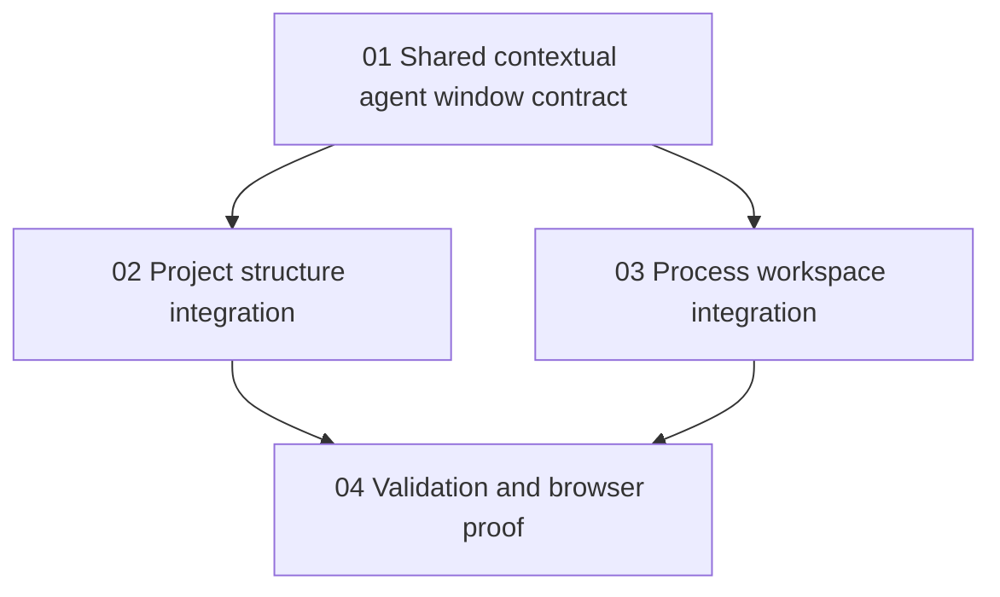

# Phase Plan

## Phase Sequence

1. Build the shared contextual agent launcher/chat component in AgentFramework components.
2. Integrate the shared component into the project structure canvas.
3. Integrate the shared component into the process definition canvas.
4. Build, test, and run Playwright MCP proof with screenshots across project and process flows.

## Subbundle Dependency Map

## Critical Subbundles

- `01-shared-contextual-agent-window-contract` is critical because both host pages depend on the same access filtering and persisted chat behavior.
- `02-project-structure-integration` is critical because it proves project access metadata and canvas overlay placement.
- `03-process-workspace-integration` is critical because it proves process access metadata and process canvas overlay placement.
- `04-validation-and-browser-proof` is critical because the raw request explicitly requires Playwright MCP screenshots and real project/process prompt flows.

## Phase Gates

- Gate 01: Shared component builds, filters project/process access correctly, opens a new chat thread, and reuses `ChatWorkspacePanel`.
- Gate 02: Project structure toolbar opens the launcher and chat without clipping existing toolbox/selection windows.
- Gate 03: Process Steps canvas toolbar opens the launcher and chat without breaking toolbox, selection, or editor windows.
- Gate 04: Playwright MCP captures project and process open-window screenshots, sends requested prompts, and confirms the contextual thread from the Agents chat tab.
