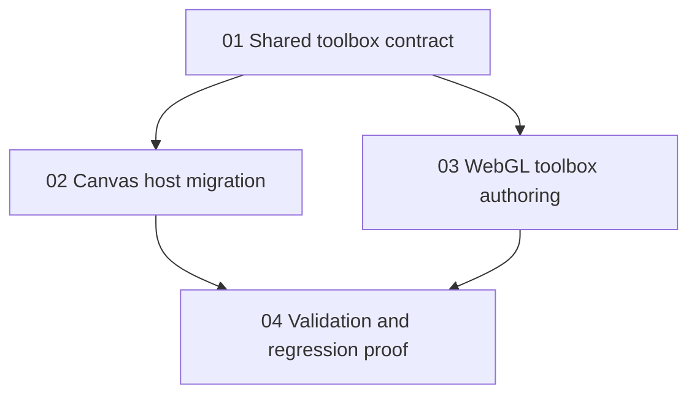

# Phase Plan

## Execution Order

1. Build the shared OverlayLib toolbox contract and component.
2. Migrate project structure, process canvas, and prompt factory host markup through adapters while preserving action callbacks.
3. Add WebGL toolbox overlay and role creation flow.
4. Run builds, targeted tests, and Playwright MCP validation with screenshots.

## Subbundle Dependency Map

## Critical Subbundles

- `01-01-shared-toolbox-contract` is critical because all migrated hosts depend on the generic model and event semantics.
- `02-02-canvas-host-migration` is critical for regression safety because project/process structures must not break.
- `03-03-webgl-toolbox-authoring` is critical for the new user-facing WebGL role-add behavior.
- `04-04-validation-and-regression-proof` is critical because the request explicitly requires Playwright MCP screenshots and real add-flow proof.

## Phase Gates

- Gate 01: Shared component builds, renders grouped items, fires primary and secondary item callbacks, and has stable test IDs.
- Gate 02: Existing project/process/prompt add flows still call the same domain actions after migration.
- Gate 03: WebGL toolbox adds a new role and the rebuilt surface contains a visible 3D role node.
- Gate 04: Playwright MCP proves project structure block add and WebGL role add with screenshots; process and prompt factory toolbox smoke checks pass.
