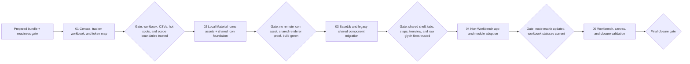

# Phase Plan

## Phase Sequence

1. Run the prepared-stage validator on the bundle and repair any structural gaps before product code changes.
2. Execute subbundle `01` to lock the workbook, CSV exports, hot spots, and token mapping baseline.
3. Execute subbundle `02` to vendor the local Material Icons assets and replace the shared icon render foundation.
4. Execute subbundle `03` to migrate BaseLib and legacy shared-component renderers, raw glyph escapes, and CSS hooks that downstream pages reuse broadly.
5. Execute subbundle `04` to migrate shell and non-Workbench route surfaces across the app and modules while keeping the workbook updated.
6. Execute subbundle `05` to finish the Workbench and canvas-heavy surfaces, merge carefully around the locally modified files, and then run the route sweep and closure audit.
7. End with the final closure gate after raw-note closure, workbook status updates, build or test proof, and browser analytics review.

## Subbundle Dependency Map

## Critical Subbundles

- `01 Icon census, tracker workbook, and migration map`
- This is a critical foundation because every downstream migration decision depends on the workbook and token map being complete enough to prevent hidden leftover icon systems.
- `02 Local Material Icons foundation and shared renderer conversion`
- This is a critical foundation because it establishes the local asset path, removes the external dependency, and defines the runtime markup that later CSS and call-site changes depend on.
- `03 BaseLib and legacy shared-component icon migration`
- This is a critical UI foundation because shell, button, tab, step, and treeview proof becomes the trust base for later route-level migration.

## Phase Gates

- After preparation: run `codex/skills/bundles/candoitall-bundle-preparation/scripts/validate_bundle.py --stage prepared` and do not start product code changes until it passes.
- After subbundle `01`: require the workbook, inventory CSV, token CSV, top hotspot summary, and explicit dirty-worktree notes.
- After subbundle `02`: require local icon asset files checked into the solution, the remote stylesheet removed from `App.razor`, build proof, and browser proof on at least `/` and `/groups/foundations`.
- After subbundle `03`: require proof that shared components and their CSS hooks no longer depend on Font Awesome classes, plus a dependent-route smoke on `/`, `/groups/navigation`, and `/projects`.
- After subbundle `04`: require the non-Workbench route matrix to pass on desktop and narrower-width viewports, and require workbook statuses to show which rows moved to completed versus remaining.
- After subbundle `05`: require Workbench and canvas route proof, merge-safe handling of the already modified files, raw-note closure, browser analytics review, and the final bundle validator.
