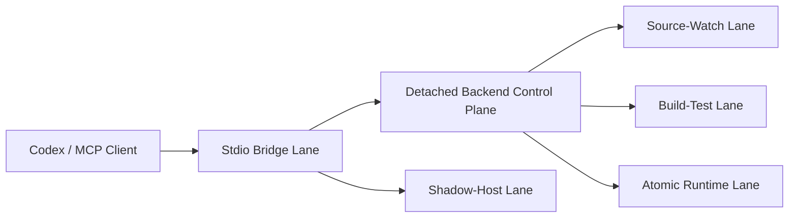
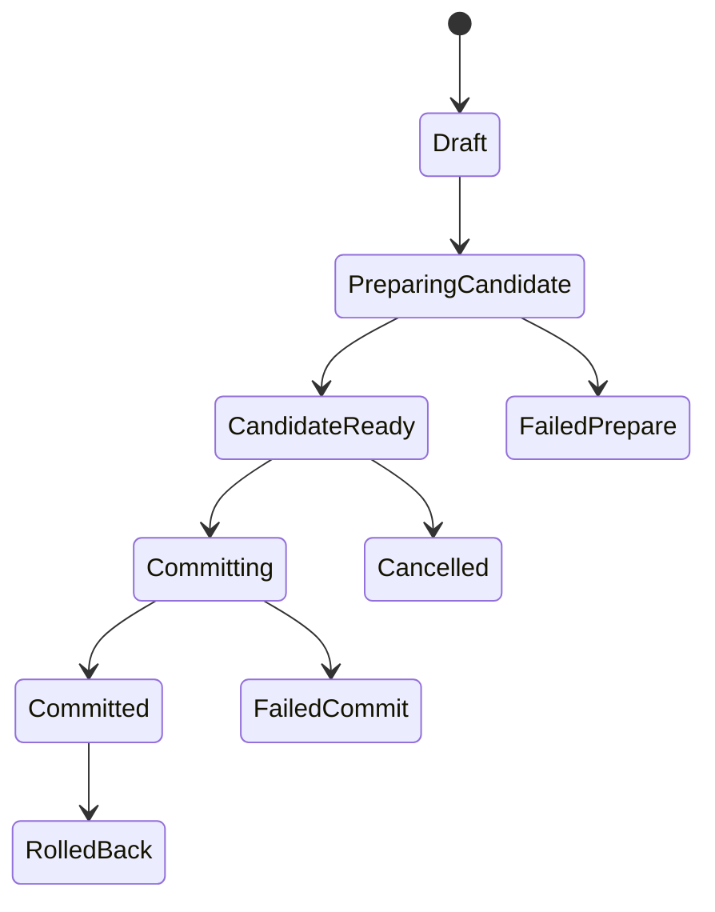

# 02. Target Operating Model

## Overview

The target model separates the MCP stack into five lanes with different safety and latency characteristics.

## Lane definitions

### 1. Stdio bridge lane

Purpose:

- accept MCP stdio traffic from Codex
- repair or rebind to the detached backend
- never own app session truth

Required properties:

- self-repairing connection
- typed, actionable failures
- no hidden timeout that contradicts tool contracts

### 2. Source-watch lane

Purpose:

- fast feedback for small source edits
- hot reload and restart-required flows driven by `dotnet watch`

Required properties:

- watch iteration remains the source revision signal
- `app_wait` and `app_status` expose generation-aware state
- high watch pressure can trigger a recommendation or automatic fallback to another lane

### 3. Build-test lane

Purpose:

- `dotnet build`
- `dotnet test`
- focused validation without sharing hot output directories

Required properties:

- isolated artifacts
- explicit preemption policy relative to active app sessions
- preserved test/build evidence

### 4. Atomic runtime lane

Purpose:

- prepare a candidate runtime from published artifacts
- validate it in isolation
- commit or roll back logically

Required properties:

- slot-based runtime artifacts
- candidate health gate
- previous active runtime preserved until commit
- rollback path

### 5. Shadow-host lane

Purpose:

- build and launch immutable stdio shadow binaries
- keep Codex talking to current repo code instead of stale host artifacts

Required properties:

- immutable build roots
- manifest pointer to current build
- in-use-safe cleanup

## Default Codex workflow policy

### Fast path

Use the source-watch lane when:

- the change is local to a few source files
- the current watch session is healthy
- the goal is quick UI or behavior feedback
- no stable candidate handoff is required

### Safe path

Use the atomic runtime lane when:

- many files/projects were changed
- `dotnet watch` emits overload or pressure signals
- a deterministic validation candidate is needed
- a publish-backed handoff artifact is required
- Codex should not observe partially propagated state

### Validation path

Use the build-test lane when:

- unit, integration, or solution validation is the goal
- app lifecycle preemption is acceptable
- there is no need to expose the output as an active runtime

## Runtime identity model

Bundle 1 should distinguish these identities everywhere:

- `logicalAppId`
  - the stable Codex-facing app identity
- `sessionId`
  - a concrete process/session record
- `revisionId`
  - the runtime revision currently being observed
- `transactionId`
  - an atomic update attempt
- `slotId`
  - the inactive or active publish slot

## Revision model

### Source-watch revision

Authoritative source:

- watch iteration from `/_dev/runtime`

Representation:

- revision kind: `WatchIteration`
- value: integer iteration plus logical app id

### Published runtime revision

Authoritative source:

- publish manifest hash plus source signature

Representation:

- revision kind: `PublishedBundle`
- value: content hash, publish timestamp, slot id

### Run-once revision

Authoritative source:

- process start instance id

Representation:

- revision kind: `ProcessInstance`
- value: start timestamp plus pid

## Atomic update lifecycle

Rules:

1. `PreparingCandidate` never mutates the active runtime.
2. `CandidateReady` means the candidate runtime is healthy in isolation.
3. `Committed` changes the logical active runtime pointer.
4. `FailedPrepare` and `FailedCommit` leave the previous active runtime authoritative unless commit already advanced.
5. `RolledBack` restores the previous active runtime pointer and preserves evidence.

## Non-goals

Bundle 1 does not require:

- cross-machine deployment orchestration
- containerized blue-green deployment
- stable public socket continuity without a relay/proxy
- replacement of `dotnet watch` with a custom file watcher
- turning the MCP server into a generic process manager for unrelated applications
