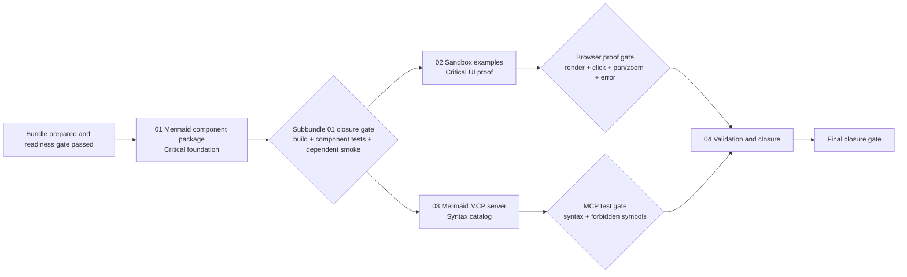

# Phase Plan

## Phase Sequence

1. Prepare and validate this bundle.
2. Execute subbundle 01: add `CanDoItAll.Components.Mermaid`, vendor Mermaid asset, JS interop, C# models, node-click, pan/zoom, and error display.
3. Run subbundle 01 closure gate and one dependent smoke that the sandbox can reference the package.
4. Execute subbundle 02: add Mermaid sandbox group/page and examples for flowchart, architecture-beta, click logging, pan/zoom, and syntax errors.
5. Execute subbundle 03: add `CanDoItAll.Mcp.Mermaid`, syntax catalog, tools, settings, and tests.
6. Execute subbundle 04: run build/test/browser proof, update execution report, close raw notes, and run final bundle validators.

## Subbundle Dependency Map

## Critical Subbundles

- `01-mermaid-component-package` is a critical foundation. If asset loading, rendering, node-click, error normalization, or pan/zoom fails, sandbox proof and downstream consumers are untrustworthy.
- `02-sandbox-examples` is critical UI proof. It must verify the real browser behavior, not only compile-time markup.
- `03-mermaid-mcp-server` is process-critical for agent guidance. If forbidden symbol guidance is weak, future agents will produce invalid Mermaid.

## Phase Gates

- Prepared gate: `python C:\Users\dell\.codex\skills\candoitall-bundle-preparation\scripts\validate_bundle.py --stage prepared --bundle mermaid_wrapper_bundle`
- Subbundle entry gate: confirm prerequisites, exact source references, and raw-note ownership before editing.
- Subbundle 01 progression gate: component project builds; official Mermaid asset exists; tests cover models and error normalization; sandbox project can reference package.
- Subbundle 02 progression gate: Playwright proves `/groups/mermaid` renders nonblank SVG, captures a node click, changes pan/zoom state, and displays error details on invalid syntax.
- Subbundle 03 progression gate: MCP tests prove search/get/rules/forbidden-symbol tools return architecture-beta and common diagram guidance.
- Final closure gate: all raw notes marked solved or explicitly followed up, execution report synchronized, `validate_bundle.py --stage completed` passes.
