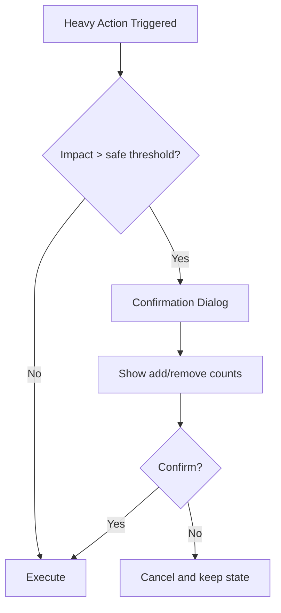
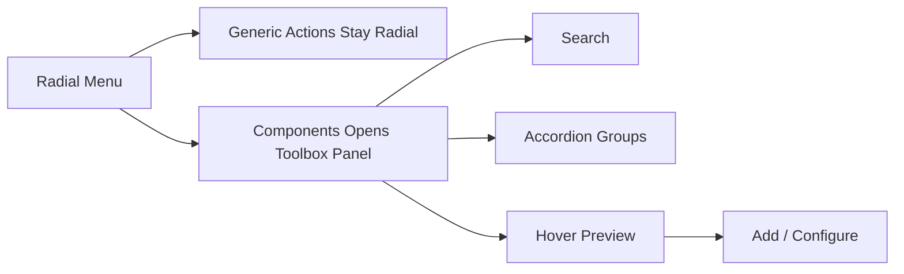

# Flows And Wireframes

## Flow Diagrams

```mermaid
flowchart LR
    A["Open Prompt Factory"] --> B["Canvas Tab"]
    B --> C["Inspect Session"]
    C --> D["Open Session Setup"]
    D --> E["Intent / Language / App State / Repos"]
    E --> F["Setup Ready"]
    F --> G["Add Components"]
    G --> H["Toolbox Panel With Search"]
    H --> I["Hover Preview"]
    I --> J["Add One Component"]
    J --> K["Attach Inputs / Resources"]
    K --> L["Build / Review / Deliver"]
```







## ASCII Layout Proposal

### Main page shell

```text
+----------------------------------------------------------------------------------+
| Prompt Factory                                                                   |
| [Canvas] [Setup] [Governance] [Assembly] [Review]                                |
+----------------------------------------------------------------------------------+
| Canvas + Inspector                                                               |
| +------------------------------------------+  +--------------------------------+ |
| | canvas toolbar                           |  | workflow rail                  | |
| |                                          |  | selected node / setup summary  | |
| | session root + setup node + prompt graph |  | stage actions                  | |
| |                                          |  | quick warnings / readiness     | |
| +------------------------------------------+  +--------------------------------+ |
+----------------------------------------------------------------------------------+
| Active support lane only                                                         |
| Setup tab OR Governance tab OR Assembly tab OR Review tab                        |
+----------------------------------------------------------------------------------+
```

### Components toolbox panel

```text
+---------------------------------------------------------------+
| Components Toolbox                                       [x] |
| Search components: [ architecture ...                  ] [ ] |
|---------------------------------------------------------------|
| v Foundation                                                 |
|   > Session Framing                                           |
|   > Mission & Scope                                           |
|   > Context Discovery                                         |
|                                                               |
| v Delivery                                                   |
|   v Architecture                                              |
|     - System role prompt                 [hover preview]      |
|     - Architecture constraints           [hover preview]      |
|     - Review checklist                   [hover preview]      |
|                                                               |
| v Validation                                                 |
|   > QA                                                       |
|   > Handoff                                                  |
|---------------------------------------------------------------|
| Preview                                                      |
| A concise summary or prompt text excerpt for the hovered item |
+---------------------------------------------------------------+
```

### Setup node inspector

```text
+---------------------------------------------------------------+
| Session setup                                                 |
| status: 3 fields missing                                      |
|---------------------------------------------------------------|
| Prompt intent      [ Programming v ]                          |
| Main language      [ C# v ]                                   |
| Other languages    [ SQL, TypeScript ]                        |
| App state          [ Existing app v ]                         |
| Work repository    [ repo-a ]                                 |
| Info repositories  [ repo-docs, repo-api ]                    |
| Working notes      [ what the AI should optimize for... ]     |
|---------------------------------------------------------------|
| [Save setup] [Open Setup Tab]                                 |
+---------------------------------------------------------------+
```

### Attachment node visual model

```text
[PDF]  Spec.pdf            red accent      "Extract acceptance criteria"
[XLS]  Costs.xlsx          green accent    "Compare line items and totals"
[IMG]  Screen.png          blue accent     "Read layout issues"
[TXT]  Logs.txt            slate accent    "Summarize errors"
[VID]  Demo.mp4            violet accent   "Find regression steps"
```

## Why This Matters

- Tabs cut page-length anxiety and improve perceived control.
- A setup node keeps foundational context inside the same mental model as the prompt graph.
- A toolbox panel supports recognition and comparison better than radial browsing for long lists.
- Rich attachment styling helps users understand context at a glance.
- Confirmations reduce fear and increase trust.
