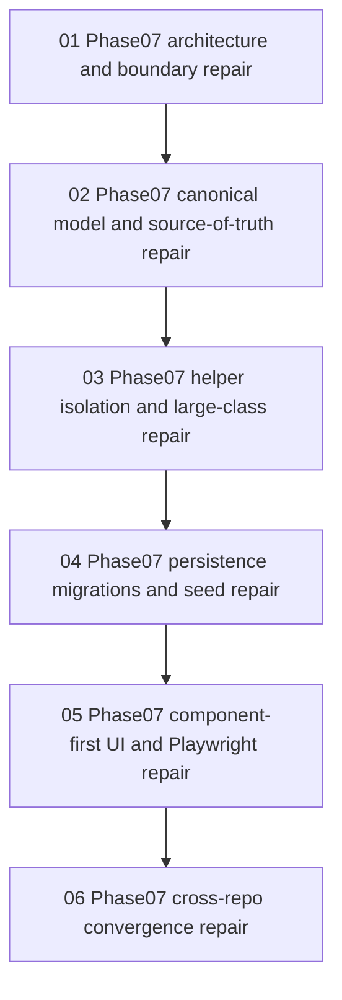

# Phase Plan

## Phase Sequence

1. Review the completed phase07 evidence from the root bundle.
2. Map the evidence across the six standard repair lanes.
3. Keep every lane blocked unless concrete phase07 defects remain.
4. Validate this generated repair bundle at completed stage.
5. Restore root-bundle closure only after this repair bundle exists and passes validation.

## Subbundle Dependency Map

## Critical Subbundles

- `01-phase07-architecture-and-boundary-repair`
  This lane protects the rule that the MCP stays a thin shell over canonical process services.
- `02-phase07-canonical-model-and-source-of-truth-repair`
  This lane protects against accidental duplicate process models or raw persistence logic.
- `06-phase07-cross-repo-convergence-repair`
  This lane protects the install-discoverability workflow so the MCP does not become another hidden workstation-only dependency.

## Phase Gates

- Gate before subbundle review: confirm the root phase07 evidence exists.
- Gate after each subbundle review: either keep the lane blocked or create explicit repair work if a real defect exists.
- Gate before closure: run the completed-stage validator on this repair bundle, then rerun the root-bundle completed-stage validator.
