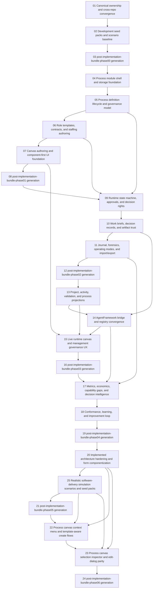

# Phase Plan

## Phase Sequence

1. Phase 00:
   source-of-truth convergence and realistic seed baseline
2. Phase 01:
   module shell, authoring domain, staffing authoring, and authoring UI
3. Phase 02:
   runtime state machine, governance, work briefs, trust, journals, and replay-ready imports
4. Phase 03:
   cross-module projections, future bridge seams, and management/runtime UI
5. Phase 04:
   metrics, economics, decision intelligence, conformance, and improvement loop
6. Phase 05:
   architecture hardening, realistic simulation scenario expansion, reusable form extraction, and oversized-file repair after the implementation coverage audit
7. Phase 06:
   process-canvas parity with project structure, including context menu, floating create flows, selection inspector, and edit-dialog behavior

## Subbundle Dependency Map

## Critical Subbundles

| Subbundle | Why it is critical | Extra proof required |
| --- | --- | --- |
| `01-canonical-ownership-and-cross-repo-convergence` | Locks single-source-of-truth boundaries before code is written. | Explicit cross-repo ownership matrix and no unresolved duplicate-registry decision. |
| `02-development-seed-packs-and-scenario-baseline` | All later validation quality depends on realistic fixtures. | Seed scenarios, data ownership, and fixture strategy reviewed and accepted. |
| `04-process-module-shell-and-storage-foundation` | Every later process entity, migration, and route depends on it. | Build, migrations, and module registration proof. |
| `05-process-definition-lifecycle-and-governance-model` | Defines canonical process identity, lifecycle, and version truth. | Domain, persistence, and publication guardrail proof. |
| `06-role-templates-contracts-and-staffing-authoring` | Locks the role-first model and staffing semantics. | Cross-module integration proof with CRM-HR and role-template snapshots. |
| `09-runtime-state-machine-approvals-and-decision-rights` | All live execution and later analytics depend on this state model being correct. | Integration tests plus dependent-flow smoke before downstream work proceeds. |
| `10-work-briefs-decision-records-and-artifact-trust` | Explainability and trust structures must exist before external bridge or analytics work. | Journaled decision records and artifact metadata proof. |
| `14-agentframework-bridge-and-registry-convergence` | Protects long-term mergeability and prevents duplicate registries. | Explicit bridge contracts, ownership tests, and no compile-time dependency proof. |
| `20-implemented-architecture-hardening-and-form-componentization` | The current implementation cannot safely absorb new canvas UX until the oversized files are split, reusable forms exist, and missing enterprise placeholders stop collapsing into summary blobs. | File-size reduction proof, component extraction evidence, service-boundary review, and regression coverage. |
| `25-realistic-software-delivery-simulation-scenarios-and-seed-packs` | UI, analytics, and governance proof become weak if the process module only seeds toy data. | Rich seed data proof, realistic software-delivery scenario walkthroughs, and simulation-oriented regression validation. |
| `22-process-canvas-context-menu-and-template-aware-create-flows` | The authored process canvas is currently only a rendered surface, not an interactive workbench. | Playwright proof for right-click flows, floating toolbox/create windows, and template-aware authoring. |
| `23-process-canvas-selection-inspector-and-edit-dialog-parity` | Selection, editing, and runtime inspection must match the project-structure workbench rhythm before the module can claim canvas maturity. | Playwright proof for single-click selection sync, double-click edit modal/actions, and floating inspector parity. |

## Phase Gates

- Phase 00 gate:
  subbundles `01` and `02` closed, then `03` must generate and validate `post-implementation-bundle-phase00`.
- Phase 01 gate:
  subbundles `04` through `07` closed, UI proof recorded for authoring surfaces, then `08` must generate and validate `post-implementation-bundle-phase01`.
- Phase 02 gate:
  subbundles `09` through `11` closed with runtime, journal, and trust proof, then `12` must generate and validate `post-implementation-bundle-phase02`.
- Phase 03 gate:
  subbundles `13` through `15` closed with cross-module and UI proof, then `16` must generate and validate `post-implementation-bundle-phase03`.
- Phase 04 gate:
  subbundles `17` and `18` closed with analytics and conformance proof, then `19` must generate and validate `post-implementation-bundle-phase04`.
- Phase 05 gate:
  subbundles `20` and `25` closed with architecture, componentization, realistic-seed, and simulation proof, then `21` must generate and validate `post-implementation-bundle-phase05`.
- Phase 06 gate:
  subbundles `22` and `23` closed with project-structure parity proof, then `24` must generate and validate `post-implementation-bundle-phase06`.
- Universal gate:
  the next phase may not start while the previous post-phase repair bundle still contains `Ready` or `In progress` repair subbundles.
