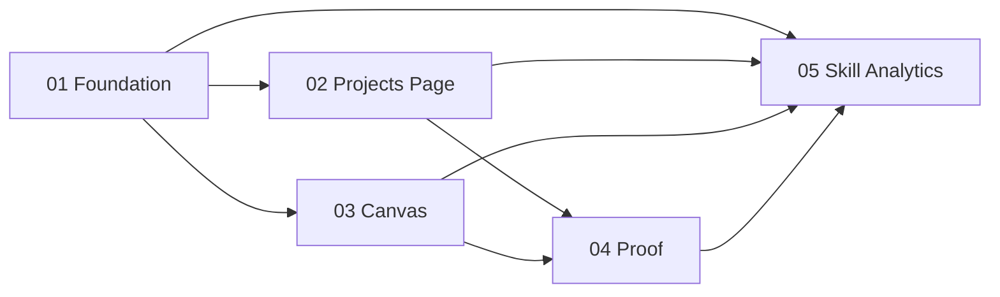

# Phase Plan

## Execution Order

1. Prepare and validate the bundle, including the raw-note coverage matrix and analytics-ready execution report.
2. Execute subbundle 01 to establish the hierarchy model, service contract, cycle rules, and workbench projection foundation.
3. Execute subbundle 02 to surface hierarchy discovery and recursive subproject navigation on `/projects`.
4. Execute subbundle 03 to surface hierarchy nodes and actions on `/projects/{id}/structure`.
5. Execute subbundle 04 to run cross-surface regression proof, close raw notes, and verify the feature works as a whole rather than as isolated edits.
6. Execute subbundle 05 to review the captured analytics, repair the repo skill pack and install/sync scripts, and rerun the validators before closure.

## Subbundle Dependency Map

## Critical Subbundles

- `01-model-project-hierarchy-and-persistence-foundation`
- Reason: it defines the relation model, cycle rules, and workbench projection contract consumed by every later phase.
- `03-extend-structure-canvas-for-project-hierarchy-visualization-and-actions`
- Reason: it is the highest-risk UI projection of the hierarchy model; weak proof here would make the final regression pass meaningless.

## Phase Gates

| Subbundle | Entry gate | Closure gate | Downstream impact if weak |
| --- | --- | --- | --- |
| `01` | Bundle ready, source refs still match repo, no hidden narrowing of the hierarchy scope. | Targeted integration tests prove multi-parent persistence, cycle rejection, and structure-surface projection; one dependent lookup smoke proves subbundles 02 and 03 can consume the new data without guessing. | Invalidates all downstream UI work and raw-note closure. |
| `02` | Subbundle 01 completed and trusted. | Component tests plus Playwright proof on `/projects`, including filters, recursive subproject modal flow, and screenshot review at large and narrower widths. | Leaves raw notes about Projects page discovery unresolved and makes final proof incomplete. |
| `03` | Subbundle 01 completed and trusted; labels from subbundle 02 reviewed for UX consistency. | Component/integration tests plus Playwright proof on `/projects/{id}/structure`, including visible child nodes, parent nodes, extra-parent nodes, new-tab opening, add/reconnect flow, and screenshot review. | Makes the hierarchy visually or behaviorally untrustworthy even if persistence works. |
| `04` | Subbundles 02 and 03 completed with fresh proof. | Clean targeted build/test matrix, browser analytics rows updated, and raw-note closure table no longer pending for shipped feature notes. | Prevents honest bundle closure because the feature would only be locally proven. |
| `05` | Subbundles 01-04 completed and analytics rows populated. | Analytics review written, repo skill-pack changes committed to code, install/sync propagation proven, prepared/completed validators rerun, and bundle docs synchronized. | Leaves the workflow defect unresolved and fails the user's process-improvement requirement. |
