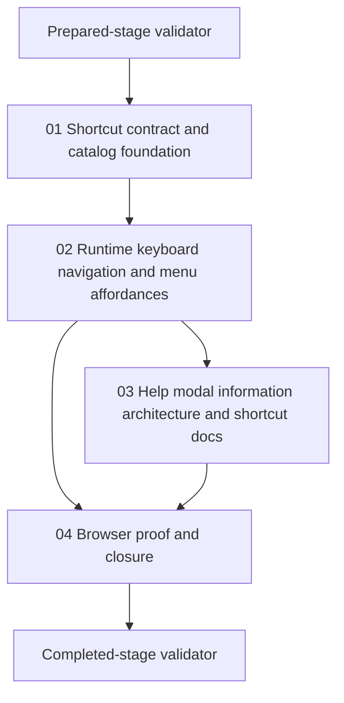

# Phase Plan

## Phase Sequence

1. Run the prepared-stage validator and repair any structural bundle issues before implementation starts.
2. Execute `01-shortcut-contract-and-catalog-foundation` to establish the shared accelerator contract and deterministic assignment rules.
3. Execute `02-runtime-keyboard-navigation-and-menu-affordances` after the shortcut contract is proven stable.
4. Execute `03-help-modal-information-architecture-and-shortcut-docs` after the runtime behavior and visible menu affordances are real.
5. Execute `04-browser-proof-and-closure` to consolidate focused tests, browser truth, screenshots, execution-report updates, and the completed-stage validator.

## Subbundle Dependency Map



## Critical Subbundles

- `01-shortcut-contract-and-catalog-foundation` is the primary foundation subbundle because downstream runtime, docs, and browser proof all depend on the menu tree exposing stable accelerator metadata.
- `02-runtime-keyboard-navigation-and-menu-affordances` is the critical UI foundation because help content and closure proof are invalid if keyboard routing and visible shortcut affordances are not already correct.

## Validator Checkpoints

- Prepared-stage validator command:

```text
python C:\repositories\CanDoItAll\codex\skills\bundles\candoitall-bundle-preparation\scripts\validate_bundle.py C:\repositories\CanDoItAll\project-structure-canvas-context-menu-shortcuts-bundle-v1 --profile feedback --stage prepared
```

- Completed-stage validator command:

```text
python C:\repositories\CanDoItAll\codex\skills\bundles\candoitall-bundle-preparation\scripts\validate_bundle.py C:\repositories\CanDoItAll\project-structure-canvas-context-menu-shortcuts-bundle-v1 --profile feedback --stage completed
```

## Phase Gates

- Gate after preparation: prepared-stage validator passes, all placeholders are removed, and each subbundle has executable proof instructions.
- Gate before subbundle `02`: catalog and adapter proof confirms architect-fixed mappings plus collision-free fallback assignments.
- Gate before subbundle `03`: browser-visible runtime proof confirms keyboard routing, submenu progression, and shortcut underlining are real.
- Gate before subbundle `04`: help modal structure is implemented and documented content matches the actual shortcut contract.
- Gate before closure: focused automated tests pass, browser analytics are recorded, screenshots are reviewed, raw notes are closed explicitly, and the completed-stage validator passes.
