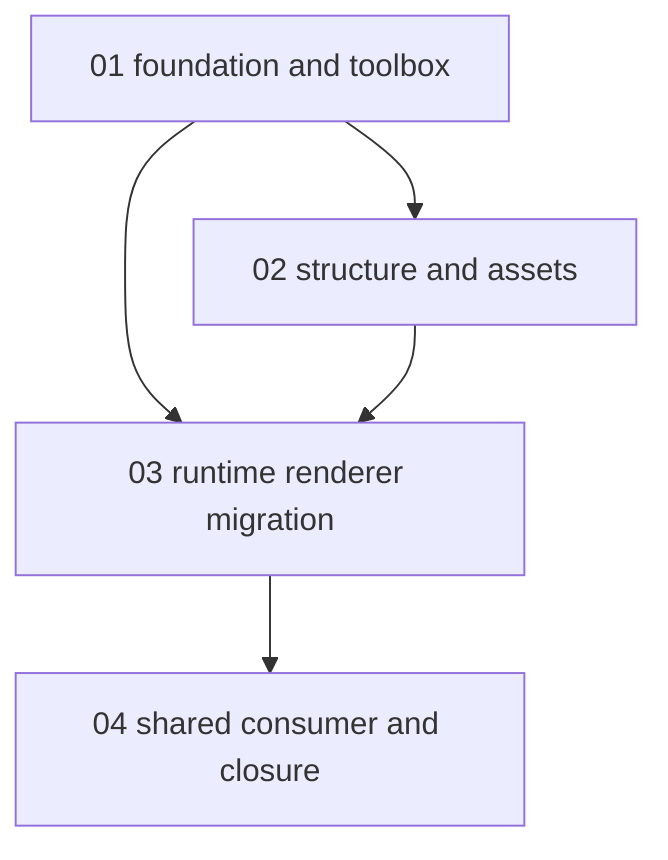

# Phase Plan

## Execution Order

- `01-foundation-and-toolbox`
- `02-structure-and-assets`
- `03-runtime-renderer-migration`
- `04-shared-consumer-and-closure`

## Subbundle Dependency Map

## Critical Subbundles

- `03-runtime-renderer-migration`: This is the critical foundation because it proves the active scene, export path, and ProjectStructure adoption are truly canvas-based.
- `04-shared-consumer-and-closure`: This is the closure gate because it validates PromptFactory compatibility, final regression coverage, documentation sync, and validator success.

## Phase Gates

| Subbundle | Gate | Stop condition |
| --- | --- | --- |
| `01-foundation-and-toolbox` | Overlay, toolbox, and browser flows are green. | Stop if floating-window or create/context flows regress. |
| `02-structure-and-assets` | Asset includes and structure split are in sync. | Stop if asset verification fails or shells diverge. |
| `03-runtime-renderer-migration` | Active scene and export are canvas-owned and ProjectStructure is green. | Stop if source audit or browser proof shows DOM/SVG scene dependence. |
| `04-shared-consumer-and-closure` | PromptFactory, benchmark artifacts, docs, and validator gates are green. | Stop if shared-consumer proof, final regression pack, or bundle validator fails. |
