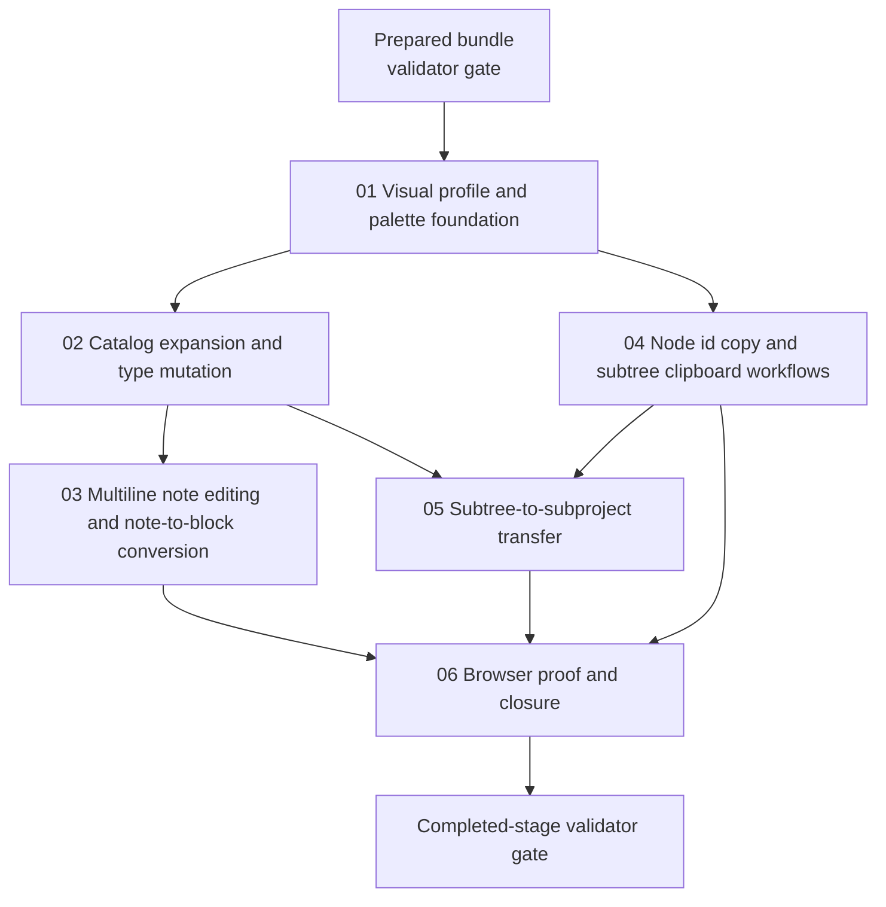

# Phase Plan

## Execution Order

1. Prepare the bundle, run the prepared-stage validator, and repair any structural or proof-contract defects before code changes begin.
2. Execute `01-01-visual-profile-and-palette-foundation` because later preset additions and mutations depend on a single source of truth for node visuals.
3. Execute `02-02-catalog-expansion-and-type-mutation-flows` so new common blocks and type changes reuse the stabilized preset pipeline.
4. Execute `03-03-inline-note-multiline-and-note-conversion` after block mutation groundwork is available for note-to-block conversion.
5. Execute `04-04-node-id-copy-and-subtree-clipboard-workflows` after the core node model is stable enough to serialize and recreate subtrees predictably.
6. Execute `05-05-subtree-to-subproject-transfer` after subtree clipboard semantics and recomposition assumptions are proven.
7. Execute `06-06-browser-proof-and-closure`, populate the execution report, and run the completed-stage validator before marking the bundle finished.

## Subbundle Dependency Map

## Critical Subbundles

- `01-01-visual-profile-and-palette-foundation` is the architectural foundation. If it leaves palette logic split across layers, subbundles `02`, `03`, and `04` will either duplicate the problem or produce inconsistent visuals.
- `04-04-node-id-copy-and-subtree-clipboard-workflows` is the interaction foundation for any descendant-aware transfer logic. Weak proof here invalidates confidence in `05`.
- `05-05-subtree-to-subproject-transfer` is the highest-risk state mutation phase because it crosses project structure and subproject boundaries. Its closure proof must be stronger than a happy-path UI click sequence.

## Phase Gates

- After preparation, run `python C:\Users\lucys\.codex\skills\candoitall-bundle-preparation\scripts\validate_bundle.py C:\repositories\CanDoItAll\project-structure-canvas-feedback-bundle-v1 --profile feedback --stage prepared` and repair every failure before implementation begins.
- Before each subbundle starts, confirm its prerequisites are completed and none of its upstream screenshots or tests already show a reopen trigger.
- After each subbundle closes, capture its required tests, screenshots, and notes in `reviews/01-execution-report.md` before starting any dependent subbundle.
- Before final closure, rerun focused automated coverage, complete all execution-report tables, and run the completed-stage validator.
